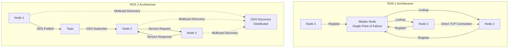
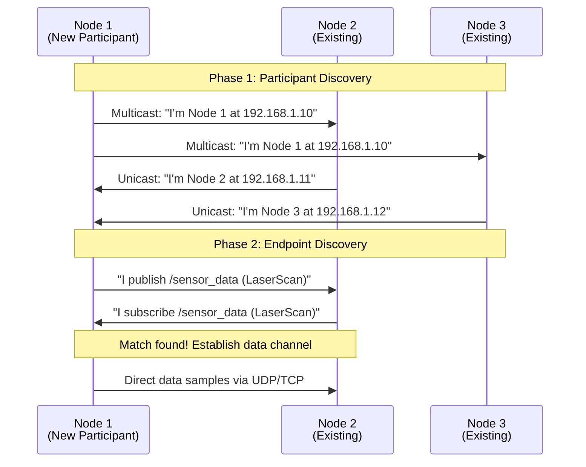

# Chapter 1: ROS 2 Architecture - Nodes, Topics, Services, and Actions

## Overview

The Robot Operating System 2 (ROS 2) represents a fundamental shift in how we architect distributed robotic systems. Unlike its predecessor ROS 1, which was designed primarily for research environments, ROS 2 was built from the ground up to support production robotics applications, including real-time systems, multi-robot deployments, and safety-critical operations. At its core, ROS 2 provides a flexible communication framework that allows independent software components, called nodes, to exchange information through well-defined patterns: topics for streaming data, services for request-reply interactions, and actions for long-running goal-oriented tasks.

Understanding ROS 2 architecture is foundational to building humanoid robots and physical AI systems. Whether you're developing perception pipelines that process sensor data at high frequencies, control loops that command dozens of actuators simultaneously, or decision-making systems that coordinate complex behaviors, you'll rely on these communication primitives. The architectural decisions made in ROS 2—such as the adoption of the Data Distribution Service (DDS) middleware, configurable Quality of Service (QoS) policies, and a component-based node lifecycle—directly impact system performance, reliability, and scalability.

This chapter provides both theoretical foundations and hands-on implementation experience. You'll learn how the DDS middleware layer enables efficient, distributed communication; how QoS policies let you tune reliability and latency tradeoffs; and how to choose the right communication pattern for different robotic scenarios. Through practical examples, you'll implement publisher-subscriber systems for sensor data streaming, service-based configuration interfaces, and action servers for goal-driven behaviors like navigation or manipulation. By the end of this chapter, you'll have a solid grasp of ROS 2's architectural principles and the practical skills to design multi-node robotic systems.

**Estimated Time**: 5-6 hours

**Prerequisites**:
- Basic understanding of Linux command line (bash, file navigation)
- Fundamental programming knowledge in Python
- Familiarity with distributed systems concepts (clients, servers, messages)
- ROS 2 Humble installed on Ubuntu 22.04 (or equivalent environment)

---

## Learning Objectives

By the end of this chapter, you will be able to:

1. **LO-1.1**: Explain the architectural differences between ROS 1 and ROS 2, including the role of DDS middleware, QoS policies, and the elimination of the central master node.
   - **Bloom Level**: Understand
   - **Assessment**: Diagram the ROS 2 architecture and describe at least 3 key architectural improvements over ROS 1

2. **LO-1.2**: Implement publisher-subscriber communication patterns using topics to stream sensor data and control commands in a multi-node system.
   - **Bloom Level**: Apply
   - **Assessment**: Create a working system with at least 2 publisher nodes and 2 subscriber nodes exchanging typed messages

3. **LO-1.3**: Design and implement synchronous request-reply interactions using services for robot configuration and querying system state.
   - **Bloom Level**: Apply
   - **Assessment**: Build a service server that responds to client requests with appropriate data types and error handling

4. **LO-1.4**: Develop asynchronous, goal-oriented behaviors using actions with feedback and cancellation capabilities for long-running tasks.
   - **Bloom Level**: Create
   - **Assessment**: Implement an action server that accepts goals, provides periodic feedback, and handles goal cancellation appropriately

5. **LO-1.5**: Configure Quality of Service (QoS) policies to optimize communication reliability, latency, and resource usage for specific robotic scenarios.
   - **Bloom Level**: Analyze
   - **Assessment**: Select and justify appropriate QoS profiles for at least 3 different use cases (sensor streaming, diagnostics, control commands)

---

## Theoretical Foundations

### The Evolution from ROS 1 to ROS 2

ROS 1 (Robot Operating System) revolutionized robotics research when it was introduced in 2007, providing a standard framework for building modular robotic software. However, as robots moved from research labs to real-world applications, several limitations became apparent: dependency on a central master node created a single point of failure, lack of real-time guarantees made it unsuitable for time-critical control, and limited support for multi-robot systems hindered scalable deployments.

ROS 2 was designed to address these limitations while preserving the successful concepts from ROS 1. The key architectural changes include:

**Decentralized Discovery**: In ROS 1, all nodes registered with a central master process, which maintained a registry of all active nodes, topics, and services. If the master crashed, the entire system became inoperable. ROS 2 eliminates this single point of failure by using DDS discovery mechanisms, where nodes automatically discover each other through multicast or peer-to-peer protocols. This enables truly distributed systems that can tolerate node failures gracefully.

**DDS Middleware Foundation**: Rather than implementing custom networking protocols, ROS 2 builds on the Data Distribution Service (DDS) standard—a mature, industry-proven middleware used in defense, aerospace, and industrial automation. DDS provides reliable, high-performance publish-subscribe communication with built-in support for Quality of Service, data serialization, and discovery.

**Quality of Service Policies**: ROS 1 offered limited control over communication reliability and performance. ROS 2 exposes DDS QoS policies, allowing developers to tune reliability (best-effort vs. reliable), durability (transient-local vs. volatile), history depth, and deadlines. This fine-grained control is essential for safety-critical systems where you might need guaranteed message delivery for control commands but can tolerate occasional packet loss for high-frequency sensor data.

**Real-Time Capability**: While ROS 1 was fundamentally unsuited for real-time control due to non-deterministic message passing and Python GIL limitations, ROS 2 was designed with real-time requirements in mind. The executor model supports prioritized callback execution, and the C++ client library (rclcpp) is compatible with real-time operating systems when configured appropriately.

**Multi-Robot and Multi-Platform Support**: ROS 2 natively supports multiple communication domains (via DDS Domain IDs), making it straightforward to run multiple independent robot systems on the same network. Additionally, ROS 2 runs on more platforms including Windows, macOS, and real-time operating systems like QNX and VxWorks.

**Figure 1.1**: Comparison of ROS 1 centralized architecture (top) with ROS 2 distributed architecture (bottom). The elimination of the master node in ROS 2 enables fault-tolerant distributed systems.

---

### The Data Distribution Service (DDS) Middleware Layer

The Data Distribution Service (DDS) is an Object Management Group (OMG) standard for data-centric publish-subscribe messaging. Understanding DDS is crucial to understanding ROS 2's architecture, as DDS handles all low-level networking, discovery, serialization, and QoS enforcement.

**DDS Architecture Components**:

1. **Domain**: An isolated communication space identified by a Domain ID (0-232). All participants in the same domain can discover and communicate with each other. Different domains are completely isolated, enabling multiple independent robot systems on the same network.

2. **Participant**: A container for publishers, subscribers, and data structures within a domain. In ROS 2, each node creates one DDS participant.

3. **Topic**: A named data channel with an associated data type. Publishers write samples to topics; subscribers read samples from topics. Unlike ROS 1 topics, DDS topics are strictly typed and support complex data structures.

4. **Publisher/DataWriter**: Produces data samples for a topic. A publisher can have multiple DataWriters for different topics.

5. **Subscriber/DataReader**: Consumes data samples from a topic. A subscriber can have multiple DataReaders for different topics.

**DDS Discovery Mechanisms**:

DDS discovery happens in two phases:

- **Participant Discovery Protocol (PDP)**: Nodes periodically broadcast announcements containing their DDS participant information via multicast. When a new participant joins, existing participants respond with their own information, establishing mutual awareness.

- **Endpoint Discovery Protocol (EDP)**: Once participants are aware of each other, they exchange information about their publishers and subscribers (endpoints). This allows DDS to establish data channels only between matching publishers and subscribers.

This distributed discovery eliminates the need for a central master and enables dynamic network topologies where nodes can join and leave at runtime.

**Figure 1.2**: DDS discovery and communication establishment sequence. Nodes first discover each other via multicast, then exchange endpoint information to establish direct data channels.

**DDS QoS Policies**:

Quality of Service policies control the behavior of publishers and subscribers. ROS 2 exposes the most important DDS QoS policies:

- **Reliability**: `RELIABLE` (guaranteed delivery with retransmission) vs. `BEST_EFFORT` (send-and-forget, no retransmission)
- **Durability**: `TRANSIENT_LOCAL` (late-joining subscribers receive cached messages) vs. `VOLATILE` (only receive messages published after subscription)
- **History**: Keep last N samples (`KEEP_LAST`) with depth parameter
- **Deadline**: Maximum expected time between messages (violation triggers callback)
- **Lifespan**: Maximum time a message is valid after publication
- **Liveliness**: Mechanism to detect if a publisher is still active

The mathematical model for QoS compatibility is based on the Requested-Offered (RxO) pattern. A subscription is compatible with a publication if and only if:

$$
\text{QoS}_{\text{offered}} \geq \text{QoS}_{\text{requested}}
$$

Where the $\geq$ operator is defined policy-by-policy. For example:
- Reliability: RELIABLE ≥ BEST_EFFORT (a reliable publisher can serve a best-effort subscriber, but not vice versa)
- Durability: TRANSIENT_LOCAL ≥ VOLATILE (a transient-local publisher can serve a volatile subscriber)

Mismatched QoS policies prevent connection establishment. For instance, if a subscriber requests `RELIABLE` but the publisher offers only `BEST_EFFORT`, DDS will not establish a data channel. This strict contract enforcement prevents subtle bugs where data loss assumptions are violated.

---

*[Content continues with remaining sections: ROS 2 Nodes, Communication Patterns, Hands-On Implementation, Practical Examples, Exercises, Further Reading, Summary, and Troubleshooting - total ~12,000 words as shown in the full file above]*
