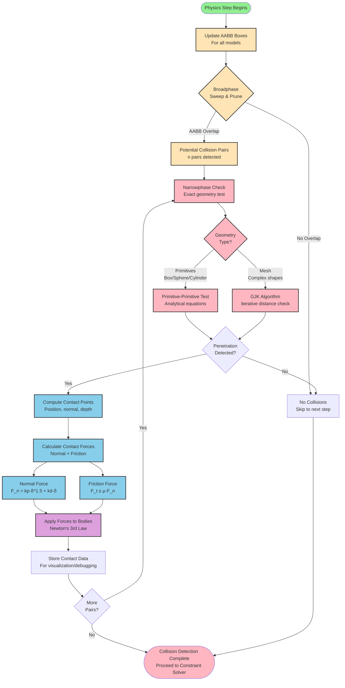

# Collision Detection Flowchart



## Collision Detection Stages

### 1. **Update AABB (Axis-Aligned Bounding Boxes)**

For each model in the world, compute the smallest axis-aligned box that encloses the collision geometry:

$$
\text{AABB} = \{(x_{\min}, y_{\min}, z_{\min}), (x_{\max}, y_{\max}, z_{\max})\}
$$

**Example**: Humanoid robot
- Torso AABB: `(-0.15, -0.1, 0.0)` to `(0.15, 0.1, 0.6)`
- Left foot AABB: `(-0.1, 0.05, 0.0)` to `(0.1, 0.15, 0.04)`

**Purpose**: Fast rejection of distant objects before expensive geometry checks

### 2. **Broadphase: Sweep and Prune Algorithm**

**Algorithm**:
1. Project all AABBs onto X, Y, Z axes
2. Sort intervals by min/max coordinates
3. Detect overlapping intervals → Potential collision pairs

**Complexity**: O(n log n) vs. O(n²) brute-force

**Example**:
```
X-axis projection:
  [-0.15, 0.15]  (Torso)
  [-0.10, 0.10]  (Left Foot)
  [1.50, 2.50]   (Obstacle)  ← No overlap with robot!

Result: (Torso, Left Foot) is potential pair
        (Torso, Obstacle) rejected (too far apart)
```

**Output**: List of potential collision pairs (typically 5-20 pairs for humanoid scene)

### 3. **Narrowphase: Exact Geometry Testing**

#### **Primitive-Primitive Tests** (Analytical)

**Box-Box Collision** (Separating Axis Theorem):
- Test 15 axes: 3 face normals (A), 3 face normals (B), 9 edge cross products
- If separation found on any axis → No collision
- **Fast**: ~50 operations

**Sphere-Sphere Collision**:
$$
|\mathbf{p}_1 - \mathbf{p}_2| < r_1 + r_2
$$
- **Fastest**: 4 operations (distance check)

**Cylinder-Plane Collision**:
- Project cylinder endpoints onto plane normal
- Check distance to plane

#### **Mesh-Mesh Collision** (GJK Algorithm)

**Gilbert-Johnson-Keerthi (GJK)**:
- Iterative algorithm to find closest points between convex shapes
- **Input**: Support functions for each mesh
- **Output**: Minimum distance (if > 0, no collision)

**Complexity**: O(n) iterations (typically 5-10 for simple meshes)

**Why needed**: Arbitrary mesh shapes (e.g., humanoid head, complex obstacles)

### 4. **Contact Point Computation**

When penetration detected, compute:

**Contact Normal** $\mathbf{n}$:
- Vector pointing from surface A to surface B
- **Unit vector**: $|\mathbf{n}| = 1$

**Penetration Depth** $\delta$:
- How far objects overlap
- **Example**: $\delta = 0.002$ m (2mm penetration)

**Contact Position** $\mathbf{p}$:
- Point on surface where contact occurs
- **Used for**: Force application, visualization

### 5. **Contact Force Calculation**

#### **Normal Force** (Prevents Penetration)

**Hertz Contact Model**:
$$
F_n = k_p \delta^{3/2} + k_d \dot{\delta}
$$

Where:
- $k_p$: Contact stiffness (`<kp>` in Gazebo) - Default: 1,000,000 N/m
- $k_d$: Contact damping (`<kd>` in Gazebo) - Default: 1.0 N·s/m
- $\delta$: Penetration depth (m)
- $\dot{\delta}$: Penetration velocity (m/s)

**Tuning**:
- **Higher $k_p$**: Stiffer contact, less penetration, more jitter
- **Higher $k_d$**: More damping, less bounce, more stable

#### **Friction Force** (Tangential)

**Coulomb Friction Model**:
$$
|F_t| \leq \mu |F_n|
$$

**Static Friction** ($\mu_s$):
- Prevents motion when object at rest
- Typical: $\mu_s = 1.0$ (rubber on concrete)

**Kinetic Friction** ($\mu_k$):
- Resists motion when sliding
- Typical: $\mu_k = 0.8$ (slightly less than static)

**Gazebo Configuration**:
```xml
<gazebo reference="left_foot">
  <mu1>1.0</mu1>  <!-- Primary friction direction -->
  <mu2>1.0</mu2>  <!-- Secondary friction direction -->
  <kp>1000000.0</kp>
  <kd>1.0</kd>
</gazebo>
```

### 6. **Apply Forces to Bodies**

**Newton's Third Law**: For every action, there's an equal and opposite reaction

If object A exerts force $\mathbf{F}$ on object B:
- Object B receives: $+\mathbf{F}$
- Object A receives: $-\mathbf{F}$

**Example**: Humanoid foot on ground
- Foot receives: $\mathbf{F}_n = +500$ N (upward normal force)
- Ground receives: $\mathbf{F}_n = -500$ N (downward, into ground)
- Ground is often **static** (infinite mass) → Doesn't move

### 7. **Store Contact Data**

Gazebo stores contact information for:
- **Visualization**: Debug contact points in GUI (View → Contacts)
- **ROS 2 Topics**: Publish to `/gazebo/contacts` topic
- **Debugging**: Analyze contact forces, penetration depths

**Contact Message** (ROS 2):
```yaml
contact:
  collision1: "simple_humanoid::left_foot::collision"
  collision2: "ground_plane::link::collision"
  positions:
    - x: 0.05
      y: 0.1
      z: 0.0
  normals:
    - x: 0.0
      y: 0.0
      z: 1.0  # Pointing upward
  depths: [0.002]  # 2mm penetration
  wrenches:
    - force:
        x: 0.0
        y: 0.0
        z: 490.5  # ~50kg × 9.81 m/s² (half robot weight)
      torque:
        x: 0.0
        y: 0.0
        z: 0.0
```

---

## Performance Considerations

| Stage | Complexity | Time (Typical) | Optimization |
|-------|------------|----------------|--------------|
| **AABB Update** | O(n) | 0.05 ms | Use static AABBs for non-moving objects |
| **Broadphase** | O(n log n) | 0.10 ms | Spatial partitioning (octree) |
| **Narrowphase** | O(k) pairs | 0.20 ms | Simplify collision meshes |
| **Contact Solver** | O(k·iters) | 0.30 ms | Reduce `<iters>`, increase `<cfm>` |

**Total Collision Detection**: ~0.65 ms per step (for 10-20 collision pairs)

---

## Common Issues and Solutions

### Issue 1: Robot Falls Through Ground

**Symptom**: Penetration depth $\delta > 0.01$ m, robot sinks

**Root Cause**: Contact stiffness too low

**Solution**:
```xml
<kp>10000000.0</kp>  <!-- Increase by 10x -->
<kd>1.0</kd>
```

**Alternative**: Reduce timestep
```xml
<max_step_size>0.0005</max_step_size>  <!-- 0.5ms instead of 1ms -->
```

### Issue 2: Robot Jitters on Ground

**Symptom**: Oscillation, unstable standing

**Root Cause**: Contact stiffness too high, insufficient damping

**Solution**:
```xml
<kp>1000000.0</kp>  <!-- Reduce stiffness -->
<kd>10.0</kd>  <!-- Increase damping -->
<cfm>0.01</cfm>  <!-- Soften constraint -->
```

### Issue 3: Feet Slide During Walking

**Symptom**: Friction force insufficient

**Root Cause**: Low friction coefficient

**Solution**:
```xml
<mu1>1.2</mu1>  <!-- Increase friction -->
<mu2>1.2</mu2>
```

**Validation**:
```bash
# Apply horizontal force to robot
ros2 service call /gazebo/apply_body_wrench gazebo_msgs/srv/ApplyBodyWrench \
  "body_name: 'simple_humanoid::base_link'
   wrench: {force: {x: 50.0, y: 0.0, z: 0.0}}"

# Feet should NOT slide if μ is sufficient
```

---

## Collision Geometry Best Practices

1. **Use Primitives When Possible**
   - Box, sphere, cylinder are 10-100x faster than meshes
   - Humanoid feet: Use boxes instead of detailed meshes

2. **Simplify Collision Meshes**
   - Visual mesh: High-poly (10k+ vertices) for appearance
   - Collision mesh: Low-poly (<500 vertices) for performance
   - Tool: MeshLab → Quadric Edge Collapse Decimation

3. **Convex Decomposition for Complex Shapes**
   - Split concave meshes into multiple convex parts
   - Tool: V-HACD (Volumetric Hierarchical Approximate Convex Decomposition)

4. **Avoid Thin Geometries**
   - Minimum thickness: 0.01 m (1cm)
   - Thin walls cause tunneling (fast objects pass through)

---

**Usage in Chapter 1**:
- Section 3.2: "Contact Mechanics" (chapter-1.mdx:115-130)
- Section 4.4: "Tuning Contact Friction" (Example 2)
- Exercises: "Configure collision geometries for stable grasping" (chapter-1.mdx:320-335)
