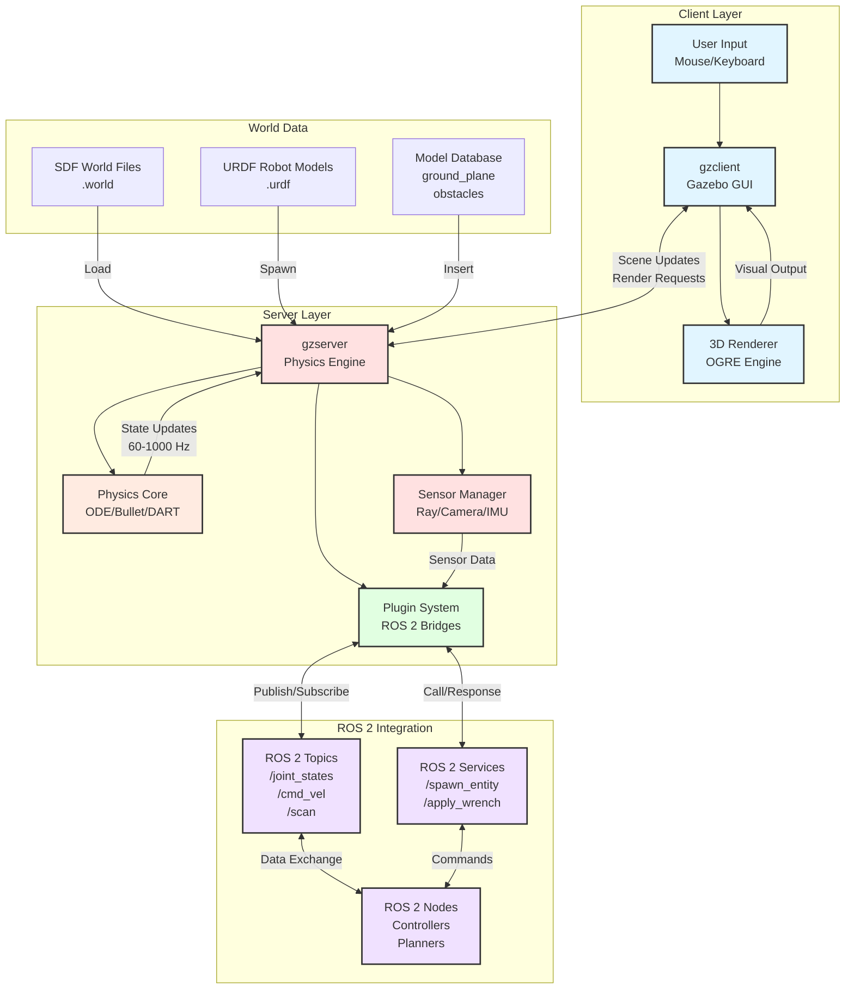

# Gazebo Client-Server Architecture

## Architecture Components

### Client Layer (gzclient)
- **Gazebo GUI**: User interface for visualization and interaction
- **OGRE Renderer**: OpenGL rendering engine for 3D graphics
- **User Input**: Mouse/keyboard controls for camera, model manipulation

### Server Layer (gzserver)
- **Physics Engine**: Simulates rigid body dynamics, contacts, forces
  - ODE (default): Constraint-based solver, fast for articulated robots
  - Bullet: Impulse-based solver, good general-purpose
  - DART: High-accuracy solver, smoother contacts
- **Sensor Manager**: Simulates LiDAR, cameras, IMU, contact sensors
- **Plugin System**: Extensibility via C++ plugins, ROS 2 bridges

### ROS 2 Integration
- **Topics**: Publish/subscribe for continuous data streams
  - `/joint_states`: Robot joint positions, velocities
  - `/cmd_vel`: Velocity commands for mobile robots
  - `/scan`: LiDAR point clouds
- **Services**: Request/response for one-time operations
  - `/spawn_entity`: Spawn URDF models
  - `/apply_body_wrench`: Apply forces to links
- **Nodes**: Control algorithms, motion planners, state estimators

### World Data
- **SDF World Files**: XML descriptions of simulation environments
- **URDF Robot Models**: Unified Robot Description Format (links, joints, sensors)
- **Model Database**: Pre-built models (ground_plane, boxes, humanoids)

## Communication Flow

1. **Initialization**:
   - `gzserver` loads SDF world file
   - Spawns models (URDF converted to SDF internally)
   - Initializes physics engine and sensors

2. **Simulation Loop** (1000 Hz default):
   - Physics engine updates: $\mathbf{x}_{t+1} = f(\mathbf{x}_t, \mathbf{u}_t, \Delta t)$
   - Sensors collect data (ray casting, rendering)
   - Plugins publish ROS 2 messages

3. **Visualization** (60 Hz):
   - `gzserver` sends scene updates to `gzclient`
   - `gzclient` renders 3D view via OGRE

4. **User Interaction**:
   - User inputs (mouse drag, keyboard) → `gzclient`
   - `gzclient` sends commands → `gzserver`
   - `gzserver` applies forces/torques, updates state

## Separation Benefits

**Headless Operation**: Run `gzserver` without `gzclient` for:
- Faster-than-real-time training (RTF > 1.0)
- Remote simulation on GPU servers
- Batch testing with multiple parallel instances

**Distributed Simulation**:
- `gzserver` on powerful workstation
- `gzclient` on lightweight laptop
- Connected via network (TCP/IP)

---

**Usage in Chapter 1**:
- Section 2: "Understanding Gazebo Architecture" (referenced in chapter-1.mdx:95-110)
- Explains why RTF measurement appears in `gzclient` but physics runs in `gzserver`
