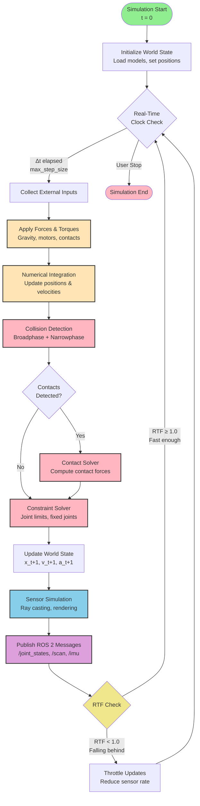

# Physics Engine Pipeline (Simulation Loop)

## Pipeline Stages Explained

### 1. **Initialization** (One-Time Setup)
- Load SDF world file and URDF models
- Initialize physics engine (ODE/Bullet/DART)
- Set initial positions, velocities, and forces
- **Time**: 0.5-2 seconds (depends on model complexity)

### 2. **Real-Time Clock Check**
- Determines when to advance simulation
- **Timestep** $\Delta t$: Controlled by `<max_step_size>` (default: 0.001s = 1ms)
- **Update Rate**: `<real_time_update_rate>` (default: 1000 Hz)
- **Real-Time Factor (RTF)**: $\text{RTF} = \frac{\text{Simulation Time}}{\text{Real Time}}$
  - RTF = 1.0 → Real-time simulation
  - RTF > 1.0 → Faster than real-time (good for training)
  - RTF < 1.0 → Slower than real-time (need optimization)

### 3. **Collect External Inputs**
- **User Commands**: Forces from GUI (drag-and-drop)
- **ROS 2 Commands**: `/cmd_vel`, `/apply_body_wrench` services
- **Controller Outputs**: Motor torques from control algorithms

### 4. **Apply Forces & Torques**
- **Gravity**: $\mathbf{F}_g = m\mathbf{g}$ (configured in world file)
- **Motor Torques**: Joint actuators (from URDF effort limits)
- **External Forces**: User-applied forces via services
- **Contact Forces**: Computed in contact solver stage

### 5. **Numerical Integration**
Solve equations of motion using chosen integrator:

**Euler Method** (First-Order):
$$
\begin{align}
\mathbf{v}_{t+1} &= \mathbf{v}_t + \mathbf{a}_t \Delta t \\
\mathbf{x}_{t+1} &= \mathbf{x}_t + \mathbf{v}_t \Delta t
\end{align}
$$

**Runge-Kutta 4th Order** (Higher Accuracy):
$$
\mathbf{x}_{t+1} = \mathbf{x}_t + \frac{\Delta t}{6}(\mathbf{k}_1 + 2\mathbf{k}_2 + 2\mathbf{k}_3 + \mathbf{k}_4)
$$

- **Output**: Updated positions $\mathbf{x}_{t+1}$ and velocities $\mathbf{v}_{t+1}$

### 6. **Collision Detection**

**Broadphase** (Fast, Approximate):
- Axis-Aligned Bounding Boxes (AABB)
- Eliminates distant objects
- **Algorithm**: Sweep and Prune (O(n log n))

**Narrowphase** (Precise, Expensive):
- Exact collision geometry checks
- **Primitives**: Box-box, sphere-sphere, cylinder-plane
- **Meshes**: GJK (Gilbert-Johnson-Keerthi) algorithm

**Output**: List of collision pairs with contact points

### 7. **Contact Solver**
Computes contact forces to prevent penetration:

**Normal Force** (Prevents penetration):
$$
F_n = k_p \delta^{3/2} + k_d \dot{\delta}
$$
- $k_p$: Contact stiffness (`<kp>` in Gazebo)
- $k_d$: Contact damping (`<kd>` in Gazebo)
- $\delta$: Penetration depth

**Friction Force** (Tangential):
$$
|F_t| \leq \mu |F_n|
$$
- $\mu$: Friction coefficient (`<mu1>`, `<mu2>` in Gazebo)

**ODE Solver Method**:
- Linear Complementarity Problem (LCP)
- Iterative solver with `<iters>` iterations
- ERP (Error Reduction Parameter): Controls position error correction
- CFM (Constraint Force Mixing): Softens constraints

### 8. **Constraint Solver**
Enforces joint constraints:
- **Revolute Joints**: Limit rotation to `<lower>` and `<upper>` bounds
- **Fixed Joints**: Zero relative motion
- **Prismatic Joints**: Linear motion along axis

**Constraint Equation**:
$$
C(\mathbf{q}) = 0 \quad \text{(position constraint)}
$$
$$
\dot{C}(\mathbf{q}, \dot{\mathbf{q}}) = 0 \quad \text{(velocity constraint)}
$$

### 9. **Update World State**
- Store new positions, velocities, accelerations
- Update link transforms for rendering
- Increment simulation time: $t \leftarrow t + \Delta t$

### 10. **Sensor Simulation**
- **LiDAR**: GPU ray casting (100k+ rays/frame)
- **Cameras**: Render scene to texture, publish as `sensor_msgs/Image`
- **IMU**: Compute linear acceleration and angular velocity from rigid body state

### 11. **Publish ROS 2 Messages**
- `/joint_states`: Joint positions, velocities, efforts
- `/scan`: LaserScan point cloud
- `/imu/data`: IMU measurements
- `/tf`: Transform tree (robot kinematics)

### 12. **RTF Check**
Monitor performance and adapt:
- **RTF ≥ 1.0**: Simulation keeping up with real-time
- **RTF < 0.9**: Falling behind → Reduce sensor update rates, simplify models
- **RTF < 0.5**: Critical → Use headless mode, disable shadows

---

## Performance Optimization

| Bottleneck | Symptom | Solution |
|------------|---------|----------|
| **Contact Solver** | RTF drops when many collisions | Reduce `<iters>`, simplify collision meshes |
| **Sensor Simulation** | RTF drops when LiDAR active | Lower sensor `<update_rate>`, reduce ray count |
| **Rendering** | GUI lag, low FPS | Run headless (`gzserver` only), disable shadows |
| **Integration** | Unstable behavior | Reduce `<max_step_size>`, increase `<iters>` |

## Typical Timing (Reference Hardware)

| Stage | Time per Step | Frequency |
|-------|---------------|-----------|
| Integration | 0.1 ms | 1000 Hz |
| Collision Detection | 0.3 ms | 1000 Hz |
| Contact Solver | 0.4 ms | 1000 Hz |
| Sensors (LiDAR) | 10 ms | 10 Hz |
| ROS 2 Publish | 0.2 ms | 1000 Hz |
| **Total** | **~1 ms** | **RTF ≈ 1.0** |

---

**Usage in Chapter 1**:
- Section 3.4: "Numerical Integration Methods" (chapter-1.mdx:130-145)
- Section 4.3: "Physics Parameter Tuning" (chapter-1.mdx:250-280)
- Explains how `<max_step_size>` and `<iters>` affect simulation accuracy and RTF
