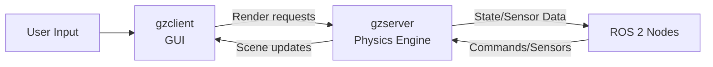

# Chapter 1: Simulating Physics, Gravity, and Collisions in Gazebo

## Overview

In this chapter, you will master **Gazebo Classic 11**, the industry-standard physics simulation platform for robotics research and development. Gazebo serves as the physics engine in your Digital Twin workflow, providing accurate simulation of gravity, rigid body dynamics, collision detection, and contact forces that govern how humanoid robots interact with their environment.

**Why Gazebo for Digital Twins?** Gazebo bridges the gap between theoretical robot design and physical deployment. By simulating physics with high fidelity (Real-Time Factor ≥ 0.9), you can test control algorithms, validate mechanical designs, and debug behavior in a safe, repeatable environment before deploying to expensive hardware.

**What You'll Build:** By the end of this chapter, you'll create Gazebo worlds where a simulated humanoid robot stands, walks, and interacts with objects using realistic physics parameters tuned from real-world data.

**Estimated Time:** 6-8 hours

**Prerequisites:**
- Completion of **Module 1: ROS 2 Fundamentals** (ROS 2 topics, launch files, URDF modeling)
- Ubuntu 22.04 with ROS 2 Humble and Gazebo Classic 11 installed
- Basic understanding of Newtonian mechanics (forces, torques, friction)

---

## Learning Objectives

By the end of this chapter, you will be able to:

1. **Explain** Gazebo's client-server architecture and the roles of physics engines (ODE, Bullet, DART) in simulation accuracy
2. **Configure** physics parameters (gravity, timestep, solver iterations, ERP/CFM) to achieve stable humanoid robot simulations with RTF ≥ 0.9
3. **Implement** collision geometries and surface properties (friction coefficients, contact stiffness, damping) for realistic object interaction
4. **Demonstrate** external force application using Gazebo services and ROS 2 interfaces to simulate disturbances and validate robot stability
5. **Analyze** performance trade-offs between simulation accuracy and real-time factor through systematic parameter tuning

---

## Theoretical Foundations

### 1. Rigid Body Dynamics

Gazebo simulates robots as systems of **rigid bodies** connected by joints, governed by Newton-Euler equations of motion:

$$
\mathbf{F} = m\mathbf{a} \quad \text{(Translation)}
$$

$$
\boldsymbol{\tau} = I\boldsymbol{\alpha} + \boldsymbol{\omega} \times (I\boldsymbol{\omega}) \quad \text{(Rotation)}
$$

Where:
- $\mathbf{F}$: Net force vector (N)
- $m$: Mass (kg)
- $\mathbf{a}$: Linear acceleration (m/s²)
- $\boldsymbol{\tau}$: Net torque vector (N·m)
- $I$: Moment of inertia tensor (kg·m²)
- $\boldsymbol{\alpha}$: Angular acceleration (rad/s²)
- $\boldsymbol{\omega}$: Angular velocity (rad/s)

**Application to Humanoid Robots:** Each link (torso, leg, arm) in your URDF model is treated as a rigid body with mass and inertia properties. Gazebo's physics engine numerically integrates these equations at each timestep to compute link positions, velocities, and accelerations.

### 2. Contact Mechanics

When two bodies collide (e.g., robot foot touching ground), Gazebo computes **contact forces** using:

**Hertz Contact Theory (Normal Forces):**

$$
F_n = k_p \delta^{3/2}
$$

Where $k_p$ is contact stiffness and $\delta$ is penetration depth.

**Coulomb Friction Model (Tangential Forces):**

$$
|F_t| \leq \mu |F_n|
$$

Where $\mu$ is the friction coefficient and $F_t$ is the tangential force.

**Key Parameters in Gazebo:**
- `<mu>`: Friction coefficient (0.0 = frictionless, 1.0 = high friction)
- `<kp>`: Contact stiffness (N/m) - higher values reduce penetration
- `<kd>`: Contact damping (N·s/m) - higher values reduce bounce

:::tip Real-World Calibration
Typical friction coefficients: rubber on concrete ($\mu \approx 1.0$), metal on metal ($\mu \approx 0.15$). Always cite datasheets when setting simulation parameters!
:::

### 3. Numerical Integration Methods

Gazebo solves differential equations of motion using numerical integrators:

**Euler Method (First-Order):**
$$
\mathbf{x}_{n+1} = \mathbf{x}_n + h\mathbf{f}(\mathbf{x}_n, t_n)
$$

- **Pros:** Fast, simple
- **Cons:** Accumulates error, unstable for stiff systems

**Runge-Kutta 4th Order (RK4):**
$$
\mathbf{x}_{n+1} = \mathbf{x}_n + \frac{h}{6}(\mathbf{k}_1 + 2\mathbf{k}_2 + 2\mathbf{k}_3 + \mathbf{k}_4)
$$

- **Pros:** More accurate, better stability
- **Cons:** Computationally expensive

**Symplectic Integrators (for Hamiltonian systems):**
- Preserve energy over long simulations
- Used in ODE and DART physics engines

**Gazebo Configuration:** Set `<max_step_size>` (timestep $h$) and `<real_time_update_rate>` to balance accuracy vs. performance.

### 4. Physics Engine Algorithms

Gazebo supports three physics engines:

| Engine | Algorithm Type | Strengths | Weaknesses |
|--------|---------------|-----------|------------|
| **ODE** | Constraint-based (LCP solver) | Fast, stable for articulated robots | Less accurate contacts, tuning required |
| **Bullet** | Impulse-based | Good general-purpose performance | Can be unstable with complex joints |
| **DART** | Constraint-based (Dantzig solver) | High accuracy, smooth contacts | Slower, more CPU-intensive |

**Default Choice:** ODE for real-time humanoid simulation (RTF ≥ 0.9 achievable).

---

## Hands-On Implementation

### 1. Gazebo Installation and Verification

If you haven't installed Gazebo yet, follow these steps:

```bash
# Install Gazebo Classic 11 with ROS 2 Humble integration
sudo apt update
sudo apt install ros-humble-gazebo-ros-pkgs -y

# Verify installation
gazebo --version
# Expected output: Gazebo multi-robot simulator, version 11.14.0

# Test with empty world
gazebo
```

**Expected Behavior:** Gazebo GUI opens with an empty world. Check the bottom-right corner for **Real-Time Factor (RTF)** - should be ~1.0 (simulation running at real-time speed).

:::warning Performance Check
If RTF < 0.9, your system may struggle with complex simulations. Reduce world complexity or use headless mode (`gzserver` without GUI).
:::

### 2. Understanding Gazebo Architecture

Gazebo follows a **client-server model**:



- **`gzserver`**: Runs physics simulation (ODE/Bullet/DART), sensor simulation, plugin execution
- **`gzclient`**: Renders 3D visualization (OGRE graphics engine)
- **Separation benefit:** Run headless `gzserver` on remote GPU servers for faster-than-real-time training

### 3. World File Creation (SDF Format)

Gazebo worlds are defined in **SDF (Simulation Description Format)** XML files. Create your first world:

**File:** `examples/ros2_ws/src/gazebo_sim/worlds/basic_physics.world`

```xml
<?xml version="1.0"?>
<sdf version="1.7">
  <world name="basic_physics_world">

    <!-- Physics Configuration -->
    <physics type="ode">
      <max_step_size>0.001</max_step_size>  <!-- 1ms timestep -->
      <real_time_update_rate>1000</real_time_update_rate>  <!-- 1000 Hz -->
      <gravity>0 0 -9.81</gravity>  <!-- Earth gravity (m/s²) -->

      <ode>
        <solver>
          <type>quick</type>
          <iters>50</iters>  <!-- Solver iterations (trade-off: accuracy vs speed) -->
          <sor>1.3</sor>  <!-- Successive Over-Relaxation parameter -->
        </solver>
        <constraints>
          <cfm>0.0</cfm>  <!-- Constraint Force Mixing -->
          <erp>0.2</erp>  <!-- Error Reduction Parameter -->
          <contact_max_correcting_vel>100.0</contact_max_correcting_vel>
          <contact_surface_layer>0.001</contact_surface_layer>
        </constraints>
      </ode>
    </physics>

    <!-- Scene Configuration -->
    <scene>
      <ambient>0.4 0.4 0.4 1.0</ambient>
      <background>0.7 0.7 0.7 1.0</background>
      <shadows>true</shadows>
      <grid>true</grid>
    </scene>

    <!-- Lighting -->
    <light type="directional" name="sun">
      <cast_shadows>true</cast_shadows>
      <pose>0 0 10 0 0 0</pose>
      <diffuse>0.8 0.8 0.8 1</diffuse>
      <specular>0.2 0.2 0.2 1</specular>
      <attenuation>
        <range>1000</range>
        <linear>0.01</linear>
      </attenuation>
      <direction>-0.5 0.1 -0.9</direction>
    </light>

    <!-- Ground Plane -->
    <include>
      <uri>model://ground_plane</uri>
    </include>

  </world>
</sdf>
```

**Key Parameters Explained:**
- `<max_step_size>`: Smaller = more accurate but slower (try 0.001s for humanoid robots)
- `<iters>`: More iterations = better constraint solving but higher CPU cost
- `<erp>`: Controls how aggressively position errors are corrected (0.2 is stable default)
- `<cfm>`: Softens constraints (higher = spongier contacts, prevents jitter)

### 4. Spawning Robot from URDF

Use the `spawn_entity.py` node from `gazebo_ros` to load your humanoid:

**Launch File:** `examples/ros2_ws/src/gazebo_sim/launch/spawn_humanoid.launch.py`

```python
from launch import LaunchDescription
from launch.actions import IncludeLaunchDescription
from launch.launch_description_sources import PythonLaunchDescriptionSource
from launch.substitutions import PathJoinSubstitution
from launch_ros.actions import Node
from launch_ros.substitutions import FindPackageShare
import os

def generate_launch_description():
    # Path to URDF file
    urdf_path = os.path.join(
        os.path.dirname(__file__),
        '..', '..', '..', '..',  # Navigate to repo root
        'examples', 'module-2', 'shared', 'urdf', 'simple_humanoid.urdf'
    )

    # Launch Gazebo with basic_physics world
    gazebo = IncludeLaunchDescription(
        PythonLaunchDescriptionSource([
            PathJoinSubstitution([
                FindPackageShare('gazebo_ros'),
                'launch',
                'gazebo.launch.py'
            ])
        ]),
        launch_arguments={'world': PathJoinSubstitution([
            FindPackageShare('gazebo_sim'),
            'worlds',
            'basic_physics.world'
        ])}.items()
    )

    # Spawn robot entity
    spawn_entity = Node(
        package='gazebo_ros',
        executable='spawn_entity.py',
        arguments=[
            '-entity', 'simple_humanoid',
            '-file', urdf_path,
            '-x', '0.0',
            '-y', '0.0',
            '-z', '1.0',  # Spawn 1m above ground to test gravity
        ],
        output='screen'
    )

    return LaunchDescription([
        gazebo,
        spawn_entity
    ])
```

**Run the simulation:**

```bash
cd ~/hackathon1-humanoid-robotics-book/examples/ros2_ws
colcon build --packages-select gazebo_sim
source install/setup.bash
ros2 launch gazebo_sim spawn_humanoid.launch.py
```

**Expected Result:** Gazebo opens, humanoid robot spawns 1m above ground, falls due to gravity, and settles on ground plane. Measure RTF - should be ≥ 0.9.

---

## Practical Examples

### Example 1: Modifying Gravity (Beginner)

**Task:** Simulate Moon gravity ($g = 1.62$ m/s²) and observe slower falling motion.

Edit `basic_physics.world`:

```xml
<gravity>0 0 -1.62</gravity>  <!-- Moon gravity -->
```

Relaunch and observe the robot falls ~6x slower. This demonstrates how physics parameters directly affect simulation behavior.

### Example 2: Tuning Contact Friction (Intermediate)

**Problem:** Robot feet slide on ground during walking.

**Solution:** Increase friction coefficients in URDF foot links:

```xml
<gazebo reference="left_foot">
  <mu1>1.0</mu1>  <!-- Friction coefficient in primary direction -->
  <mu2>1.0</mu2>  <!-- Friction coefficient in secondary direction -->
  <kp>1000000.0</kp>  <!-- Contact stiffness (high = rigid contact) -->
  <kd>1.0</kd>  <!-- Contact damping -->
</gazebo>
```

**Validation:** Apply horizontal force to robot base - feet should not slide.

### Example 3: External Force Application (Advanced)

**Use Case:** Test robot stability against wind or push disturbances.

**ROS 2 Service Call:**

```bash
ros2 service call /gazebo/apply_body_wrench gazebo_msgs/srv/ApplyBodyWrench \
"body_name: 'simple_humanoid::base_link'
wrench:
  force: {x: 50.0, y: 0.0, z: 0.0}
  torque: {x: 0.0, y: 0.0, z: 0.0}
start_time: {sec: 0, nanosec: 0}
duration: {sec: 1, nanosec: 0}"
```

This applies a 50N push force in the +X direction for 1 second. Observe if the robot can maintain balance.

---

## Exercises

### Beginner Exercises

1. **Modify Gravity to Mars ($g = 3.71$ m/s²)**
   - Edit the world file gravity parameter
   - Launch simulation and measure fall time from 1m height
   - Expected: ~0.82s (vs 0.45s on Earth)

2. **Spawn Custom Box Model**
   - Create a 10kg box (0.5m × 0.5m × 0.5m) using SDF
   - Spawn it at (2, 0, 1) position
   - Observe collision with ground

### Intermediate Exercises

3. **Configure Collision Geometries for Grasping**
   - Add collision spheres to humanoid hand links
   - Create a graspable cylinder object
   - Tune `<kp>` and `<kd>` to prevent object slipping

4. **Tune Friction Coefficients for Stair Climbing**
   - Build a staircase model (5 steps, 15cm rise each)
   - Test humanoid foot friction values: 0.5, 0.8, 1.0, 1.2
   - Determine minimum $\mu$ to prevent slipping

### Advanced Exercises

5. **Bipedal Standing with Contact-Based Stabilization**
   - Set up humanoid in standing pose (both feet on ground)
   - Apply random lateral forces (20-50N) every 2 seconds
   - Measure ground reaction forces using Gazebo contact sensors
   - Success criteria: Robot maintains standing for 30 seconds without falling

---

## Summary

In this chapter, you mastered the fundamentals of physics simulation with Gazebo:

- **Gazebo Architecture:** Client-server model enables distributed simulation and headless training
- **Physics Engines:** ODE provides fast, stable simulation for articulated humanoid robots
- **Parameter Tuning:** Balancing `<max_step_size>`, `<iters>`, and contact properties achieves RTF ≥ 0.9 with realistic behavior
- **Collision Mechanics:** Friction coefficients ($\mu$), contact stiffness ($k_p$), and damping ($k_d$) govern object interaction fidelity

**Next Steps:** In Chapter 2, you'll render this simulated humanoid in Unity with photorealistic materials and implement human-robot interaction UI for teleoperation.

---

## Troubleshooting

### Issue: Low Real-Time Factor (RTF < 0.9)

**Symptoms:** Simulation runs slower than real-time, Gazebo GUI lags

**Solutions:**
1. Reduce physics update rate: `<real_time_update_rate>500</real_time_update_rate>`
2. Simplify collision meshes: Use primitive shapes (box, cylinder, sphere) instead of complex meshes
3. Decrease solver iterations: `<iters>20</iters>` (trade accuracy for speed)
4. Disable shadows: `<shadows>false</shadows>` in scene configuration
5. Run headless: `gzserver` only without `gzclient` GUI

### Issue: Robot Falls Through Ground

**Symptoms:** Robot penetrates ground plane, simulation becomes unstable

**Solutions:**
1. Increase contact stiffness: `<kp>10000000.0</kp>` in URDF collision properties
2. Reduce timestep: `<max_step_size>0.0005</max_step_size>` (0.5ms)
3. Check URDF collision geometries: Ensure collision boxes fully enclose visual meshes
4. Verify ground plane is loaded: `<include><uri>model://ground_plane</uri></include>`

### Issue: Robot Jitters or Vibrates

**Symptoms:** Links shake even when stationary, joints oscillate

**Solutions:**
1. Increase joint damping in URDF: `<dynamics damping="1.0" friction="0.5"/>`
2. Adjust CFM/ERP parameters: `<cfm>0.01</cfm>` softens constraints
3. Use DART physics engine (more stable): `<physics type="dart">`
4. Reduce contact surface layer: `<contact_surface_layer>0.0001</contact_surface_layer>`

### Issue: URDF Fails to Load

**Symptoms:** `Error: Invalid URDF model` in Gazebo log

**Solutions:**
1. Validate URDF syntax: `check_urdf simple_humanoid.urdf`
2. Check Gazebo compatibility: `gz sdf -p simple_humanoid.urdf` (converts URDF to SDF)
3. Verify file paths: Use absolute paths for mesh files
4. Check for duplicate link/joint names

---

## Further Reading

### Official Documentation

1. **Gazebo Classic Tutorials**: https://classic.gazebosim.org/tutorials
   - SDF specification, plugin development, world building
2. **ROS 2 + Gazebo Integration**: https://github.com/ros-simulation/gazebo_ros_pkgs
   - Launch file examples, ROS 2 message interfaces
3. **ODE Physics Engine**: http://www.ode.org/ode-latest-userguide.html
   - Constraint solver algorithms, contact parameter tuning

### Research Papers

4. **Koenig, N., & Howard, A. (2004).** "Design and use paradigms for Gazebo, an open-source multi-robot simulator." *IEEE/RSJ International Conference on Intelligent Robots and Systems (IROS).*
   - Original Gazebo architecture paper

5. **Erez, T., Tassa, Y., & Todorov, E. (2015).** "Simulation tools for model-based robotics: Comparison of Bullet, Havok, MuJoCo, ODE and PhysX." *IEEE International Conference on Robotics and Automation (ICRA).*
   - Comprehensive physics engine benchmark

### Community Resources

6. **Gazebo Answers Forum**: https://answers.gazebosim.org/
   - Community Q&A for troubleshooting
7. **ROS 2 Humble Documentation**: https://docs.ros.org/en/humble/
   - ROS 2 launch file syntax, `gazebo_ros` API reference

---

**Chapter 1 Complete!** You now have a solid foundation in Gazebo physics simulation. Continue to Chapter 2 to learn Unity rendering for high-fidelity robot visualization.
