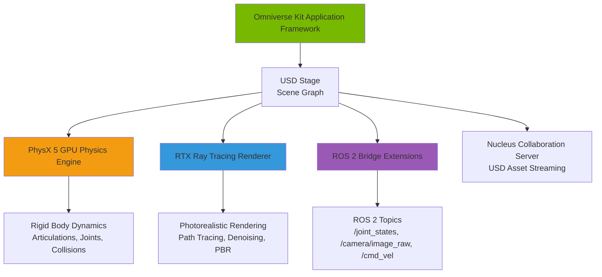

# 1.1 Isaac Sim Architecture

## Introduction

NVIDIA Isaac Sim is built on **NVIDIA Omniverse**, a platform for building and operating 3D applications and workflows. Understanding Isaac Sim's architecture is crucial for leveraging its GPU-accelerated capabilities effectively. This section covers the five core components: Omniverse Kit (application framework), PhysX 5 (physics engine), RTX (rendering engine), USD (Universal Scene Description format), and ROS 2 Bridge (robotics integration).

---

## Architecture Overview

Isaac Sim's architecture is designed for **massively parallel GPU computation**, enabling real-time simulation of complex robots with thousands of physics bodies, realistic sensors, and photorealistic rendering.



**Key Data Flow**:
1. **USD Stage** holds the scene graph (robots, environment, sensors, lights)
2. **PhysX 5** computes rigid body dynamics on GPU (10-100x faster than CPU physics)
3. **RTX Renderer** generates photorealistic images using ray tracing (camera sensors, human visualization)
4. **ROS 2 Bridge** publishes sensor data and subscribes to control commands
5. **Nucleus Server** provides centralized USD asset storage for collaboration (optional for single-user setups)

---

## 1. Omniverse Kit: Application Framework

**Omniverse Kit** is the extensible application framework powering Isaac Sim. It provides:

- **Extension System**: Modular architecture where features are loaded as extensions (e.g., URDF Importer, ROS 2 Bridge, Synthetic Data Recorder)
- **Python API**: `omni.isaac.core`, `omni.usd`, `omni.kit` modules for programmatic control
- **GUI Framework**: Built on ImGui for interactive scene editing, property inspection, viewport rendering
- **Multi-GPU Support**: Can distribute rendering and physics across multiple GPUs (advanced feature)

**Why It Matters**: The extension system allows you to customize Isaac Sim for your specific robotics needs. For example, you can write custom sensor extensions, add domain-specific robot controllers, or integrate with external tools.

**From Module 2 Perspective**: Think of Omniverse Kit as analogous to Gazebo's architecture, but GPU-native from the ground up. Where Gazebo uses plugins (URDF loaders, sensor plugins), Isaac Sim uses Omniverse extensions.

---

## 2. PhysX 5: GPU-Accelerated Physics Engine

**NVIDIA PhysX 5** is a real-time physics engine optimized for GPU computation. Key features for robotics:

### Rigid Body Dynamics

- **Articulations**: Hierarchical kinematic chains (robots with joints)
- **Reduced Coordinate Articulations**: Efficient representation using joint positions/velocities instead of per-link 6-DOF (degrees of freedom) - critical for humanoid robots with 30+ joints
- **Contact Solvers**: Projected Gauss-Seidel (PGS) and Temporal Gauss-Seidel (TGS) solvers for collision response
- **Solver Iterations**: Configurable (default 4-16 iterations; humanoid simulations often need 16-32 for stability)

### GPU Acceleration

PhysX 5 on GPU provides:
- **10-100x speedup** vs CPU physics for scenes with 100+ bodies
- **Parallel simulation**: Run 1000+ independent robot environments simultaneously (Isaac Gym/Lab use case for RL training)
- **Broadphase collision detection**: GPU-accelerated spatial hashing for fast collision queries
- **Narrow-phase collision**: GPU convex hull, mesh, and heightfield collision

**Configuration Parameters** (you'll set these in Section 1-4):
- `gravity`: Default `[0, 0, -9.81]` m/s²
- `simulation_frequency`: 60-120 Hz (higher for stable humanoid control)
- `solver_iterations`: 16-32 (humanoid robots need more iterations than wheeled robots)
- `contact_stiffness`: 10,000-100,000 (material-dependent)
- `contact_damping`: 10-1000 (higher damping stabilizes contacts but reduces realism)

**Real-Time Factor (RTF)**:
- RTF = simulation_time / wall_clock_time
- **RTF ≥1.0** means simulation runs as fast or faster than real-time
- Isaac Sim on RTX 3080 typically achieves **RTF 2.0-5.0** for single humanoid robot (headless mode)
- Drops to RTF 0.5-1.0 with photorealistic rendering enabled (still fast enough for most use cases)

---

## 3. RTX: Ray Tracing Rendering Engine

**NVIDIA RTX** provides photorealistic rendering using hardware-accelerated ray tracing (available on RTX 20-series GPUs and later).

### Rendering Techniques

1. **Path Tracing**: Physically-based light transport simulation (global illumination, soft shadows, caustics)
2. **Denoising**: AI-powered denoising using RTX tensor cores (reduces noise in renders with fewer samples)
3. **PBR Materials**: Physically-Based Rendering materials with metallic-roughness workflow (industry standard from USD/glTF)

### Key Components

- **Dome Lights (HDR Skyboxes)**: 360° environment lighting from HDR images (e.g., `sunflower_puresky_4k.exr` from Omniverse assets)
- **Area Lights**: Rectangular light sources for studio lighting setups
- **Emissive Materials**: Self-illuminating surfaces (e.g., LED indicators, screens)
- **Cameras**: Perspective, orthographic, and fisheye cameras with realistic lens effects (depth of field, motion blur)

### Rendering Modes

- **Interactive (Viewport)**: Real-time rasterization for scene editing (30-60 FPS on RTX GPUs)
- **RTX Interactive**: Real-time ray tracing with progressive refinement (used for visualization while simulation runs)
- **RTX Accurate**: Offline path tracing for final renders (not used in real-time simulation)

**For Robotics Simulation**:
- Use **headless mode** (`--headless` flag) for training/testing to skip rendering entirely (maximizes RTF)
- Use **RTX Interactive** when you need to visualize simulation behavior
- Camera sensors in simulation use RTX rendering to generate photorealistic images (for vision-based RL or perception testing)

---

## 4. USD: Universal Scene Description Format

**USD (Universal Scene Description)** is Pixar's open-source framework for encoding scalable, hierarchical 3D scenes. Isaac Sim uses USD as its native scene format.

### USD Stage Hierarchy

A typical Isaac Sim scene USD hierarchy:

```
/World                          # Root prim
├── /Environment                # Environment assets
│   ├── /Ground                 # Ground plane mesh
│   ├── /Obstacles              # Obstacles group
│   │   ├── /Box_01             # Box obstacle
│   │   └── /Cylinder_01        # Cylinder obstacle
│   └── /Lights                 # Lighting group
│       ├── /DomeLight          # HDR skybox
│       └── /AreaLight_01       # Studio light
├── /Humanoid                   # Robot articulation
│   ├── /base_link              # Root link (pelvis)
│   ├── /left_hip_yaw_link      # Child links
│   ├── /left_hip_roll_link
│   └── ...                     # All robot links
└── /Sensors                    # Sensor group
    ├── /Camera_RGB             # RGB camera
    ├── /Camera_Depth           # Depth camera
    └── /Lidar_2D               # 2D LiDAR
```

### USD Prims (Primitives)

- **Prim**: Basic scene entity (e.g., mesh, light, camera, articulation)
- **Attributes**: Properties of prims (e.g., `position`, `rotation`, `scale`, `mass`, `friction`)
- **Relationships**: Connections between prims (e.g., joint parent-child relationships)

### USD Composition

USD supports powerful composition features:
- **References**: Reuse USD assets (e.g., reference a robot USD in multiple scenes)
- **Layers**: Non-destructive editing by stacking USD layers (base layer + override layers)
- **Variants**: Multiple versions of an asset in one file (e.g., robot with/without sensors)

**From URDF Perspective**: URDF (XML) encodes robot kinematics and dynamics. USD encodes full 3D scenes with geometry, materials, lights, cameras, and physics. The URDF Importer extension converts URDF → USD articulation.

**File Extensions**:
- `.usd`: Binary USD (fast loading, smaller size)
- `.usda`: ASCII USD (human-readable, good for version control)
- `.usdc`: Crate USD (compressed binary)

---

## 5. ROS 2 Bridge: Robotics Integration

The **Isaac Sim ROS 2 Bridge** connects Isaac Sim with the ROS 2 ecosystem, enabling:

### Publishers (Isaac Sim → ROS 2)

- **Joint States**: `/joint_states` (sensor_msgs/JointState) - Robot articulation positions, velocities, efforts
- **Camera Images**: `/camera/image_raw` (sensor_msgs/Image) - RGB, depth, or segmentation images from Isaac Sim cameras
- **Point Clouds**: `/points` (sensor_msgs/PointCloud2) - 3D point clouds from depth cameras or LiDAR
- **Laser Scans**: `/scan` (sensor_msgs/LaserScan) - 2D laser scans from rotating LiDAR
- **Odometry**: `/odom` (nav_msgs/Odometry) - Ground-truth robot odometry from simulation
- **Clock**: `/clock` (rosgraph_msgs/Clock) - Simulation time for clock synchronization

### Subscribers (ROS 2 → Isaac Sim)

- **Velocity Commands**: `/cmd_vel` (geometry_msgs/Twist) - Linear and angular velocity commands for mobile robots
- **Joint Commands**: `/joint_commands` (trajectory_msgs/JointTrajectory) - Joint position/velocity/effort targets for manipulators and humanoid robots
- **Joint Position Control**: `/joint_position_controller/command` (std_msgs/Float64MultiArray) - Direct joint position control

### Clock Synchronization

**Critical for ROS 2 integration**: Isaac Sim publishes simulation time on `/clock` topic. ROS 2 nodes MUST use `use_sim_time:=true` parameter to synchronize with simulation time instead of system wall-clock time. This ensures proper sensor data timestamping and TF transforms.

**Bridge Architecture**:
```
Isaac Sim (PhysX simulation step)
    → Sensor data query (cameras, LiDAR, joint encoders)
    → ROS 2 message serialization (DDS middleware)
    → Publish to ROS 2 topics
    → ROS 2 subscribers (e.g., RViz, Nav2, custom nodes)

ROS 2 publishers (e.g., teleop, Nav2 controllers)
    → Publish control commands
    → Subscribe in Isaac Sim
    → Apply forces/positions to PhysX bodies
    → Simulation step with updated commands
```

**Latency**: Typical end-to-end latency (sensor reading → ROS 2 topic publish → subscriber callback) is **10-50ms** on localhost (same machine). This is acceptable for most robotics applications. See Section 1-5 for optimization techniques.

---

## 6. Nucleus Collaboration Server (Optional)

**NVIDIA Nucleus** is a database and collaboration engine for USD assets. Key features:

- **Asset Streaming**: Stream large USD scenes from Nucleus server to multiple Isaac Sim instances (reduces local disk storage)
- **Version Control**: Track USD asset versions (like Git for 3D scenes)
- **Collaboration**: Multiple users can edit the same USD scene simultaneously (non-destructive layer-based editing)
- **Access Control**: Permissions for USD assets (read-only, read-write)

**For Single-User Isaac Sim**: Nucleus is optional. You can work with local USD files (`file:///path/to/scene.usd`) without Nucleus. We'll use local USD files in this chapter for simplicity.

**For Teams**: Nucleus Enterprise is useful for sharing robot models, simulation environments, and training datasets across a team.

---

## Comparison: Isaac Sim vs Traditional Simulators

| Feature | Isaac Sim (GPU) | Gazebo Classic (CPU) | Gazebo Sim (CPU/GPU) |
|---------|-----------------|----------------------|----------------------|
| **Physics Engine** | PhysX 5 (GPU) | ODE, Bullet, DART | Bullet, DART, TPE |
| **Parallel Envs** | 1000+ (GPU) | 1 (CPU bottleneck) | 10-100 (GPU limited by rendering) |
| **RTF (Real-Time Factor)** | 2.0-10.0 single robot | 0.5-2.0 single robot | 0.8-3.0 single robot |
| **Rendering** | RTX ray tracing (photorealistic) | OpenGL (rasterization) | Ogre2 (rasterization, basic PBR) |
| **Scene Format** | USD (industry standard) | SDF (simulation-specific) | SDF (simulation-specific) |
| **ROS Integration** | ROS 2 Bridge extension | Native gazebo_ros_pkgs | Native ros_gz packages |
| **Use Cases** | Perception, RL training, photorealistic visualization | Prototyping, education | Prototyping, multi-robot simulation |

**When to use Isaac Sim**:
- GPU-accelerated perception testing (synthetic data generation for deep learning)
- Massively parallel RL training (1000+ environments for humanoid locomotion)
- Photorealistic visualization for presentations or sim-to-real validation
- Large-scale simulation (100+ robots in one scene)

**When to use Gazebo**:
- Quick prototyping with existing SDF models and plugins
- CPU-only servers (no NVIDIA GPU available)
- Educational environments where photorealism is not required

---

## Key Takeaways

1. **Isaac Sim = Omniverse Kit + PhysX 5 + RTX + USD + ROS 2 Bridge**
2. **GPU acceleration** enables 10-100x speedup vs CPU physics for parallel simulations
3. **USD format** is more powerful than URDF (full scenes with materials, lights, cameras, physics)
4. **RTX rendering** provides photorealistic camera sensors for vision-based robotics (not just visualization)
5. **ROS 2 Bridge** connects Isaac Sim to the ROS 2 ecosystem with low latency (~10-50ms)
6. **PhysX 5 articulations** efficiently simulate robots with 30+ joints (humanoid robots, quadrupeds)

---

## Further Reading

- **[NVIDIA Isaac Sim Documentation](https://docs.omniverse.nvidia.com/isaacsim/latest/)** - Official docs for installation, core API, and examples
- **[Omniverse USD Documentation](https://docs.omniverse.nvidia.com/usd/latest/)** - USD fundamentals, composition, and authoring
- **[PhysX 5 SDK Documentation](https://nvidia-omniverse.github.io/PhysX/physx/5.3.1/)** - Rigid body dynamics, articulations, and collision detection
- **[USD Official Documentation](https://openusd.org/release/index.html)** - Pixar's USD specification and tutorials
- **Research Paper**: "Isaac Gym: High Performance GPU-Based Physics Simulation For Robot Learning" (Makoviychuk et al., NeurIPS 2021) - Describes GPU-parallel RL training architecture

---

**Next**: [1.2 Installation and Setup →](./1-2-installation.md) - Let's install Isaac Sim and get hands-on!
