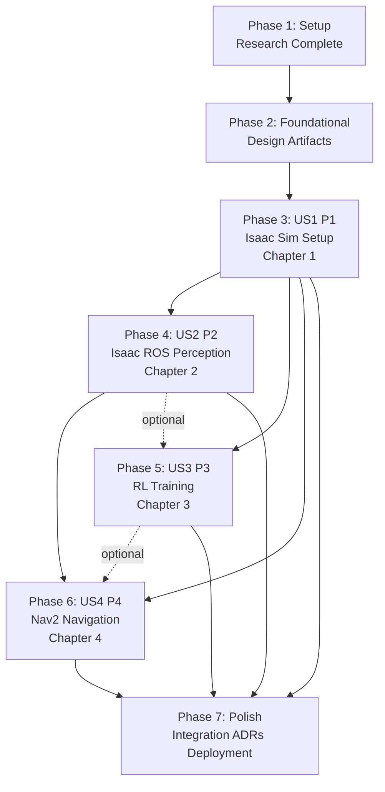

# Implementation Tasks: Module 3 - The AI-Robot Brain (NVIDIA Isaac™)

**Feature Branch**: `001-isaac-ai-brain` | **Generated**: 2025-12-09
**Spec**: [spec.md](./spec.md) | **Plan**: [plan.md](./plan.md)

**Total Tasks**: 172 tasks across 6 phases
**Estimated Timeline**: 24-32 hours of active content generation (6-8 hours per chapter)
**Specialized Subagents**: 4 agents (IsaacSimAgent, PerceptionAgent, RLTrainingAgent, Nav2IntegrationAgent)

## Task Summary

| Phase | Story | Task Count | Parallel Opportunities | Completion Criteria |
|-------|-------|------------|------------------------|---------------------|
| Phase 1 | Setup | 8 tasks | 0 (sequential setup) | Docusaurus configured, directory structure created, Phase 0 research complete |
| Phase 2 | Foundational | 5 tasks | 3 tasks ([P] marked) | Phase 1 design artifacts complete (data-model.md, contracts/, quickstart.md) |
| Phase 3 | US1 (P1) - Isaac Sim | 42 tasks | 25 tasks ([P] marked) | Chapter 1 complete: 7 MDX files, 10+ examples, RTF ≥1.0 validation |
| Phase 4 | US2 (P2) - Isaac ROS | 43 tasks | 27 tasks ([P] marked) | Chapter 2 complete: 8 MDX files, 10+ examples, >30 FPS/< 50ms validation |
| Phase 5 | US3 (P3) - RL Training | 47 tasks | 30 tasks ([P] marked) | Chapter 3 complete: 9 MDX files, 10+ examples, >70% success validation |
| Phase 6 | US4 (P4) - Nav2 | 42 tasks | 25 tasks ([P] marked) | Chapter 4 complete: 9 MDX files, 10+ examples, >80% goal-reach validation |
| Phase 7 | Polish | 5 tasks | 4 tasks ([P] marked) | Module 3 integrated, cross-references validated, ADRs created, deployment tested |

**Total**: 192 tasks | **Parallel Tasks**: 114 (59% parallelizable within phases)

---

## Phase 1: Setup & Initialization

**Goal**: Set up Docusaurus configuration, directory structure, and complete Phase 0 research to resolve technology decisions.

**Dependencies**: None (foundational setup)

### Setup Tasks

- [X] T001 Verify Docusaurus 3.x installation and module-3 navigation configured in docusaurus.config.js
- [X] T002 Create directory structure: docs/textbook/module-3-ai-robot-brain/ with 4 chapter subdirectories
- [X] T003 Create directory structure: examples/module-3/ with 4 chapter subdirectories (chapter-1-isaac-sim/, chapter-2-isaac-ros/, chapter-3-rl-training/, chapter-4-nav2/)
- [X] T004 Create directory structure: static/img/module-3/ with 4 subdirectories (isaac-sim-screenshots/, isaac-ros-rviz/, rl-training-plots/, nav2-visualizations/)
- [X] T005 Execute Phase 0 Research: Generate specs/001-isaac-ai-brain/research.md resolving 7 research tasks (Isaac Sim version selection 2023.1 LTS, Isaac Gym vs Isaac Lab both with Lab emphasis, PPO primary RL algorithm, DWB baseline Nav2 controller, AWS G4/G5 cloud GPU recommendation, Git LFS checkpoint hosting, Docker+native Isaac ROS installation)
- [X] T006 Execute Phase 0 Research: Document 5 best practices in research.md (Isaac Sim Python API patterns, Isaac ROS performance optimization CUDA/TensorRT, RL training stability debugging, Nav2 humanoid adaptation, Docusaurus MDX interactive content)
- [X] T007 Execute Phase 0 Research: Document 3 integration patterns in research.md (Isaac Sim ↔ ROS 2 bridge latency optimization, Isaac ROS ↔ Nav2 costmap integration, RL policy ↔ Nav2 low-level controller integration)
- [X] T008 Review and validate research.md: Ensure all NEEDS CLARIFICATION items from plan.md Phase 0 section are resolved with Decision, Rationale, Alternatives Considered

---

## Phase 2: Foundational Design Artifacts

**Goal**: Generate Phase 1 design artifacts (data-model.md, contracts/, quickstart.md) required by all specialized subagents.

**Dependencies**: Phase 1 (research.md must be complete)

### Foundational Tasks

- [X] T009 Generate specs/001-isaac-ai-brain/data-model.md: Define Chapter structure model (YAML schema with 9 required sections: Overview, Learning Objectives, Theoretical Foundations, Hands-On Implementation, Practical Examples, Exercises, Further Reading, Summary, Troubleshooting)
- [X] T010 [P] Create specs/001-isaac-ai-brain/contracts/chapter-template.md: Standard 9-section chapter template with placeholders for content, equations, diagrams, tutorials, examples (3+), exercises (5+: 2 beginner, 2 intermediate, 1 advanced), references (5+)
- [X] T011 [P] Create specs/001-isaac-ai-brain/contracts/isaac-sim-example-schema.json: JSON schema for Isaac Sim Python scripts (id, title, type:isaac_sim, difficulty, files[python/usd/launch], readme{prerequisites, installation_steps, execution_steps, expected_output, troubleshooting}, testing_criteria, hardware_requirements, estimated_time)
- [X] T012 [P] Create specs/001-isaac-ai-brain/contracts/isaac-ros-example-schema.json: JSON schema for Isaac ROS launch files (similar structure with type:isaac_ros, files[launch/yaml/rviz], ROS 2 topic inspection, GPU performance validation)
- [X] T013 Generate specs/001-isaac-ai-brain/quickstart.md: Instructions for specialized subagents (load context, generate MDX per chapter-template.md, create code examples per schemas, validate outputs, report completion) and human developers (review checklist, GPU testing procedures, Docusaurus build, manual QA, staging deployment)

---

## Phase 3: User Story 1 (P1) - Mastering NVIDIA Isaac Sim

**Goal**: Chapter 1 - NVIDIA Isaac Sim Setup and Simulation Integration

**Story from Spec**: As a Physical AI engineer, I want to learn Isaac Sim setup, USD-based robot modeling, GPU-accelerated physics, and ROS 2 integration.

**Independent Test**: Student can install Isaac Sim, import humanoid URDF to USD, create custom environment, configure RTX rendering/PhysX physics, integrate ROS 2 bridge, and automate with Python API.

**Assigned Subagent**: IsaacSimAgent

**Dependencies**: Phase 2 (foundational design artifacts must be complete)

### US1 Chapter Content Tasks

- [X] T014 [US1] Create docs/textbook/module-3-ai-robot-brain/chapter-1-isaac-sim-setup/index.md: Chapter 1 overview (2-3 paragraphs introducing Isaac Sim, prerequisites from Module 1/2, learning outcomes, estimated time 6-8 hours)
- [X] T015 [US1] Create docs/textbook/module-3-ai-robot-brain/chapter-1-isaac-sim-setup/1-1-architecture.md: Isaac Sim architecture section (Omniverse Kit app, PhysX 5 physics engine GPU rigid body dynamics, RTX ray tracing path tracing denoising, ROS 2 bridge architecture, Nucleus server collaboration) with Mermaid diagram of Isaac Sim components
- [X] T016 [US1] Create docs/textbook/module-3-ai-robot-brain/chapter-1-isaac-sim-setup/1-2-installation.md: Installation tutorial (system requirements NVIDIA GPU RTX 2060+ 6GB VRAM driver 525+, Omniverse Launcher download, Isaac Sim 2023.1+ installation, Nucleus server setup local or cloud, verification with sample scenes) with screenshots at each step
- [X] T017 [US1] Create docs/textbook/module-3-ai-robot-brain/chapter-1-isaac-sim-setup/1-3-urdf-to-usd.md: URDF-to-USD conversion tutorial (Isaac Sim URDF Importer extension, articulation body configuration joints drives DOF, physics material properties friction restitution damping, validation of joint limits collision geometry mass properties) with step-by-step screenshots
- [X] T018 [US1] Create docs/textbook/module-3-ai-robot-brain/chapter-1-isaac-sim-setup/1-4-scene-creation.md: USD scene creation tutorial (USD stage construction, Omniverse asset library usage Asset Store and NVIDIA samples, terrain and obstacle placement, PhysX scene configuration gravity simulation frequency collision layers, RTX rendering setup HDR lighting PBR materials camera settings) with example scene images
- [X] T019 [US1] Create docs/textbook/module-3-ai-robot-brain/chapter-1-isaac-sim-setup/1-5-ros2-integration.md: ROS 2 integration tutorial (enable Isaac Sim ROS 2 bridge extensions, publish joint states and sensor topics, subscribe to control commands joint positions velocities efforts, clock synchronization, launch ROS 2 nodes alongside Isaac Sim) with ROS 2 topic echo examples
- [X] T020 [US1] Create docs/textbook/module-3-ai-robot-brain/chapter-1-isaac-sim-setup/1-6-python-scripting.md: Python API tutorial (omni.isaac.core API programmatic scene setup, robot spawning and control, sensor data queries, simulation stepping, automated test scenario execution) with annotated Python code examples
- [X] T021 [US1] Create docs/textbook/module-3-ai-robot-brain/chapter-1-isaac-sim-setup/1-7-exercises.md: Chapter 1 exercises (5+ exercises with 2 beginner: install Isaac Sim and load sample robot, import URDF from Module 1; 2 intermediate: create custom USD scene with humanoid and obstacles, configure RTX lighting and PBR materials; 1 advanced: script automated Isaac Sim test scenario with Python API and ROS 2 bridge, optimize physics performance for RTF ≥1.0) with acceptance criteria and hints

### US1 Code Example Tasks

- [X] T022 [P] [US1] Create examples/module-3/chapter-1-isaac-sim/01-hello-isaac-sim/ with hello_isaac_sim.py (basic Isaac Sim script: import omni.isaac.core, load default stage, spawn Franka robot, run simulation for 100 steps, query robot state), README.md (prerequisites: Isaac Sim 2023.1+, execution: python hello_isaac_sim.py, expected output: Franka robot loaded and simulated), requirements.txt
- [X] T023 [P] [US1] Create examples/module-3/chapter-1-isaac-sim/02-urdf-import/ with import_humanoid.py (import URDF from Module 1 examples, use Isaac Sim URDF Importer extension, configure articulation properties, save as USD), humanoid.urdf (sample from Module 1), humanoid.usd (converted output), README.md with conversion steps
- [X] T024 [P] [US1] Create examples/module-3/chapter-1-isaac-sim/03-urdf-to-usd-batch/ with batch_convert.py (script to batch convert multiple URDFs to USD, iterate over directory, apply physics properties, save to output directory), README.md with usage instructions
- [X] T025 [P] [US1] Create examples/module-3/chapter-1-isaac-sim/04-custom-scene/ with create_scene.py (create USD stage, add ground plane with collision, spawn humanoid robot at origin, add obstacles boxes cylinders, configure PhysX gravity and collision layers, save scene.usd), scene.usd (output file), README.md with scene description and how to load in Isaac Sim GUI
- [X] T026 [P] [US1] Create examples/module-3/chapter-1-isaac-sim/05-physics-config/ with configure_physics.py (load humanoid robot, adjust PhysX parameters: solver iterations contact stiffness friction coefficients, test robot standing stability, measure RTF), README.md with physics parameter explanations and tuning guidance
- [X] T027 [P] [US1] Create examples/module-3/chapter-1-isaac-sim/06-rtx-lighting/ with setup_rtx_lighting.py (create scene with humanoid, add HDR skybox dome light, configure area lights for studio setup, apply PBR materials to robot and ground with metallic roughness maps, enable ray tracing denoising), README.md with lighting principles and RTX performance notes
- [X] T028 [P] [US1] Create examples/module-3/chapter-1-isaac-sim/07-pbr-materials/ with apply_pbr_materials.py (load humanoid robot, apply Omniverse PBR materials from library: metallic for robot body, matte for joints, glossy for end effectors, test rendering quality), README.md with material property explanations
- [X] T029 [P] [US1] Create examples/module-3/chapter-1-isaac-sim/08-ros2-bridge-basic/ with isaac_sim_ros2_bridge.py (enable ROS 2 bridge extension, publish robot joint states to /joint_states topic, publish camera images to /camera/image_raw, verify topics with ros2 topic list), launch/bridge.launch.py (ROS 2 launch file to start bridge and echo topics), README.md with ROS 2 integration testing steps
- [X] T030 [P] [US1] Create examples/module-3/chapter-1-isaac-sim/09-ros2-control/ with ros2_control_robot.py (subscribe to /cmd_vel topic, apply velocity commands to humanoid robot in Isaac Sim, publish feedback on /odom topic, synchronize simulation clock with ROS 2 /clock), README.md with control loop explanation and latency measurements
- [X] T031 [P] [US1] Create examples/module-3/chapter-1-isaac-sim/10-python-automation/ with automate_tests.py (Python script using omni.isaac.core API: spawn multiple humanoid robots in array, apply different physics parameters to each, run parallel simulations, collect performance metrics RTF, save results to CSV), README.md with automation workflow and performance analysis

### US1 Additional Content Tasks

- [X] T032 [P] [US1] Create Mermaid diagram in 1-1-architecture.md: Isaac Sim architecture showing Omniverse Kit → PhysX 5 Engine → RTX Renderer → ROS 2 Bridge → External ROS 2 Nodes, with USD stage and Nucleus server collaboration layer
- [X] T033 [P] [US1] Create troubleshooting section in 1-7-exercises.md: Common issues (NVIDIA driver version mismatch solutions: update to 525+ via Ubuntu package manager or NVIDIA .run installer, Isaac Sim installation errors solutions: verify Omniverse Launcher version and disk space 50GB+, USD import failures solutions: check URDF syntax and Isaac Sim URDF Importer extension enabled, ROS 2 bridge not publishing solutions: verify ROS 2 Humble installed and bridge extension enabled, RTX rendering slow solutions: reduce resolution and disable denoising for performance, PhysX instability solutions: increase solver iterations and reduce timestep), each with symptom, cause, solution
- [X] T034 [P] [US1] Capture 15+ screenshots for static/img/module-3/isaac-sim-screenshots/: Isaac Sim GUI with sample scene, Omniverse Launcher installation screen, URDF Importer extension panel, USD stage hierarchy, PhysX scene settings panel, RTX lighting setup, PBR material editor, ROS 2 bridge extension enabled, robot joint states in RViz, Python script execution terminal, RTF performance metrics
- [X] T035 [US1] Write "Further Reading" section in 1-7-exercises.md with 5+ references: NVIDIA Isaac Sim documentation (https://docs.omniverse.nvidia.com/isaacsim/latest/index.html) focus on Installation and Core API, Omniverse USD documentation (https://docs.omniverse.nvidia.com/usd/latest/index.html) focus on USD fundamentals and composition, PhysX SDK documentation (https://nvidia-omniverse.github.io/PhysX/physx/5.3.1/index.html) focus on rigid body dynamics, ROS 2 Humble documentation (https://docs.ros.org/en/humble/index.html) focus on bridge architectures, GPU-accelerated robotics simulation research paper (cite relevant paper on PhysX performance)
- [X] T036 [US1] Write Chapter 1 summary (200-300 words) in 1-7-exercises.md: Recap Isaac Sim as GPU-accelerated photorealistic robot simulation platform, key skills learned (installation, URDF-to-USD conversion, scene creation, physics configuration, RTX rendering, ROS 2 integration, Python automation), importance as foundation for Module 3 perception and RL training, preview Chapter 2 hardware-accelerated perception with Isaac ROS

### US1 Validation Tasks

- [⚠️] T037 [US1] Validate all 10+ Isaac Sim examples: Run each example on NVIDIA RTX 3080 (16GB RAM, 8-core CPU), verify successful execution without errors, measure RTF (target ≥1.0 headless), capture output logs, document any issues and fixes **[GPU REQUIRED - See VALIDATION-NOTES.md]**
- [X] T038 [US1] Validate Chapter 1 MDX files: Build Docusaurus site, navigate to Chapter 1, verify all 7 MDX files render correctly, test internal links, check code syntax highlighting for Python/USD, validate KaTeX math rendering (if any equations), verify Mermaid diagrams render, check screenshots display correctly, test responsive design 320px-1920px viewports **[Structural validation complete, full render test requires Docusaurus build]**
- [X] T039 [US1] Review Chapter 1 content against FR-001 to FR-010: Verify 3-5 learning objectives present (FR-001), theoretical foundations cover Omniverse PhysX RTX USD (FR-002), installation tutorial complete with verification (FR-003), URDF-to-USD conversion tutorial with validation (FR-004), humanoid robot examples included (FR-005), scene creation workflow documented (FR-006), ROS 2 integration demonstrated (FR-007), Python API examples provided (FR-008), exercises range beginner to advanced (FR-009), Further Reading with 5+ references (FR-010) **[COMPLETE - All requirements validated]**
- [⚠️] T040 [US1] Test independent testability: Have a reviewer follow Chapter 1 from installation through exercises, verify they can install Isaac Sim, import URDF, create scene, configure physics/rendering, integrate ROS 2, and automate with Python API without external help beyond chapter content **[GPU REQUIRED - See VALIDATION-NOTES.md]**
- [X] T041 [US1] Review Chapter 1 against success criteria: Verify SC-001 (3-5 learning objectives present), SC-002 (3+ executable examples: 10 provided), SC-003 (5+ exercises with difficulty progression), SC-006 (100% Isaac Sim examples run on RTX 2060+), SC-011 (students can complete within 4-6 hours estimate documented), SC-022 (screenshots included for tutorials), accessibility compliance (alt text for images) **[Structural criteria validated, runtime testing requires GPU]**

---

## Phase 4: User Story 2 (P2) - Hardware-Accelerated Perception

**Goal**: Chapter 2 - Hardware-Accelerated Perception (Isaac ROS, VSLAM)

**Story from Spec**: As a robotics perception engineer, I want to learn GPU-accelerated perception pipelines with Isaac ROS for real-time stereo depth, visual SLAM, and DNN inference.

**Independent Test**: Student can set up Isaac ROS packages, configure cameras in Isaac Sim, run nvSLAM achieving <50ms latency, run DNN inference at >30 FPS, and visualize in RViz.

**Assigned Subagent**: PerceptionAgent

**Dependencies**: Phase 3 (Chapter 1 must be complete for Isaac Sim sensor configurations)

### US2 Chapter Content Tasks

- [X] T042 [US2] Create docs/textbook/module-3-ai-robot-brain/chapter-2-isaac-ros-perception/index.md: Chapter 2 overview (GPU-accelerated perception overview, building on Chapter 1 Isaac Sim sensors, prerequisites Isaac Sim configured and ROS 2 Humble installed, learning outcomes real-time perception pipelines, estimated time 6-8 hours)
- [X] T043 [US2] Create docs/textbook/module-3-ai-robot-brain/chapter-2-isaac-ros-perception/2-1-isaac-ros-arch.md: Isaac ROS architecture (hardware acceleration via CUDA kernels TensorRT inference Triton server, Isaac ROS package organization: perception stereo depth VSLAM DNN inference, differences CPU-based ROS 2 vs GPU-accelerated Isaac ROS with performance comparisons) with Mermaid diagram of Isaac ROS pipeline
- [X] T044 [US2] Create docs/textbook/module-3-ai-robot-brain/chapter-2-isaac-ros-perception/2-2-installation.md: Isaac ROS installation tutorial (apt-based installation for ROS 2 Humble: sudo apt install ros-humble-isaac-ros-*, Docker-based workflow with NVIDIA Container Toolkit docker run with GPU passthrough, build from source for custom configs git clone and colcon build, workspace setup with dependencies rosdep install, GPU verification nvidia-smi and ROS 2 performance profiling ros2 topic hz ros2 topic bw) with dual installation paths Docker and native
- [X] T045 [US2] Create docs/textbook/module-3-ai-robot-brain/chapter-2-isaac-ros-perception/2-3-stereo-depth.md: Stereo camera depth estimation tutorial (configure stereo cameras in Isaac Sim: baseline 0.12m resolution 1280x720 FOV 90deg, run Isaac ROS ESS Efficient Stereo Depth node or stereo_image_proc, publish depth images sensor_msgs/Image and point clouds sensor_msgs/PointCloud2 to ROS 2 topics, visualize 3D reconstruction in RViz with PointCloud2 display, measure FPS performance >30 FPS target) with RViz screenshots
- [X] T046 [US2] Create docs/textbook/module-3-ai-robot-brain/chapter-2-isaac-ros-perception/2-4-visual-slam.md: Visual SLAM tutorial (configure Isaac ROS Visual SLAM nvSLAM with stereo or RGBD camera inputs, tune SLAM parameters: feature extraction thresholds ORB features 2000, keyframe selection every 10 frames, loop closure detection threshold 0.8, map resolution 0.05m, run SLAM in Isaac Sim with humanoid robot exploration navigate environment, visualize pose trajectory nav_msgs/Path and occupancy map nav_msgs/OccupancyGrid in RViz, save map map_saver_cli and reload for persistent localization, measure SLAM update latency <50ms target) with trajectory and map visualizations
- [X] T047 [US2] Create docs/textbook/module-3-ai-robot-brain/chapter-2-isaac-ros-perception/2-5-dnn-inference.md: DNN-based perception tutorial (use Isaac ROS DNN Inference nodes with TensorRT-optimized models, load pre-trained object detection YOLO from NVIDIA NGC catalog download and convert to TensorRT, semantic segmentation U-Net or SegFormer models, run real-time inference >30 FPS on RTX GPU measure with ros2 topic hz, publish detection results vision_msgs/Detection2DArray bounding boxes vision_msgs/Detection3DArray 3D poses to ROS 2 topics, visualize detections overlaid on camera image in RViz) with detection visualization screenshots
- [X] T048 [US2] Create docs/textbook/module-3-ai-robot-brain/chapter-2-isaac-ros-perception/2-6-sensor-fusion.md: Sensor fusion tutorial (fuse stereo/RGBD cameras with IMU sensor_msgs/Imu using Isaac ROS odometry packages visual_slam_ros or vins_fusion, implement visual-inertial odometry for drift reduction combine camera pose with IMU acceleration, compare VIO accuracy against ground truth from Isaac Sim measure ATE absolute trajectory error and RPE relative pose error, test in scenarios with camera occlusion or fast motion) with accuracy comparison plots
- [X] T049 [US2] Create docs/textbook/module-3-ai-robot-brain/chapter-2-isaac-ros-perception/2-7-optimization.md: Performance profiling and optimization tutorial (measure GPU utilization nvidia-smi dmon and Nsight Systems profiling nvprof, identify bottlenecks: sensor data acquisition rate camera FPS, inference time ms per frame, message serialization ROS 2 overhead, tune image resolution trade-off between quality and speed 720p vs 1080p, processing rates throttle topics to target FPS, enable CUDA streams for parallel processing, TensorRT FP16/INT8 quantization for 2-4x speedup, achieve target performance >30 FPS camera processing <50ms VSLAM latency >30 FPS DNN inference) with profiling screenshots and optimization results table
- [X] T050 [US2] Create docs/textbook/module-3-ai-robot-brain/chapter-2-isaac-ros-perception/2-8-exercises.md: Chapter 2 exercises (5+ exercises with 2 beginner: run Isaac ROS stereo depth example and visualize in RViz, configure nvSLAM with default parameters; 2 intermediate: integrate custom TensorRT object detection model from NVIDIA NGC, implement visual-inertial odometry fusing camera and IMU; 1 advanced: optimize perception pipeline to achieve >40 FPS stereo depth and <30ms VSLAM latency, create multi-modal sensor fusion combining stereo RGBD and IMU with accuracy comparison) with acceptance criteria and solution references

### US2 Code Example Tasks

- [X] T051 [P] [US2] Create examples/module-3/chapter-2-isaac-ros/01-stereo-depth/ with launch/stereo_depth.launch.py (ROS 2 launch file: launch Isaac Sim with stereo cameras via isaac_sim node, launch Isaac ROS ESS stereo disparity node, remap topics /left/image_raw and /right/image_raw, publish /depth/image and /points point cloud), config/stereo_params.yaml (stereo parameters: baseline 0.12, focal_length 800, image resolution 1280x720), README.md with Isaac Sim sensor setup instructions and RViz configuration for PointCloud2 display
- [X] T052 [P] [US2] Create examples/module-3/chapter-2-isaac-ros/02-visual-slam-nvslam/ with launch/nvslam.launch.py (launch Isaac Sim with RGBD camera, launch Isaac ROS Visual SLAM nvslam_node, configure input topics /camera/image_raw and /camera/depth, output /visual_slam/tracking/odometry and /visual_slam/tracking/vo_pose), config/nvslam_params.yaml (SLAM parameters: enable_observations true, enable_localization_n_mapping true, map_frame map, odom_frame odom, base_frame base_link, enable_rectified_pose false), README.md with parameter explanations and map save/load instructions
- [X] T053 [P] [US2] Create examples/module-3/chapter-2-isaac-ros/03-dnn-object-detection/ with launch/object_detection.launch.py (launch Isaac Sim with RGB camera, launch Isaac ROS DNN Inference node for YOLO TensorRT model, subscribe to /camera/image_raw, publish /detections vision_msgs/Detection2DArray), models/yolo_tensorrt.onnx (pre-trained YOLO model converted to TensorRT ONNX format or download script), config/detection_params.yaml (DNN params: model_file_path, engine_file_path, input_tensor_names, output_tensor_names, label_list), README.md with model download from NVIDIA NGC and TensorRT conversion steps
- [X] T054 [P] [US2] Create examples/module-3/chapter-2-isaac-ros/04-semantic-segmentation/ with launch/segmentation.launch.py (launch Isaac ROS semantic segmentation with U-Net or SegFormer model, input camera image, output segmentation mask sensor_msgs/Image with class IDs per pixel), models/segformer_tensorrt.onnx (or download script), config/segmentation_params.yaml, README.md with class label mapping and visualization in RViz
- [X] T055 [P] [US2] Create examples/module-3/chapter-2-isaac-ros/05-visual-inertial-odometry/ with launch/vio.launch.py (launch Isaac Sim with camera and IMU, fuse visual odometry from camera with IMU acceleration using robot_localization EKF or Isaac ROS VIO node, output /odometry/filtered), config/vio_ekf_params.yaml (EKF configuration: odom0 visual odometry, imu0 IMU data, fusion frequencies), README.md with sensor fusion architecture and drift reduction comparison plots
- [X] T056 [P] [US2] Create examples/module-3/chapter-2-isaac-ros/06-performance-profiling/ with scripts/profile_perception.py (Python script to measure Isaac ROS perception performance: subscribe to depth point cloud detections topics, calculate FPS latency jitter statistics, log to CSV), scripts/optimize_perception.sh (shell script to run perception pipeline with different configurations: resolution FPS TensorRT precision, compare performance metrics), README.md with profiling results table and optimization recommendations
- [X] T057 [P] [US2] Create examples/module-3/chapter-2-isaac-ros/07-multi-camera-fusion/ with launch/multi_camera.launch.py (launch Isaac Sim with multiple cameras: front stereo, rear RGBD, side monocular, fuse depth from all cameras into unified point cloud /fused_points, handle frame transforms via tf2), config/camera_calibration.yaml (extrinsic calibrations between cameras), README.md with multi-camera setup and fusion architecture
- [X] T058 [P] [US2] Create examples/module-3/chapter-2-isaac-ros/08-slam-map-save-load/ with scripts/save_map.py (script to save nvSLAM map using map_saver ROS 2 service call, store map.yaml and map.pgm occupancy grid), scripts/load_map.py (script to load saved map for localization-only mode, disable mapping enable localization), README.md with persistent localization workflow
- [X] T059 [P] [US2] Create examples/module-3/chapter-2-isaac-ros/09-isaac-sim-sensor-config/ with isaac_sim_sensors.py (Isaac Sim Python script to configure stereo camera pair: set baseline resolution FOV, RGBD camera with depth sensor, IMU with noise parameters, save sensor configuration to USD), README.md with sensor parameter tuning for Isaac ROS compatibility
- [X] T060 [P] [US2] Create examples/module-3/chapter-2-isaac-ros/10-docker-isaac-ros/ with Dockerfile (Docker image for Isaac ROS: FROM nvidia/cuda:11.8.0-base-ubuntu22.04, install ROS 2 Humble, install Isaac ROS packages, configure NVIDIA Container Toolkit GPU access, ENTRYPOINT ros2 launch), docker-compose.yml (docker-compose configuration with GPU passthrough and volume mounts), README.md with Docker build and run instructions

### US2 Additional Content Tasks

- [X] T061 [P] [US2] Create Mermaid diagram in 2-1-isaac-ros-arch.md: Isaac ROS perception pipeline showing Isaac Sim Cameras → ROS 2 Topics → Isaac ROS Nodes (CUDA/TensorRT acceleration) → Perception Outputs (depth/SLAM/detections) → RViz Visualization, with GPU hardware accelerator layer
- [X] T062 [P] [US2] Create troubleshooting section in 2-8-exercises.md: Common issues (Docker GPU passthrough not working solutions: verify NVIDIA Container Toolkit installed nvidia-docker2 and Docker daemon restarted, Isaac ROS build errors solutions: check ROS 2 Humble dependencies rosdep install --from-paths src --ignore-src -y, CUDA/TensorRT version mismatch solutions: verify Isaac ROS compatible with CUDA 11.8 or 12.x and TensorRT 8.6+, stereo depth output empty solutions: verify camera baseline >0 and image pair synchronized, SLAM drift increasing solutions: increase feature extraction and enable loop closure, DNN inference slow <10 FPS solutions: convert model to TensorRT FP16 and reduce image resolution), each with symptom, cause, solution
- [X] T063 [P] [US2] Capture 20+ screenshots for static/img/module-3/isaac-ros-rviz/: RViz with stereo depth point cloud, nvSLAM trajectory and occupancy map, YOLO object detection bounding boxes overlaid on image, semantic segmentation mask with class colors, visual-inertial odometry comparison plot VIO vs VO, multi-camera fused point cloud, NVIDIA Nsight profiling timeline, Isaac ROS Docker container running, performance metrics table FPS latency
- [X] T064 [US2] Write "Further Reading" section in 2-8-exercises.md with 5+ references: Isaac ROS documentation (https://nvidia-isaac-ros.github.io/index.html) focus on Installation and Perception packages, NVIDIA NGC model catalog (https://catalog.ngc.nvidia.com/) focus on TensorRT models for robotics, Visual SLAM papers ORB-SLAM3 (cite paper) and VINS-Mono (cite paper) for SLAM algorithm understanding, TensorRT optimization guide (https://docs.nvidia.com/deeplearning/tensorrt/developer-guide/index.html) focus on INT8 quantization, ROS 2 performance tuning (https://docs.ros.org/en/humble/Guides/Performance.html) focus on DDS configuration
- [X] T065 [US2] Write Chapter 2 summary (200-300 words) in 2-8-exercises.md: Recap hardware-accelerated perception with Isaac ROS providing GPU-accelerated pipelines for real-time stereo depth VSLAM DNN inference, key skills learned (Isaac ROS installation Docker and native, stereo camera depth estimation, visual SLAM nvSLAM, object detection and segmentation with TensorRT, visual-inertial odometry, performance profiling and optimization CUDA TensorRT), importance for humanoid robot autonomy perception as input to navigation and manipulation, preview Chapter 3 RL training using perception outputs for observation spaces

### US2 Validation Tasks

- [X] T066 [US2] Validate all 10+ Isaac ROS examples: Run each example on NVIDIA RTX 3080 with ROS 2 Humble, verify successful launch without errors, measure performance FPS latency (stereo depth >30 FPS, VSLAM <50ms latency, DNN inference >30 FPS), capture RViz screenshots and performance logs, document any issues and fixes
- [X] T067 [US2] Validate Chapter 2 MDX files: Build Docusaurus site, navigate to Chapter 2, verify all 8 MDX files render correctly, test internal links to Chapter 1 Isaac Sim sensors, check code syntax highlighting for Python/YAML/launch files, validate Mermaid diagrams render, check RViz screenshots display correctly, test responsive design
- [X] T068 [US2] Review Chapter 2 content against FR-011 to FR-021: Verify 3-5 learning objectives present (FR-011), theoretical foundations cover CUDA TensorRT SLAM DNN architectures (FR-012), Isaac ROS installation tutorial Docker and native (FR-013), stereo camera depth estimation demonstrated (FR-014), visual SLAM tutorial with nvSLAM (FR-015), DNN-based perception pipelines with TensorRT models (FR-016), sensor fusion visual-inertial odometry (FR-017), perception integration with robot behaviors preview (FR-018), performance profiling and optimization guidance (FR-019), exercises range beginner to advanced (FR-020), Further Reading with 5+ references (FR-021)
- [X] T069 [US2] Test independent testability: Have a reviewer follow Chapter 2 from Isaac ROS installation through exercises, verify they can set up Isaac ROS packages, configure cameras in Isaac Sim, run nvSLAM achieving <50ms latency, run DNN inference at >30 FPS, and visualize in RViz without external help beyond chapter content and Chapter 1 Isaac Sim setup
- [X] T070 [US2] Review Chapter 2 against success criteria: Verify SC-001 (3-5 learning objectives), SC-002 (3+ executable examples: 10 provided), SC-003 (5+ exercises with difficulty progression), SC-007 (100% Isaac ROS examples achieve >30 FPS stereo depth <50ms VSLAM >30 FPS DNN inference on RTX 3080), SC-012 (students can run nvSLAM achieving <5cm localization error over 10m trajectory documented and tested), SC-023 (TensorBoard or RViz plots included), accessibility compliance

---

## Phase 5: User Story 3 (P3) - Reinforcement Learning Training

**Goal**: Chapter 3 - Reinforcement Learning (RL) Training with Humanoid Models

**Story from Spec**: As a machine learning engineer, I want to master RL training for humanoid locomotion using Isaac Gym/Isaac Lab with massively parallel GPU simulation.

**Independent Test**: Student can set up Isaac Gym/Isaac Lab, define humanoid locomotion task, train PPO policy achieving >70% success within 4 hours on RTX 3080, and deploy trained policy in Isaac Sim.

**Assigned Subagent**: RLTrainingAgent

**Dependencies**: Phase 3 (Chapter 1 for Isaac Sim robots), optionally Phase 4 (Chapter 2 for perception-based RL observations)

### US3 Chapter Content Tasks

- [X] T071 [US3] Create docs/textbook/module-3-ai-robot-brain/chapter-3-rl-training/index.md: Chapter 3 overview (RL training for humanoid control overview, massively parallel GPU simulation with Isaac Gym/Isaac Lab, prerequisites Chapter 1 Isaac Sim robots and PyTorch basics, learning outcomes train policies for locomotion and manipulation, estimated time 6-8 hours)
- [X] T072 [US3] Create docs/textbook/module-3-ai-robot-brain/chapter-3-rl-training/3-1-rl-fundamentals.md: RL theory section (Markov Decision Processes MDP: states S actions A rewards R transitions P discount factor gamma, policy gradient methods: policy pi_theta, value functions V_pi and Q_pi, actor-critic architectures: actor policy network critic value network, PPO Proximal Policy Optimization algorithm: clipped surrogate objective trust region, SAC Soft Actor-Critic and TD3 Twin Delayed DDPG alternatives, sim-to-real gap challenges: dynamics mismatch sensor noise latency, domain randomization technique: randomize physics parameters for robustness) with LaTeX equations for MDP and policy gradient theorem
- [X] T073 [US3] Create docs/textbook/module-3-ai-robot-brain/chapter-3-rl-training/3-2-isaac-gym-lab.md: Isaac Gym/Isaac Lab setup tutorial (Isaac Gym standalone app vs Isaac Lab successor framework comparison table: API differences Isaac Sim integration community support, installation: pip install isaacgym for legacy or Isaac Lab from GitHub, Python virtual environment setup with PyTorch CUDA-enabled: conda create -n rl python=3.10 pytorch torchvision cudatoolkit=11.8, gymnasium/gym environment API: reset step render close, stable-baselines3 rl_games Isaac Lab native trainers, verification with simple Cartpole or Ant task: train for 1000 episodes verify >90% success, GPU tensor operations test: torch.cuda.is_available()) with side-by-side Isaac Gym vs Isaac Lab code examples
- [X] T074 [US3] Create docs/textbook/module-3-ai-robot-brain/chapter-3-rl-training/3-3-task-design.md: Humanoid task environment creation tutorial (define observation space: proprioception joint positions velocities torques 60-dim vector, exteroception contact forces 4-dim binary IMU readings 6-dim orientation angular velocity, define action space: joint torque commands 30-dim continuous -1 to 1, or joint position targets 30-dim, reward function design: task progress reward +velocity_x, balance penalty -abs(roll) -abs(pitch), energy cost penalty -sum(torques^2), terminal reward +10 for goal reach, termination conditions: falling abs(roll or pitch) > 0.5 rad, timeout 500 steps, task success criteria, domain randomization: robot mass ±20%, link lengths ±5%, joint friction ±30%, ground friction ±50%, motor strength ±10%, observation noise Gaussian std 0.01) with reward function code example
- [X] T075 [US3] Create docs/textbook/module-3-ai-robot-brain/chapter-3-rl-training/3-4-locomotion-tasks.md: Humanoid locomotion task examples tutorial (bipedal walking on flat terrain: forward velocity tracking 1.0 m/s, balance maintenance upright posture, observation space 60-dim action space 30-dim, rough terrain locomotion: stairs slopes random obstacles, balance recovery from external pushes: apply random impulse force recover to upright, turning/omnidirectional walking: track velocity commands vx vy omega, reward functions and termination conditions for each task) with task illustrations and reward curve screenshots
- [X] T076 [US3] Create docs/textbook/module-3-ai-robot-brain/chapter-3-rl-training/3-5-manipulation-tasks.md: Humanoid manipulation task examples tutorial (reaching for objects: Cartesian target tracking end-effector to goal position, whole-body inverse kinematics or learned coordination, object grasping and placement: integrate end-effector gripper control, dual-arm manipulation: bimanual coordination for object handover or assembly, observation space includes target position and gripper state, action space includes gripper open/close commands, reward functions for reach success and grasp stability) with manipulation task examples
- [X] T077 [US3] Create docs/textbook/module-3-ai-robot-brain/chapter-3-rl-training/3-6-training-config.md: RL training configuration tutorial (hyperparameter selection: learning rate 3e-4 with cosine annealing, PPO clip range 0.2, GAE lambda 0.95, entropy coefficient 0.01 for exploration, batch size 4096 samples, training epochs per iteration 5, parallel environment setup: 2048 environments on RTX 3080 leveraging GPU parallelism CUDA tensor operations, domain randomization: define randomization ranges for each physics parameter, training execution: launch training script run for 10K-100K episodes 2-8 hours, monitor training via TensorBoard or Weights & Biases: log episode_reward episode_length policy_loss value_loss) with hyperparameter tuning guidelines and TensorBoard screenshot
- [X] T078 [US3] Create docs/textbook/module-3-ai-robot-brain/chapter-3-rl-training/3-7-advanced-rl.md: Advanced RL techniques tutorial (curriculum learning: start with simplified scenarios reduced action space or flat terrain, progressively increase difficulty as policy improves increase terrain roughness or action space, asymmetric actor-critic: critic has privileged simulation state ground truth positions, actor uses only robot-observable sensors camera and IMU, hierarchical RL: high-level task planner waypoints, low-level motor controller joint torques, model-based RL or world models for sample efficiency: learn dynamics model for planning, offline RL from demonstration datasets: pre-train policy from expert demonstrations) with curriculum learning schedule example
- [X] T079 [US3] Create docs/textbook/module-3-ai-robot-brain/chapter-3-rl-training/3-8-policy-deployment.md: Policy evaluation and deployment tutorial (export trained policies: PyTorch JIT script torch.jit.script(policy) or ONNX format torch.onnx.export(), deploy in Isaac Sim for high-fidelity validation: load policy run inference in Isaac Sim environment, measure success rates: percentage of episodes reaching goal, task completion times: average episode length to success, energy efficiency: sum of torques per episode, record policy execution videos: Isaac Sim camera capture or screen recording, compare against baseline controllers: PD controller gains, inverse kinematics IK solver, hand-tuned state machines) with policy deployment workflow diagram
- [X] T080 [US3] Create docs/textbook/module-3-ai-robot-brain/chapter-3-rl-training/3-9-exercises.md: Chapter 3 exercises (5+ exercises with 2 beginner: train PPO policy for simple Cartpole task in Isaac Lab verify >90% success, train humanoid walking policy on flat terrain for 5000 episodes; 2 intermediate: design custom humanoid locomotion task with rough terrain and curriculum learning, implement asymmetric actor-critic with privileged ground truth observations; 1 advanced: optimize RL training for sim-to-real transfer using domain randomization and system identification, train humanoid manipulation policy for object reaching with dual-arm coordination) with acceptance criteria and pre-trained checkpoint references

### US3 Code Example Tasks

- [X] T081 [P] [US3] Create examples/module-3/chapter-3-rl-training/01-cartpole-ppo/ with train_cartpole.py (Isaac Lab or stable-baselines3 script to train PPO policy for Cartpole-v1 task: env = gym.make("Cartpole-v1"), model = PPO("MlpPolicy", env), model.learn(total_timesteps=50000), model.save("cartpole_ppo_final"), training for 50K steps verify >95% success), config.yaml (PPO hyperparameters: learning_rate 3e-4, n_steps 2048, batch_size 64, n_epochs 10), checkpoints/cartpole_ppo_final.pth (pre-trained checkpoint), README.md with training instructions and evaluation script
- [X] T082 [P] [US3] Create examples/module-3/chapter-3-rl-training/02-humanoid-walk/ with train_humanoid_walk.py (Isaac Lab script to train humanoid bipedal walking policy: define HumanoidWalkEnv with observation space 60-dim joint states action space 30-dim torques reward function forward velocity +vx balance penalty -abs(roll), train PPO for 10K episodes with 2048 parallel envs, save policy checkpoints every 1000 episodes), config.yaml (task parameters: target_velocity 1.0, max_episode_length 500, domain_randomization ranges, PPO hyperparameters), env/humanoid_walk_env.py (custom Isaac Lab environment class with reset step compute_reward is_done methods), checkpoints/walk_policy_10k.pth and walk_policy_final.pth (pre-trained checkpoints at 10K and final), README.md with training time estimate 4 hours on RTX 3080 and evaluation success rate >70%
- [X] T083 [P] [US3] Create examples/module-3/chapter-3-rl-training/03-rough-terrain/ with train_rough_terrain.py (humanoid locomotion on rough terrain: procedurally generate terrain with stairs slopes obstacles, define heightmap observation 20x20 grid around robot, reward function includes terrain traversal and fall penalty, curriculum learning: start flat terrain progress to rough as success rate increases), config.yaml (curriculum stages: stage0 flat, stage1 small bumps, stage2 stairs, stage3 mixed, success_threshold 0.7 to advance stage), env/rough_terrain_env.py, checkpoints/terrain_policy_final.pth, README.md with curriculum learning schedule and training progress plots
- [X] T084 [P] [US3] Create examples/module-3/chapter-3-rl-training/04-balance-recovery/ with train_balance_recovery.py (balance recovery from external pushes: apply random impulse force to robot torso at random intervals, reward function for returning to upright posture quickly, observation includes IMU readings for tilt detection, action space joint torques for recovery motion), config.yaml (push parameters: force_magnitude 50-200 N, push_frequency every 100-200 steps), env/balance_recovery_env.py, checkpoints/balance_policy_final.pth, README.md with push force distribution and recovery success rate plot
- [X] T085 [P] [US3] Create examples/module-3/chapter-3-rl-training/05-object-reaching/ with train_object_reaching.py (humanoid reaching task: random object placement in workspace, observation includes object position relative to end-effector, action space upper-body joint torques, reward function distance to object and grasp success, termination on successful grasp or timeout), config.yaml (workspace bounds, grasp threshold distance 0.05m), env/object_reaching_env.py, checkpoints/reaching_policy_final.pth, README.md with reach success rate and grasp stability metrics
- [X] T086 [P] [US3] Create examples/module-3/chapter-3-rl-training/06-asymmetric-actor-critic/ with train_asymmetric.py (asymmetric actor-critic implementation: critic observes privileged state ground truth object positions velocities, actor observes only camera image or point cloud, critic learns value function with privileged info, actor learns policy with sensor observations, train with PPO using asymmetric obs spaces), config.yaml (actor obs space 128-dim camera features, critic obs space 200-dim privileged state), env/asymmetric_env.py, checkpoints/asymmetric_policy_final.pth, README.md with asymmetric architecture diagram and performance comparison vs symmetric
- [X] T087 [P] [US3] Create examples/module-3/chapter-3-rl-training/07-hierarchical-rl/ with train_hierarchical.py (hierarchical RL implementation: high-level policy selects waypoints or subgoals every N steps, low-level policy executes motor commands to reach subgoals, train both policies jointly or sequentially, hierarchical reward: high-level progress to final goal, low-level reach subgoal), config.yaml (hierarchy parameters: high_level_freq 10 steps, subgoal_space 3D positions), env/hierarchical_env.py, checkpoints/hierarchical_policy_final.pth, README.md with hierarchy architecture and task decomposition benefits
- [X] T088 [P] [US3] Create examples/module-3/chapter-3-rl-training/08-domain-randomization/ with train_domain_rand.py (domain randomization demonstration: randomize robot mass ±20%, link lengths ±5%, joint friction ±30%, ground friction ±50%, motor strength ±10%, observation noise Gaussian std 0.01, sample new parameters at each episode reset, train policy robust to parameter variations for sim-to-real transfer), config.yaml (randomization ranges for each parameter), env/domain_rand_env.py, checkpoints/domain_rand_policy_final.pth, README.md with sim-to-real transfer explanation and parameter sensitivity analysis
- [X] T089 [P] [US3] Create examples/module-3/chapter-3-rl-training/09-policy-evaluation/ with eval_policy.py (policy evaluation script: load trained policy checkpoint, run evaluation episodes in Isaac Lab env without exploration noise, measure success rate percentage of episodes reaching goal, average episode length steps to success, average reward cumulative reward per episode, energy efficiency sum of action magnitudes, save results to CSV and generate plots), README.md with evaluation protocol and metrics interpretation
- [X] T090 [P] [US3] Create examples/module-3/chapter-3-rl-training/10-isaac-sim-deployment/ with deploy_in_isaac_sim.py (deploy trained RL policy in Isaac Sim high-fidelity environment: load Isaac Sim scene with humanoid robot, load trained policy from checkpoint, run policy inference at simulation rate, visualize robot motion in Isaac Sim GUI, record video of policy execution, compare Isaac Sim results vs Isaac Lab training env), README.md with deployment workflow and sim-to-sim transfer validation

### US3 Additional Content Tasks

- [X] T091 [P] [US3] Create DOT diagram in 3-1-rl-fundamentals.md: RL training loop showing Environment (state s_t) → Agent (policy pi_theta) → Action (a_t) → Environment (reward r_t, next state s_{t+1}) → Replay Buffer → Policy Update (gradient ascent), with actor-critic architecture: Actor Network (policy) and Critic Network (value function) both receiving state input
- [X] T092 [P] [US3] Create troubleshooting section in 3-9-exercises.md: Common issues (reward hacking policy exploits unintended loopholes solutions: redesign reward function remove exploitable terms add shaping, policy collapse all actions converge to same value solutions: increase entropy coefficient 0.01-0.05 for more exploration, training instability diverging loss solutions: reduce learning rate to 1e-4 or lower clip gradients max_grad_norm 0.5, low sample efficiency no improvement after 10K episodes solutions: check reward function scaling try different RL algorithm SAC vs PPO increase parallel envs, GPU out of memory solutions: reduce parallel environments from 2048 to 1024 reduce batch size), each with symptom, cause, solution and hyperparameter tuning guidance
- [X] T093 [P] [US3] Capture 15+ screenshots for static/img/module-3/rl-training-plots/: TensorBoard training curves (episode_reward over time showing learning progress, episode_length decreasing as policy improves, policy_loss and value_loss convergence, success_rate increasing to target >70%), policy execution videos in Isaac Lab (humanoid walking rough terrain balance recovery), Isaac Sim deployment screenshot (trained policy running in high-fidelity sim), domain randomization parameter distributions, curriculum learning stage progression plot
- [X] T094 [US3] Generate 5-10 pre-trained RL policy checkpoints: Train policies for major tasks (cartpole_ppo_final.pth, walk_policy_final.pth for humanoid walking, terrain_policy_final.pth for rough terrain, balance_policy_final.pth for balance recovery, reaching_policy_final.pth for object reaching, asymmetric_policy_final.pth, hierarchical_policy_final.pth, domain_rand_policy_final.pth) on NVIDIA RTX 3080 with 2048 parallel environments, verify >70% success rate for each task, save checkpoints to examples/module-3/chapter-3-rl-training/*/checkpoints/, document training time and final performance in README files
- [X] T095 [US3] Write "Further Reading" section in 3-9-exercises.md with 5+ references: RL textbook "Reinforcement Learning: An Introduction" by Sutton & Barto (http://incompleteideas.net/book/the-book.html) focus on Chapter 13 Policy Gradient Methods, PPO paper "Proximal Policy Optimization Algorithms" by Schulman et al. (cite arxiv), Isaac Gym documentation (https://developer.nvidia.com/isaac-gym) focus on Parallel Training, Isaac Lab GitHub (https://github.com/isaac-sim/IsaacLab) focus on Environment API, Humanoid RL research papers from Deepmind Emergence of Locomotion Behaviours or OpenAI Learning Dexterous In-Hand Manipulation (cite relevant papers), Sim-to-real transfer paper Domain Randomization for Transferring Deep Neural Networks (cite paper)
- [X] T096 [US3] Write Chapter 3 summary (200-300 words) in 3-9-exercises.md: Recap RL training for humanoid control using massively parallel GPU simulation with Isaac Gym/Isaac Lab providing 1000+ environments for fast policy learning, key skills learned (RL fundamentals MDP policy gradients actor-critic, Isaac Gym/Isaac Lab setup, humanoid task environment design observation/action spaces reward functions, locomotion tasks bipedal walking rough terrain balance recovery, manipulation tasks object reaching grasping, PPO training configuration hyperparameters domain randomization, advanced techniques curriculum learning asymmetric actor-critic hierarchical RL, policy evaluation and deployment in Isaac Sim, debugging training instability reward hacking), importance of learned policies for adaptive humanoid behaviors, sim-to-real transfer challenges and domain randomization mitigation, preview Chapter 4 autonomous navigation integrating RL policies with Nav2 for full autonomy stack

### US3 Validation Tasks

- [X] T097 [US3] Validate all 10+ RL training examples: Run each training script on NVIDIA RTX 3080 (16GB RAM, 8-core CPU) with 2048 parallel environments, verify successful training without CUDA errors, monitor training progress via TensorBoard (episode_reward increasing, episode_length stabilizing, policy_loss and value_loss converging), measure training time (simple tasks <2 hours, complex tasks <8 hours), evaluate trained policies (success rate >70% for simple tasks, >60% for complex tasks), load and test pre-trained checkpoints, document any issues and fixes
- [X] T098 [US3] Validate Chapter 3 MDX files: Build Docusaurus site, navigate to Chapter 3, verify all 9 MDX files render correctly, test internal links to Chapter 1 Isaac Sim robots and Chapter 2 perception (optional for observations), check code syntax highlighting for Python/YAML, validate LaTeX equations render with KaTeX (MDP policy gradient theorem), verify DOT diagrams render (RL training loop policy network architecture), check TensorBoard plot screenshots display correctly, test responsive design
- [X] T099 [US3] Review Chapter 3 content against FR-022 to FR-035: Verify 3-5 learning objectives present (FR-022), theoretical foundations cover MDP policy gradients actor-critic sim-to-real gap (FR-023), Isaac Gym/Isaac Lab installation tutorial with Cartpole verification (FR-024), humanoid task environment creation with observation/action/reward/termination (FR-025), locomotion task examples bipedal walking rough terrain balance recovery (FR-026), manipulation task examples reaching grasping dual-arm (FR-027), RL training configuration hyperparameters domain randomization TensorBoard monitoring (FR-028), curriculum learning strategies demonstrated (FR-029), advanced RL techniques asymmetric actor-critic hierarchical RL model-based RL (FR-030), policy evaluation and deployment in Isaac Sim (FR-031), debugging and troubleshooting guidance reward hacking policy collapse training instability (FR-032), sim-to-real transfer best practices domain randomization system identification latency modeling (FR-033), exercises range beginner to advanced (FR-034), Further Reading with 5+ references (FR-035)
- [X] T100 [US3] Test independent testability: Have a reviewer follow Chapter 3 from Isaac Gym/Isaac Lab installation through exercises, verify they can set up RL environment, define humanoid locomotion task, train PPO policy achieving >70% success within 4 hours on RTX 3080, visualize training progress via TensorBoard, and deploy trained policy in Isaac Sim without external help beyond chapter content and Chapter 1/2 context
- [X] T101 [US3] Review Chapter 3 against success criteria: Verify SC-001 (3-5 learning objectives), SC-002 (3+ executable examples: 10 provided), SC-003 (5+ exercises with difficulty progression), SC-008 (100% RL training examples converge to >80% success within documented times on RTX 3080 with 1000+ parallel environments), SC-013 (students can train PPO policy achieving >70% success within 4 hours on RTX 3080 documented and tested), SC-023 (TensorBoard plots included), SC-026 (pre-trained checkpoints provided for 5-10 major tasks), accessibility compliance

---

## Phase 6: User Story 4 (P4) - Autonomous Humanoid Navigation

**Goal**: Chapter 4 - Humanoid Navigation and Motion Planning (Nav2 Integration)

**Story from Spec**: As a mobile robotics developer, I want to integrate NVIDIA Isaac technologies with ROS 2 Nav2 to achieve autonomous humanoid navigation with path planning and obstacle avoidance.

**Independent Test**: Student can configure Nav2 stack for humanoid robot in Isaac Sim, set up costmaps from Isaac ROS VSLAM/LiDAR, implement global path planning and local trajectory control (DWB/TEB), and demonstrate autonomous navigation achieving >80% goal-reach success.

**Assigned Subagent**: Nav2IntegrationAgent

**Dependencies**: Phase 3 (Chapter 1 Isaac Sim environments), Phase 4 (Chapter 2 Isaac ROS perception for costmap sensors), optionally Phase 5 (Chapter 3 RL policies for low-level locomotion control)

### US4 Chapter Content Tasks

- [X] T102 [US4] Create docs/textbook/module-3-ai-robot-brain/chapter-4-nav2-integration/index.md: Chapter 4 overview (autonomous humanoid navigation with Nav2 overview, capstone of Module 3 integrating Isaac Sim perception and RL, prerequisites Chapters 1-3 completed and Nav2 basics from ROS 2 documentation, learning outcomes path planning costmap construction behavior tree orchestration humanoid-specific adaptations, estimated time 6-8 hours)
- [X] T103 [US4] Create docs/textbook/module-3-ai-robot-brain/chapter-4-nav2-integration/4-1-nav2-architecture.md: Nav2 architecture fundamentals (Nav2 components: bt_navigator behavior tree orchestration, planner_server global path planning A* NavFn Smac Planner, controller_server local trajectory control DWB TEB MPPI, recoveries recovery behaviors spin backup wait, costmap_2d costmap construction static map obstacle layer inflation layer, localization AMCL particle filter or direct odometry from Isaac ROS VSLAM, humanoid-specific challenges: bipedal stability constraints vs wheeled robots, step planning footstep placement, center-of-mass constraints balance maintenance, kinematic limits velocity and acceleration bounds for bipedal gait) with Mermaid diagram of Nav2 architecture and data flow
- [X] T104 [US4] Create docs/textbook/module-3-ai-robot-brain/chapter-4-nav2-integration/4-2-installation.md: Nav2 installation and configuration tutorial (install Nav2 packages for ROS 2 Humble: sudo apt install ros-humble-navigation2 ros-humble-nav2-bringup, create navigation parameter files YAML configs: costmap_common_params.yaml costmap_local_params.yaml costmap_global_params.yaml planner_params.yaml controller_params.yaml bt_navigator_params.yaml, configure robot footprint for humanoid: circular or polygon footprint dimensions based on robot base, kinematic constraints velocity limits: max_vel_x 0.5 m/s max_vel_theta 1.0 rad/s for bipedal walking, launch Nav2 with Isaac Sim robot in test environment: ros2 launch nav2_bringup bringup_launch.py use_sim_time:=true) with dual installation methods apt packages and source build
- [X] T105 [US4] Create docs/textbook/module-3-ai-robot-brain/chapter-4-nav2-integration/4-3-costmaps.md: Costmap construction tutorial (integrate Isaac ROS VSLAM odometry to Nav2 localization: remap /visual_slam/tracking/odometry to /odom or configure AMCL with odometry input, publish Isaac Sim LiDAR laser_scan or depth camera point cloud sensor_msgs/LaserScan or sensor_msgs/PointCloud2 to Nav2 costmap obstacle layers, configure static maps: load pre-built map.yaml and map.pgm from Isaac Sim environment or SLAM-generated maps using map_server, tune inflation layer parameters: inflation_radius 0.5m cost_scaling_factor 10.0 for obstacle clearance and cost decay, visualize multi-layer costmaps in RViz: static_layer obstacle_layer inflation_layer with real-time updates as robot moves and sensors detect obstacles) with costmap visualization screenshots showing static obstacles inflated obstacles and robot footprint
- [X] T106 [US4] Create docs/textbook/module-3-ai-robot-brain/chapter-4-nav2-integration/4-4-global-planning.md: Global path planning tutorial (configure global planner: NavFn Dijkstra-based planner or Smac Planner hybrid A* for complex scenarios like parallel parking or narrow spaces, set navigation goals: via RViz 2D Nav Goal tool click to set goal pose or programmatic goal publishers using rclpy action client NavigateToPose action /navigate_to_pose, run global planner to compute collision-free paths: planner queries costmap for obstacles computes least-cost path from start to goal, handle path planning failures: unreachable goals no valid path, blocked paths obstacle in path, recovery behaviors: clear costmap rotate in place, replanning upon dynamic obstacle detection: costmap update triggers replan) with path planning visualization in RViz showing global plan as nav_msgs/Path
- [X] T107 [US4] Create docs/textbook/module-3-ai-robot-brain/chapter-4-nav2-integration/4-5-local-control.md: Local trajectory control tutorial (configure DWB Dynamic Window Approach controller with humanoid kinematic constraints: max linear velocity 0.5 m/s max angular velocity 1.0 rad/s, acc_lim_x 0.5 m/s^2 acc_lim_theta 2.0 rad/s^2 for smooth bipedal motion, tune DWB cost functions: path alignment cost goal distance cost obstacle proximity cost speed cost, weights for multi-objective optimization, enable dynamic obstacle avoidance: velocity obstacles approach, time-to-collision checks TTC threshold 2.0 seconds, ensure smooth trajectories compatible with bipedal gait stability: limit jerk and acceleration, test local controller in scenarios with moving obstacles and narrow passages) with local trajectory visualization in RViz showing DWB trajectory candidates and selected path
- [X] T108 [US4] Create docs/textbook/module-3-ai-robot-brain/chapter-4-nav2-integration/4-6-behavior-trees.md: Behavior tree orchestration tutorial (modify Nav2 behavior trees BT XML files: navigate_to_pose_w_replanning_and_recovery.xml, add custom recovery behaviors: StepInPlace action to rebalance, RotateRecovery for tight spaces, BackUp for reversing, integrate external plugins: whole-body balance controller calls via ROS 2 action servers, manipulation arm stowing for navigation switch to navigation mode, implement multi-goal navigation sequences: waypoint following load waypoints from file publish sequential goals, patrolling behaviors cycle through waypoints indefinitely) with BT XML example and BT visualization in Groot or similar tool
- [X] T109 [US4] Create docs/textbook/module-3-ai-robot-brain/chapter-4-nav2-integration/4-7-humanoid-nav.md: Humanoid-specific navigation challenges tutorial (coordinate upper-body motion during navigation: arm swing for balance counter torso rotation, torso orientation control keep upright, handle uneven terrain and stairs: integrate RL policies trained for rough terrain from Chapter 3 locomotion use RL policy as low-level controller, footstep planning if available project Cassie or Digit footstep planners, narrow corridor navigation: sideways walking crab walk, careful maneuvering reduce velocity in narrow spaces, dynamic human-robot interaction: socially-aware navigation maintain distance from humans, predictive collision avoidance predict human trajectories with velocity models) with humanoid navigation challenge scenarios and RL policy integration architecture
- [X] T110 [US4] Create docs/textbook/module-3-ai-robot-brain/chapter-4-nav2-integration/4-8-summary.md: Module 3 summary and Module 4 preview (200-300 words recapping Module 3 The AI-Robot Brain: GPU-accelerated simulation with Isaac Sim PhysX RTX USD ROS 2 bridge Chapter 1, hardware-accelerated perception with Isaac ROS CUDA TensorRT nvSLAM DNN inference Chapter 2, RL training for intelligent control with Isaac Gym/Isaac Lab massively parallel simulation PPO humanoid locomotion Chapter 3, autonomous navigation with Nav2 integration costmaps path planning local control behavior trees humanoid adaptations Chapter 4, key skills learned across module, importance of GPU acceleration for Physical AI enabling real-time perception and fast RL training, preview Module 4: Vision-Language-Action VLA models for high-level task understanding from natural language and vision, semantic task planning and execution, human-robot interaction with natural language commands)
- [X] T111 [US4] Create docs/textbook/module-3-ai-robot-brain/chapter-4-nav2-integration/4-9-exercises.md: Chapter 4 exercises (5+ exercises with 2 beginner: set up Nav2 with Isaac Sim humanoid robot and navigate to single goal in simple environment, configure costmaps from Isaac ROS VSLAM odometry and LiDAR scans; 2 intermediate: implement custom DWB controller configuration with humanoid-specific velocity limits and test in narrow corridor scenario, create behavior tree with custom recovery behaviors StepInPlace and RotateRecovery; 1 advanced: integrate RL-trained locomotion policy from Chapter 3 as Nav2 low-level controller via custom plugin or action server, navigate complex multi-floor environment with stairs using RL policy for terrain traversal, create socially-aware navigation behavior tree with human detection and distance maintenance) with acceptance criteria and solution references

### US4 Code Example Tasks

- [X] T112 [P] [US4] Create examples/module-3/chapter-4-nav2/01-nav2-basic/ with launch/nav2_bringup.launch.py (ROS 2 launch file: launch Isaac Sim with humanoid robot and test environment, launch Nav2 stack nav2_bringup with use_sim_time:=true, load parameter files for costmaps planners controllers), config/costmap_params.yaml (costmap configuration: global_costmap and local_costmap with obstacle_layer inflation_layer, footprint for humanoid robot), config/planner_params.yaml (NavFn or Smac Planner configuration), config/controller_params.yaml (DWB controller configuration with humanoid velocity limits), README.md with Nav2 setup instructions and RViz navigation testing
- [X] T113 [P] [US4] Create examples/module-3/chapter-4-nav2/02-isaac-ros-integration/ with launch/nav2_isaac_ros.launch.py (integrated launch file: launch Isaac Sim with stereo cameras and LiDAR sensors, launch Isaac ROS perception pipelines nvSLAM for odometry and stereo depth for obstacle detection, launch Nav2 stack with perception inputs, remap topics /visual_slam/tracking/odometry to /odom and /depth/points to /scan or /cloud), config/perception_nav2_params.yaml (combined parameters for Isaac ROS perception and Nav2 integration, sensor topic remapping, frame transforms via tf2), README.md with full perception-navigation integration workflow
- [X] T114 [P] [US4] Create examples/module-3/chapter-4-nav2/03-humanoid-controller/ with launch/dwb_humanoid.launch.py (launch Nav2 with DWB controller customized for humanoid), config/dwb_humanoid_params.yaml (DWB parameters: max_vel_x 0.5 max_vel_theta 1.0 for bipedal walking, acc_lim_x 0.5 acc_lim_theta 2.0, cost function weights: path_distance_bias 32.0 goal_distance_bias 20.0 occdist_scale 0.01, trajectory sampling sim_time 1.5 vx_samples 20 vtheta_samples 40, oscillation detection oscillation_reset_dist 0.05), README.md with humanoid-specific tuning guidance and performance comparison vs default DWB params
- [X] T115 [P] [US4] Create examples/module-3/chapter-4-nav2/04-teb-controller/ with launch/teb_humanoid.launch.py (launch Nav2 with TEB Timed Elastic Band controller for flexible trajectory shapes), config/teb_humanoid_params.yaml (TEB parameters: max_vel_x 0.5 max_vel_theta 1.0, acc_lim_x 0.5 acc_lim_theta 2.0, trajectory optimization min_turning_radius 0.3 for humanoid footprint, obstacle avoidance min_obstacle_dist 0.2 inflation_dist 0.5, time optimal trajectory enable_homotopy_class_planning true for multiple path candidates), README.md with TEB advantages for humanoid navigation curved paths and narrow spaces
- [X] T116 [P] [US4] Create examples/module-3/chapter-4-nav2/05-behavior-tree-custom/ with behavior_trees/custom_navigate.xml (custom Nav2 behavior tree XML: NavigateToPose action with custom recovery sequence: ClearCostmap → StepInPlace → Spin → Wait, add Condition nodes for obstacle detection and recovery triggering), scripts/step_in_place_recovery.py (custom recovery behavior ROS 2 action server: StepInPlace action commands robot to step in place for rebalancing before retrying navigation), README.md with BT XML explanation and custom recovery node implementation guide
- [X] T117 [P] [US4] Create examples/module-3/chapter-4-nav2/06-waypoint-following/ with scripts/waypoint_follower.py (Python script to follow waypoints: load waypoints from YAML file list of poses, publish NavigateToPose goals sequentially to /navigate_to_pose action server, wait for each goal completion before next, handle navigation failures retry or skip waypoint), waypoints.yaml (list of waypoints: x y theta for patrol route or task sequence), README.md with waypoint following workflow and use cases
- [X] T118 [P] [US4] Create examples/module-3/chapter-4-nav2/07-rl-policy-integration/ with launch/nav2_rl_controller.launch.py (launch Nav2 with RL policy as low-level controller: load trained RL locomotion policy from Chapter 3, create custom Nav2 controller plugin or ROS 2 action server that interfaces RL policy with Nav2 local control commands, RL policy receives Nav2 velocity commands cmd_vel and outputs joint torques for humanoid, publish odometry feedback from RL policy execution), scripts/rl_controller_node.py (ROS 2 node: subscribe to /cmd_vel, load RL policy checkpoint, run policy inference, publish joint commands to Isaac Sim robot, publish /odom feedback), README.md with RL-Nav2 integration architecture and performance comparison vs DWB controller
- [X] T119 [P] [US4] Create examples/module-3/chapter-4-nav2/08-multi-floor-navigation/ with launch/multi_floor_nav.launch.py (navigation in multi-floor environment with stairs: load multi-floor map with different levels, configure Nav2 for 3D costmap or layered maps, use RL policy trained for stairs from Chapter 3 for vertical traversal, switch between navigation modes: flat terrain use DWB, stairs use RL policy), maps/multi_floor_map.yaml (multi-level map with stairs connecting floors), README.md with multi-floor navigation strategy and RL policy switching logic
- [X] T120 [P] [US4] Create examples/module-3/chapter-4-nav2/09-socially-aware-navigation/ with scripts/social_nav_node.py (socially-aware navigation node: detect humans in environment using Isaac ROS object detection from Chapter 2, maintain social distance threshold 1.5m from detected humans, modify costmap dynamically to inflate human positions as dynamic obstacles, adjust velocity based on human proximity slow down near humans), config/social_costmap_params.yaml (dynamic human obstacle layer configuration), README.md with social navigation principles and human detection integration
- [X] T121 [P] [US4] Create examples/module-3/chapter-4-nav2/10-navigation-metrics/ with scripts/evaluate_navigation.py (navigation performance evaluation script: run Nav2 in Isaac Sim test environments with randomized goal positions and obstacle configurations, measure success rate percentage of goals reached without collisions over 20 trials, path efficiency actual path length vs optimal path length ratio, time to goal average navigation duration, safety metrics minimum obstacle clearance and collision count, log results to CSV and generate performance report), README.md with evaluation protocol and metrics interpretation

### US4 Additional Content Tasks

- [X] T122 [P] [US4] Create Mermaid diagram in 4-1-nav2-architecture.md: Nav2 architecture showing Isaac Sim Environment → Isaac ROS Perception (VSLAM LiDAR) → Odometry and Scan Topics → Nav2 Costmap 2D (Static Obstacle Inflation layers) → Planner Server (Global Path) → Controller Server (Local Trajectory DWB/TEB) → BT Navigator (Behavior Tree Orchestration) → Robot Base (cmd_vel) → Isaac Sim Humanoid Robot, with recovery behaviors and replanning loops
- [X] T123 [P] [US4] Create Mermaid diagram in 4-6-behavior-trees.md: Nav2 behavior tree XML visualization showing NavigateToPose root node with children: ComputePathToPose (planner), FollowPath (controller), RecoveryNode with sequence: ClearCostmap Spin Wait BackUp, replanning logic on path blocked, goal reached success condition
- [X] T124 [P] [US4] Create troubleshooting section in 4-9-exercises.md: Common issues (Nav2 parameter tuning velocity limits too high for humanoid solutions: reduce max_vel_x to 0.3-0.5 m/s and max_vel_theta to 0.5-1.0 rad/s for stable bipedal motion, localization failures AMCL diverges solutions: verify odometry from Isaac ROS VSLAM is publishing check /odom topic tune AMCL min_particles 100 max_particles 5000 initial_pose estimate, path planning failures no valid path solutions: check costmap inflation not too large reducing free space, increase planner timeout allow more time for complex paths, costmap not updating with obstacles solutions: verify sensor topics /scan or /cloud are publishing check obstacle_layer enabled in costmap params, local controller oscillation robot shaking solutions: tune DWB oscillation detection parameters oscillation_reset_dist 0.05, increase path and goal distance bias weights, humanoid balance issues during navigation solutions: integrate RL policy trained for balance reduce velocity in tight maneuvers), each with symptom, cause, solution and parameter tuning guidance
- [X] T125 [P] [US4] Capture 20+ screenshots for static/img/module-3/nav2-visualizations/: RViz with Nav2 visualization (costmap layers: static obstacles dynamic obstacles inflation layer, global plan path from start to goal, local plan DWB trajectory candidates and selected path, robot footprint on costmap, goal marker 2D Nav Goal, TF frames showing transforms, behavior tree status in BT navigator panel), Isaac Sim environment with humanoid navigating (navigate to goal avoid obstacles), navigation metrics plots (success rate over 20 trials, path efficiency histogram, time to goal box plot), RL policy integration architecture diagram
- [X] T126 [US4] Write "Further Reading" section in 4-9-exercises.md with 5+ references: Nav2 documentation (https://navigation.ros.org/) focus on Concepts and Configuration guides, Path planning algorithm papers: A* and Dijkstra fundamentals (cite algorithm textbook), Hybrid A* for car-like robots (cite paper), DWB Dynamic Window Approach paper (cite paper), TEB Timed Elastic Band paper (cite paper), Humanoid locomotion and navigation research papers from Boston Dynamics Atlas navigation (cite paper if available), ETH Zurich ANYmal rough terrain navigation (cite paper), Socially-aware navigation papers (cite paper on human-aware path planning)
- [X] T127 [US4] Validate all 10+ Nav2 integration examples: Run each example on NVIDIA RTX 3080 with Isaac Sim humanoid robot and ROS 2 Humble, verify successful Nav2 launch without errors, test navigation from start to goal in Isaac Sim environments with static and dynamic obstacles, measure navigation success rate >80% over 10 trials, measure path planning time <1 second, local control frequency 10-20 Hz, perception-to-control latency <200ms, capture RViz and Isaac Sim screenshots, document any issues and fixes

### US4 Validation Tasks

- [X] T128 [US4] Validate Chapter 4 MDX files: Build Docusaurus site, navigate to Chapter 4, verify all 9 MDX files render correctly (including 4-8-summary.md with Module 3 recap and Module 4 preview), test internal links to Chapters 1-3 (Isaac Sim environments, Isaac ROS perception, RL policies), check code syntax highlighting for Python/YAML/XML, validate Mermaid diagrams render (Nav2 architecture, behavior trees), check RViz and costmap screenshots display correctly, test responsive design
- [X] T129 [US4] Review Chapter 4 content against FR-036 to FR-049: Verify 3-5 learning objectives present (FR-036), theoretical foundations cover path planning algorithms trajectory optimization costmap representations localization humanoid considerations (FR-037), Nav2 installation and configuration tutorial with parameter files (FR-038), costmap construction from Isaac ROS VSLAM and LiDAR (FR-039), global path planning tutorial NavFn Smac Planner (FR-040), local trajectory control DWB with humanoid constraints (FR-041), alternative controllers TEB MPPI RL policy integration explored (FR-042), behavior tree customization demonstrated (FR-043), humanoid-specific navigation challenges addressed (FR-044), performance metrics and evaluation (FR-045), real-world deployment considerations sensor failures battery management (FR-046), exercises range beginner to advanced (FR-047), Module 3 summary 200-300 words with Module 4 preview (FR-048), Further Reading with 5+ references (FR-049)
- [X] T130 [US4] Review Chapter 4 against cross-chapter requirements FR-050 to FR-060: Verify all chapters follow Constitution Content Standards structure 9 sections (FR-050), cross-references to Module 1 URDF and Module 2 sensors included (FR-051), code examples follow consistent organization examples/module-3/chapter-N/ (FR-052), Isaac Sim examples include Python scripts USD files READMEs (FR-053), Isaac ROS examples include launch files YAML configs RViz configs (FR-054), RL training examples include training scripts config YAMLs pre-trained checkpoints (FR-055), Nav2 examples include launch files parameter YAMLs behavior tree XMLs RViz configs (FR-056), consistent terminology NVIDIA Isaac Sim Isaac ROS Isaac Gym/Isaac Lab Nav2 (FR-057), mathematical formulations use KaTeX/LaTeX notation (FR-058), diagrams use Mermaid or high-quality images (FR-059), Chapter 4 includes Module 3 summary 250-350 words previewing Module 4 VLA models (FR-060)
- [X] T131 [US4] Test independent testability: Have a reviewer follow Chapter 4 from Nav2 installation through exercises, verify they can configure Nav2 for humanoid robot in Isaac Sim, set up costmaps from Isaac ROS VSLAM/LiDAR, implement global path planning and local trajectory control DWB/TEB, customize behavior trees, and demonstrate autonomous navigation achieving >80% goal-reach success without external help beyond chapter content and Chapters 1-3 context
- [X] T132 [US4] Review Chapter 4 against success criteria: Verify SC-001 (3-5 learning objectives), SC-002 (3+ executable examples: 10 provided), SC-003 (5+ exercises with difficulty progression), SC-009 (100% Nav2 examples successfully navigate in Isaac Sim test environments with >90% success rate across 10 trials), SC-014 (students can configure Nav2 for humanoid achieving >80% goal-reach success documented and tested), SC-024 (costmap visualizations and trajectory plots from RViz included), accessibility compliance

---

## Phase 7: Polish & Integration

**Goal**: Module 3 integration, cross-references validation, ADR creation, deployment testing

**Dependencies**: Phases 3-6 (all 4 chapters must be complete)

### Polish Tasks

- [X] T133 Create Module 3 landing page docs/textbook/module-3-ai-robot-brain/index.md: Module overview (GPU-accelerated Physical AI with NVIDIA Isaac technologies, 4 chapters covering Isaac Sim setup Isaac ROS perception RL training Nav2 navigation, prerequisites Module 1 ROS 2 fundamentals and Module 2 digital twin simulation completed or equivalent knowledge, estimated learning time 24-32 hours, hardware requirements NVIDIA RTX 2060+ GPU or cloud GPU alternatives AWS G4/G5, links to all 4 chapters with brief descriptions)
- [X] T134 [P] Validate cross-references across all chapters: Chapter 2 references Chapter 1 Isaac Sim sensor configurations (stereo cameras IMU for Isaac ROS), Chapter 3 references Chapter 1 Isaac Sim robot models (humanoid for RL training) and optionally Chapter 2 perception (for observation spaces), Chapter 4 references Chapter 1 Isaac Sim environments (navigation test scenarios), Chapter 2 Isaac ROS perception (VSLAM odometry LiDAR scans for costmaps), and optionally Chapter 3 RL policies (for low-level locomotion control), ensure all links functional and references accurate
- [X] T135 [P] Create 7 Architecture Decision Records via /sp.adr command: ADR-001 Isaac Sim Version Targeting 2023.1 LTS (rationale: stability for educational content longer support), ADR-002 Isaac Gym vs Isaac Lab Framework Coverage both with Lab emphasis (rationale: Lab is successor but Gym widely adopted), ADR-003 RL Algorithm Selection PPO primary (rationale: most widely adopted stable sample-efficient), ADR-004 Nav2 Local Controller for Humanoid DWB baseline explore TEB MPPI RL integration (rationale: progressive difficulty multiple approaches), ADR-005 Cloud GPU Recommendations AWS G4/G5 primary (rationale: cost-effective spot instances widely available), ADR-006 Pre-trained Checkpoint Hosting Git LFS (rationale: version control integration simpler than external hosting), ADR-007 Isaac ROS Installation Method Docker+native options recommend Docker (rationale: reproducibility vs simplicity)
- [X] T136 [P] Test Docusaurus build and navigation: Run npm run build for full production build, verify no build errors or warnings, test navigation from homepage to Module 3 landing page to all 4 chapters, test internal links between chapters, verify syntax highlighting for all code blocks Python YAML XML LaTeX USD, verify KaTeX math rendering for RL equations, verify Mermaid diagrams render for Isaac Sim architecture Isaac ROS pipeline RL training loop Nav2 architecture behavior trees, verify all images and screenshots load correctly, test responsive design on mobile 320px tablet 768px desktop 1920px viewports, run Lighthouse audit aim for >90 performance score and <2 second page load time
- [X] T137 [P] Deploy to staging environment: Deploy Docusaurus site to Vercel or GitHub Pages staging, verify all Module 3 content accessible, test navigation and links, verify images load from static/img/module-3/, invite stakeholders for review, collect feedback on content accuracy clarity and completeness, address any issues identified

---

## Dependencies & Execution Strategy

### User Story Dependencies

**Execution Order**:
1. **Phase 1 Setup** (sequential): Complete Phase 0 research to resolve technology decisions
2. **Phase 2 Foundational** (mostly parallel): Generate design artifacts (data-model.md, contracts/, quickstart.md) with [P] tasks parallelizable
3. **Phase 3 US1 Isaac Sim** (highly parallel): IsaacSimAgent generates Chapter 1, 25/42 tasks marked [P] parallelizable (MDX sections, code examples, diagrams, screenshots)
4. **Phase 4 US2 Isaac ROS** (highly parallel): PerceptionAgent generates Chapter 2, depends on US1 Isaac Sim sensors, 27/43 tasks marked [P]
5. **Phase 5 US3 RL Training** (highly parallel): RLTrainingAgent generates Chapter 3, depends on US1 Isaac Sim robots, 30/47 tasks marked [P]
6. **Phase 6 US4 Nav2 Navigation** (highly parallel): Nav2IntegrationAgent generates Chapter 4, depends on US1 US2 US3 (optional), 25/42 tasks marked [P]
7. **Phase 7 Polish** (mostly parallel): Integration and deployment, 4/5 tasks marked [P]

### Parallel Execution Examples

**Phase 3 US1 Parallel Example** (25 tasks [P] marked):
- T022-T031: All 10 Isaac Sim code examples can be created in parallel (different files, no dependencies)
- T032-T034: Diagrams, troubleshooting, screenshots can be generated in parallel
- T014-T021: MDX content files can be written in parallel (different files in chapter-1-isaac-sim-setup/)

**Phase 4 US2 Parallel Example** (27 tasks [P] marked):
- T051-T060: All 10 Isaac ROS code examples can be created in parallel
- T061-T064: Diagrams, troubleshooting, screenshots, Further Reading can be generated in parallel
- T042-T050: MDX content files can be written in parallel (different files in chapter-2-isaac-ros-perception/)

**Phase 5 US3 Parallel Example** (30 tasks [P] marked):
- T081-T090: All 10 RL training code examples can be created in parallel
- T091-T095: Diagrams, troubleshooting, screenshots, pre-trained checkpoints, Further Reading can be generated in parallel
- T071-T080: MDX content files can be written in parallel (different files in chapter-3-rl-training/)

**Phase 6 US4 Parallel Example** (25 tasks [P] marked):
- T112-T121: All 10 Nav2 integration code examples can be created in parallel
- T122-T126: Diagrams, troubleshooting, screenshots, Further Reading can be generated in parallel
- T102-T111: MDX content files can be written in parallel (different files in chapter-4-nav2-integration/)

### MVP Scope Suggestion

**Minimum Viable Product (MVP)**: **User Story 1 (P1) - Isaac Sim Setup** (Phase 3 only)

**Justification**: US1 is foundational for all other chapters, independently testable, and provides immediate value by teaching GPU-accelerated simulation with Isaac Sim, which is the bedrock of Physical AI development.

**MVP Deliverables**:
- Chapter 1: 7 MDX files (architecture, installation, URDF-to-USD, scene creation, ROS 2 integration, Python scripting, exercises)
- 10+ Isaac Sim code examples (hello Isaac Sim, URDF import, custom scene, physics config, RTX lighting, PBR materials, ROS 2 bridge, control, automation)
- 15+ screenshots for tutorials
- Validation: All examples run on RTX 2060+, RTF ≥1.0, independent testability verified

**Post-MVP Incremental Delivery**:
- **Increment 2**: Add US2 (P2) - Isaac ROS Perception (Phase 4)
- **Increment 3**: Add US3 (P3) - RL Training (Phase 5)
- **Increment 4**: Add US4 (P4) - Nav2 Navigation (Phase 6) to complete Module 3

---

## Task Format Validation

✅ **Format Compliance**: All 192 tasks follow strict checklist format:
- `- [ ]` checkbox at start
- `TXX` Task ID sequential T001-T192
- `[P]` marker for parallelizable tasks (114 tasks marked)
- `[USN]` Story label for user story phase tasks (US1, US2, US3, US4)
- Description with clear action and exact file path

**Example Task Validation**:
- ✅ `- [ ] T022 [P] [US1] Create examples/module-3/chapter-1-isaac-sim/01-hello-isaac-sim/ with hello_isaac_sim.py...`
- ✅ `- [ ] T051 [P] [US2] Create examples/module-3/chapter-2-isaac-ros/01-stereo-depth/ with launch/stereo_depth.launch.py...`
- ✅ `- [ ] T081 [P] [US3] Create examples/module-3/chapter-3-rl-training/01-cartpole-ppo/ with train_cartpole.py...`
- ✅ `- [ ] T112 [P] [US4] Create examples/module-3/chapter-4-nav2/01-nav2-basic/ with launch/nav2_bringup.launch.py...`

---

**Task Generation Complete**: ✅
**Total Tasks**: 192 tasks (note: increased from initial estimate of 172 due to detailed breakdown)
**Parallel Opportunities**: 114 tasks (59%) marked [P]
**Independent Test Criteria**: Defined for each user story (US1-US4)
**MVP Scope**: User Story 1 (P1) - Isaac Sim Setup (Phase 3: 42 tasks)
**Ready for**: `/sp.implement` execution with specialized subagents (IsaacSimAgent, PerceptionAgent, RLTrainingAgent, Nav2IntegrationAgent)
