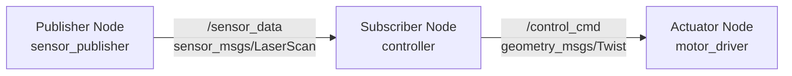

# Data Model: Module 1 - ROS 2 Fundamentals Content Structure

**Phase**: 1 (Design & Contracts)
**Date**: 2025-12-06
**Feature**: Module 1 - ROS 2 Fundamentals

## Content Entities

### Entity: Chapter

**Description**: A complete learning unit within Module 1, covering a specific ROS 2 topic.

**Attributes**:
- `chapter_number`: Integer (1-4)
- `title`: String (e.g., "ROS 2 Architecture: Nodes, Topics, Services, and Actions")
- `slug`: String (URL-safe, e.g., "ros2-architecture")
- `learning_objectives`: Array<LearningObjective> (3-5 items)
- `sections`: Array<Section> (ordered list)
- `metadata`: ChapterMetadata

**Relationships**:
- Contains many **Sections**
- Contains many **CodeExamples**
- Contains many **Exercises**
- References **FurtherReading** resources

**Validation Rules**:
- Must have 3-5 learning objectives (FR-001, FR-008, FR-015, FR-022)
- Must include all required section types (Theoretical Foundations, Hands-On Implementation, etc.)
- Total estimated reading time: 4-6 hours (per Assumptions)

---

### Entity: Section

**Description**: A logical subdivision of a chapter covering a specific subtopic.

**Attributes**:
- `section_id`: String (unique within chapter, e.g., "dds-middleware")
- `title`: String (e.g., "The DDS Middleware Layer")
- `type`: Enum [TheoryFoundation, HandsOnTutorial, PracticalExample, Exercise, FurtherReading, Summary]
- `content`: MDX (markdown with embedded React components)
- `order`: Integer (display sequence)
- `estimated_minutes`: Integer (reading time)

**Relationships**:
- Belongs to one **Chapter**
- May contain multiple **CodeExamples**
- May contain multiple **Diagrams**
- May reference other **Sections** (cross-references)

**Validation Rules**:
- TheoryFoundation sections must include at least one mathematical formulation or algorithm (SC-004)
- HandsOnTutorial sections must include step-by-step instructions
- PracticalExample sections must include real-world use cases
- All code blocks must specify language for syntax highlighting (FR-032)

**Section Types and Requirements**:

1. **TheoryFoundation**: Core concepts, algorithms, mathematical models
   - Required: Conceptual explanation, diagrams, mathematical notation (KaTeX)
   - Optional: Historical context, comparison to alternatives

2. **HandsOnTutorial**: Step-by-step implementation guides
   - Required: Prerequisites, setup instructions, code examples, expected output
   - Optional: Troubleshooting subsection, video walkthrough link

3. **PracticalExample**: Real-world applications and case studies
   - Required: Scenario description, code implementation, explanation of design choices
   - Optional: Performance analysis, alternative approaches

4. **Exercise**: Progressive difficulty challenges
   - Required: Problem statement, difficulty level (beginner/intermediate/advanced), hints
   - Optional: Solution sketch, rubric

5. **FurtherReading**: Curated references
   - Required: At least 5 references (SC-005), brief description of relevance
   - Format: ROS 2 docs, research papers, tutorials

6. **Summary**: Chapter recap and next steps
   - Required: Key concepts recap, preview of next chapter (FR-034)

---

### Entity: LearningObjective

**Description**: A measurable outcome students should achieve after completing a chapter.

**Attributes**:
- `objective_id`: String (e.g., "LO-1.1")
- `description`: String (starts with action verb: "explain", "implement", "design")
- `bloom_level`: Enum [Remember, Understand, Apply, Analyze, Evaluate, Create]
- `assessment_method`: String (how students verify achievement)

**Format**:
```markdown
**LO-1.1**: Explain the architectural differences between ROS 1 and ROS 2, including the DDS middleware layer and QoS policies.
- **Bloom Level**: Understand
- **Assessment**: Student can diagram ROS 2 architecture and describe 3+ key differences from ROS 1
```

**Validation Rules**:
- Must use action verbs (avoid "know", "understand" without specificity)
- Must be measurable (clear success criteria)
- 3-5 objectives per chapter (FR-001, FR-008, FR-015, FR-022)
- Progressive Bloom levels (early chapters: Remember/Understand, later: Apply/Analyze/Create)

---

### Entity: CodeExample

**Description**: An executable code sample demonstrating a concept.

**Attributes**:
- `example_id`: String (e.g., "chapter-1-publisher-example")
- `title`: String (e.g., "Minimal Publisher Node in Python")
- `language`: Enum [Python, Cpp, YAML, XML, Bash]
- `code`: String (source code)
- `file_path`: String (path in examples/ directory)
- `dependencies`: Array<String> (ROS 2 packages, Python libraries)
- `setup_instructions`: String (markdown)
- `expected_output`: String (what student should see)
- `test_script`: String (validation script path)

**Relationships**:
- Belongs to one **Section**
- May be referenced by **Exercises**

**Validation Rules**:
- Must execute without errors in ROS 2 Humble (SC-006)
- Must include setup instructions (FR-031)
- Must include inline comments for non-obvious logic (Code Quality Standards)
- Python code must pass PEP 8 linting (SC-020)
- C++ code must follow ROS 2 C++ conventions

**Example Structure**:
```markdown
### Example 1.1: Minimal Publisher Node in Python

**File**: `examples/module-1/chapter-1/minimal_publisher.py`

**Description**: A simple ROS 2 node that publishes string messages to a topic.

**Dependencies**:
- ROS 2 Humble (`ros-humble-desktop`)
- Python 3.10+
- rclpy

**Setup**:
```bash
# Source ROS 2
source /opt/ros/humble/setup.bash

# Run the publisher
python3 minimal_publisher.py
```

**Code**:
```python
import rclpy
from rclpy.node import Node
from std_msgs.msg import String

class MinimalPublisher(Node):
    def __init__(self):
        super().__init__('minimal_publisher')
        self.publisher_ = self.create_publisher(String, 'topic', 10)
        self.timer = self.create_timer(0.5, self.timer_callback)
        self.i = 0

    def timer_callback(self):
        msg = String()
        msg.data = f'Hello World: {self.i}'
        self.publisher_.publish(msg)
        self.get_logger().info(f'Publishing: "{msg.data}"')
        self.i += 1

def main(args=None):
    rclpy.init(args=args)
    minimal_publisher = MinimalPublisher()
    rclpy.spin(minimal_publisher)
    minimal_publisher.destroy_node()
    rclpy.shutdown()

if __name__ == '__main__':
    main()
```

**Expected Output**:
```
[INFO] [minimal_publisher]: Publishing: "Hello World: 0"
[INFO] [minimal_publisher]: Publishing: "Hello World: 1"
...
```

**Test**: Run `ros2 topic list` in another terminal to verify `/topic` exists.
```

---

### Entity: Diagram

**Description**: A visual representation of concepts (communication graphs, architectures, kinematic chains).

**Attributes**:
- `diagram_id`: String (e.g., "chapter-1-pubsub-graph")
- `title`: String (e.g., "Publisher-Subscriber Communication Pattern")
- `type`: Enum [Mermaid, SVG, PNG]
- `source`: String (Mermaid syntax or file path)
- `alt_text`: String (accessibility description)
- `caption`: String (brief explanation)

**Relationships**:
- Belongs to one **Section**

**Validation Rules**:
- All diagrams must have alt text (SC-009, accessibility)
- Mermaid diagrams preferred over static images (source-controlled)
- SVG/PNG only for complex diagrams (e.g., robot renderings)

**Mermaid Example**:
```markdown
### Figure 1.1: Publisher-Subscriber Communication Pattern



**Caption**: A simple ROS 2 communication graph showing sensor data flowing from a publisher to a subscriber, which then sends control commands to an actuator.
```

---

### Entity: Exercise

**Description**: A practice problem for students to apply learned concepts.

**Attributes**:
- `exercise_id`: String (e.g., "ex-1.1")
- `title`: String (e.g., "Create a Multi-Node Communication System")
- `difficulty`: Enum [Beginner, Intermediate, Advanced]
- `problem_statement`: String (markdown)
- `hints`: Array<String> (optional guidance)
- `solution_sketch`: String (optional, hidden by default)
- `acceptance_criteria`: Array<String> (how to verify correctness)
- `estimated_minutes`: Integer

**Relationships**:
- Belongs to one **Section**
- May reference **CodeExamples**

**Validation Rules**:
- Each chapter must have at least 5 exercises (SC-003)
- Progressive difficulty (beginner → intermediate → advanced)
- Acceptance criteria must be verifiable (testable outcomes)

**Exercise Example**:
```markdown
### Exercise 1.3: Design a Multi-Node Robot Control System

**Difficulty**: Advanced

**Problem**: Design and implement a ROS 2 system with at least 3 nodes that uses topics, services, and actions for robot control.

**Requirements**:
1. A sensor node publishing `/sensor_data` (use `std_msgs/Float32MultiArray`)
2. A controller node subscribing to `/sensor_data` and publishing `/control_cmd` (use `geometry_msgs/Twist`)
3. A configuration service (`/set_config`) to change controller parameters
4. An action server for goal-based navigation (`/navigate_to_goal`)

**Hints**:
- Start with the publisher-subscriber example and extend it
- Use `example_interfaces/srv/SetBool` for the service (or create custom)
- Use `example_interfaces/action/Fibonacci` as action template

**Acceptance Criteria**:
- [ ] `ros2 node list` shows all 3 nodes
- [ ] `ros2 topic list` shows `/sensor_data` and `/control_cmd`
- [ ] `ros2 service list` shows `/set_config`
- [ ] `ros2 action list` shows `/navigate_to_goal`
- [ ] Controller publishes control commands in response to sensor data

**Estimated Time**: 60 minutes
```

---

### Entity: ChapterMetadata

**Description**: Metadata for a chapter (SEO, navigation, tracking).

**Attributes**:
- `chapter_number`: Integer (1-4)
- `module_number`: Integer (1)
- `prerequisites`: Array<String> (e.g., ["Basic Python", "Linux command line"])
- `estimated_hours`: Float (4-6)
- `last_updated`: Date
- `authors`: Array<String> (e.g., ["ROSArchitectureAgent"])
- `tags`: Array<String> (e.g., ["ROS 2", "architecture", "DDS"])

**Docusaurus Frontmatter Format**:
```yaml
---
id: ros2-architecture
title: "Chapter 1: ROS 2 Architecture - Nodes, Topics, Services, and Actions"
sidebar_label: "Ch 1: ROS 2 Architecture"
sidebar_position: 1
description: "Learn the fundamental architecture of ROS 2, including nodes, topics, services, and actions. Understand DDS middleware and QoS policies."
keywords: [ROS 2, architecture, nodes, topics, services, actions, DDS, QoS]
slug: /module-1/ros2-architecture
tags:
  - ROS 2
  - architecture
  - fundamentals
---
```

---

## Content Structure Schema

### Chapter Template Structure

```markdown
---
[ChapterMetadata as frontmatter]
---

# [Chapter Title]

## Overview

[Brief introduction: what this chapter covers, why it matters, how it fits in Module 1]

**Estimated Time**: [X hours]

**Prerequisites**: [List of prior knowledge]

## Learning Objectives

By the end of this chapter, you will be able to:

- **LO-X.1**: [Objective 1]
- **LO-X.2**: [Objective 2]
- **LO-X.3**: [Objective 3]
- **LO-X.4**: [Objective 4]
- **LO-X.5**: [Objective 5] (optional)

---

## Theoretical Foundations

### [Subsection 1: Core Concept A]

[Theory explanation with diagrams and math]

### [Subsection 2: Core Concept B]

[Theory explanation with diagrams and math]

---

## Hands-On Implementation

### Tutorial 1: [Basic Implementation]

[Step-by-step guide with code example]

### Tutorial 2: [Intermediate Implementation]

[Step-by-step guide with code example]

---

## Practical Examples

### Example 1: [Real-World Scenario A]

[Case study with code and explanation]

### Example 2: [Real-World Scenario B]

[Case study with code and explanation]

---

## Exercises & Challenges

### Beginner Exercises

[Exercise 1]
[Exercise 2]

### Intermediate Exercises

[Exercise 3]
[Exercise 4]

### Advanced Challenges

[Exercise 5]

---

## Further Reading

1. **[Resource 1 Title]**: [URL] - [Brief description of relevance]
2. **[Resource 2 Title]**: [URL] - [Brief description of relevance]
3. **[Resource 3 Title]**: [URL] - [Brief description of relevance]
4. **[Resource 4 Title]**: [URL] - [Brief description of relevance]
5. **[Resource 5 Title]**: [URL] - [Brief description of relevance]

---

## Summary

### Key Takeaways

- [Key point 1]
- [Key point 2]
- [Key point 3]

### Next Chapter Preview

In [Next Chapter Title], we'll explore [brief preview of next chapter's content].

---

## Troubleshooting

### Common Issues

**Issue**: [Problem students might encounter]
**Solution**: [How to fix it]

**Issue**: [Another common problem]
**Solution**: [How to fix it]
```

---

## Code Example Repository Structure

```
examples/
└── module-1/
    ├── chapter-1/
    │   ├── README.md                          # Chapter 1 examples overview
    │   ├── example-01-minimal-publisher/
    │   │   ├── minimal_publisher.py
    │   │   ├── CMakeLists.txt (if C++)
    │   │   ├── package.xml
    │   │   ├── README.md
    │   │   └── test.sh
    │   ├── example-02-minimal-subscriber/
    │   │   └── [similar structure]
    │   ├── example-03-service-server/
    │   │   └── [similar structure]
    │   ├── example-04-action-server/
    │   │   └── [similar structure]
    │   └── test-all.sh                        # Test all Chapter 1 examples
    ├── chapter-2/
    │   ├── README.md
    │   ├── example-01-rclpy-node/
    │   │   └── [similar structure]
    │   ├── example-02-ai-agent-integration/
    │   │   ├── agent.py                       # AI agent logic
    │   │   ├── ros2_wrapper.py                # ROS 2 node wrapper
    │   │   ├── requirements.txt               # Python dependencies
    │   │   └── [rest of structure]
    │   └── test-all.sh
    ├── chapter-3/
    │   ├── README.md
    │   ├── example-01-simple-urdf/
    │   │   ├── robot.urdf
    │   │   ├── robot.xacro
    │   │   ├── launch/display.launch.py       # RViz launch file
    │   │   └── [rest of structure]
    │   ├── example-02-humanoid-arm/
    │   │   └── [similar structure]
    │   └── test-all.sh
    └── chapter-4/
        ├── README.md
        ├── example-01-package-creation/
        │   ├── my_robot_pkg/
        │   │   ├── package.xml
        │   │   ├── setup.py
        │   │   └── my_robot_pkg/
        │   │       └── node.py
        │   └── [rest of structure]
        ├── example-02-launch-files/
        │   └── [similar structure]
        └── test-all.sh
```

---

## Validation and Quality Metrics

### Chapter Completeness Checklist

For each chapter, validate:

- [ ] 3-5 learning objectives (FR-001, FR-008, FR-015, FR-022)
- [ ] Theoretical Foundations section with ≥1 mathematical formulation (SC-004)
- [ ] Hands-On Implementation section with step-by-step tutorials
- [ ] Practical Examples section with real-world scenarios
- [ ] ≥5 exercises with progressive difficulty (SC-003)
- [ ] ≥5 further reading references (SC-005)
- [ ] Summary section with key takeaways and next chapter preview (FR-034)
- [ ] ≥3 executable code examples (SC-002)
- [ ] All code examples tested in Docker (SC-006)
- [ ] All diagrams have alt text (SC-009)
- [ ] Cross-references to related chapters (FR-033)

### Content Quality Metrics

- **Flesch-Kincaid Grade Level**: 12-16 (undergraduate to graduate) per SC-007
- **Estimated Reading Time**: 4-6 hours per chapter (per Assumptions)
- **Code Example Success Rate**: 100% execute without errors (SC-006)
- **Accessibility**: WCAG 2.1 AA compliance (headings, alt text, keyboard navigation)
- **Performance**: Page load time <2 seconds (SC-016), Lighthouse score 90+ (SC-016)
- **Responsiveness**: Readable on 320px-1920px viewports (SC-017)

---

## State Transitions

**Chapter Lifecycle States**:

1. **Draft**: Initial content generated by subagent
2. **Review**: Manual review for technical accuracy and clarity
3. **Validated**: Code examples tested, diagrams rendered correctly
4. **Published**: Merged to main branch, deployed to Vercel/GitHub Pages
5. **Updated**: Content revised based on feedback or ROS 2 updates

**Transition Triggers**:

- Draft → Review: Subagent completes content generation
- Review → Validated: Manual review approves content, automated tests pass
- Validated → Published: Merged to main branch
- Published → Updated: Errata found, ROS 2 distribution update

---

## Consistency Rules

### Terminology

Use consistent terms across all chapters (defined on first use):

- **Node** (not "ROS 2 process" or "executable")
- **Topic** (not "channel" or "stream")
- **QoS** (Quality of Service, not "QoS policy" on first mention)
- **rclpy** (not "Python client library" after introduction)
- **URDF** (Unified Robot Description Format, not "robot description")

### Code Style

**Python**:
- Follow PEP 8
- Use type hints for function signatures (Python 3.10+ syntax)
- Node class names: CamelCase (e.g., `MinimalPublisher`)
- Function/variable names: snake_case (e.g., `timer_callback`)

**C++**:
- Follow ROS 2 C++ Style Guide
- Use `rclcpp::Node` for nodes
- Namespace: `my_robot_namespace`

**URDF/XML**:
- Use xacro for modularity (Chapter 3)
- Consistent naming: `<link name="base_link">`, `<joint name="shoulder_joint">`

### Cross-References

Format: `[Chapter X: Section Title](../chapterX/#section-id)`

Example: `For more on topics, see [Chapter 1: Topics](../chapter-1/#topics-section).`
