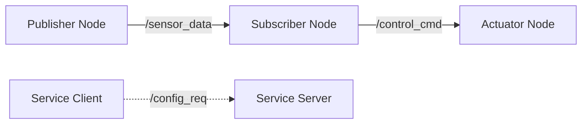

# Research: Module 1 - ROS 2 Fundamentals

**Phase**: 0 (Outline & Research)
**Date**: 2025-12-06
**Feature**: Module 1 - ROS 2 Fundamentals

## Research Questions

### Q1: Docusaurus Best Practices for Technical Educational Content

**Question**: What are the best practices for structuring and organizing technical educational content (robotics tutorials with code examples) in Docusaurus 3.x?

**Decision**: Use Docusaurus docs plugin with custom sidebar configuration, MDX for interactive components, and separate content by module/chapter hierarchy.

**Rationale**:
- Docusaurus docs plugin provides built-in versioning, search, and navigation
- MDX allows embedding React components for interactive code examples and diagrams
- Hierarchical sidebar structure (Module 1 → Chapter 1-4) matches pedagogical organization
- Custom theme swizzling enables branding without forking core

**Alternatives Considered**:
- **GitBook**: Rejected due to limited customization and no free tier for private repos
- **MkDocs Material**: Rejected as Docusaurus has better React ecosystem integration
- **Custom Next.js site**: Rejected due to reinventing documentation features (search, sidebar, navigation)

**Implementation Approach**:
- Directory structure: `docs/module-1/chapter-1/`, `docs/module-1/chapter-2/`, etc.
- Sidebar auto-generation from directory structure with custom `sidebars.js`
- Use `@docusaurus/plugin-content-docs` with multiple instances if multi-version support needed later

**References**:
- https://docusaurus.io/docs/docs-introduction
- https://docusaurus.io/docs/markdown-features
- https://docusaurus.io/docs/sidebar

---

### Q2: KaTeX Integration for Mathematical Notation in ROS 2 Content

**Question**: How to render mathematical notation (transformation matrices, DH parameters, inertia tensors) in Docusaurus using KaTeX?

**Decision**: Install `remark-math` and `rehype-katex` plugins, configure in `docusaurus.config.js`, use LaTeX syntax in markdown.

**Rationale**:
- KaTeX is faster than MathJax (critical for page load performance per SC-016)
- Server-side rendering prevents layout shift
- Wide LaTeX syntax support covers robotics math (matrices, vectors, transformations)

**Alternatives Considered**:
- **MathJax**: Rejected due to slower rendering (impacts SC-016: <2s load time)
- **Images of equations**: Rejected due to poor accessibility and searchability
- **ASCII math**: Rejected as insufficient for complex robotics notation

**Implementation Approach**:
```js
// docusaurus.config.js
presets: [
  [
    '@docusaurus/preset-classic',
    {
      docs: {
        remarkPlugins: [require('remark-math')],
        rehypePlugins: [require('rehype-katex')],
      },
    },
  ],
],
stylesheets: [
  {
    href: 'https://cdn.jsdelivr.net/npm/katex@0.16.9/dist/katex.min.css',
    type: 'text/css',
    integrity: 'sha384-n8MVd4RsNIU0tAv4ct0nTaAbDJwPJzDEaqSD1odI+WdtXRGWt2kTvGFasHpSy3SV',
    crossorigin: 'anonymous',
  },
],
```

**Example Usage**:
```markdown
Rotation matrix: $R_z(\theta) = \begin{bmatrix} \cos\theta & -\sin\theta & 0 \\ \sin\theta & \cos\theta & 0 \\ 0 & 0 & 1 \end{bmatrix}$
```

**References**:
- https://docusaurus.io/docs/markdown-features/math-equations
- https://katex.org/docs/supported.html

---

### Q3: Mermaid Integration for ROS 2 Communication Graphs and Architecture Diagrams

**Question**: How to render ROS 2 node graphs, communication patterns, and system architecture diagrams in Docusaurus?

**Decision**: Use `@docusaurus/theme-mermaid` plugin for inline Mermaid diagrams, with custom CSS for robotics-specific styling.

**Rationale**:
- Mermaid supports flowcharts (node graphs), sequence diagrams (message flow), and class diagrams (URDF structure)
- Source-controlled diagram definitions (no binary image files)
- Diagrams auto-update with content changes
- Built-in Docusaurus support reduces maintenance

**Alternatives Considered**:
- **PlantUML**: Rejected due to Java dependency and slower rendering
- **Draw.io**: Rejected as diagrams not source-controlled (binary XML)
- **Static SVG/PNG**: Rejected due to difficult maintenance and version control

**Implementation Approach**:
```js
// docusaurus.config.js
themes: ['@docusaurus/theme-mermaid'],
markdown: {
  mermaid: true,
},
```

**Example Usage**:
```markdown

```

**References**:
- https://docusaurus.io/docs/markdown-features/diagrams
- https://mermaid.js.org/syntax/flowchart.html

---

### Q4: ROS 2 Code Example Testing Strategy

**Question**: How to ensure all ROS 2 code examples (Python, C++) execute correctly in clean environments (per SC-006)?

**Decision**: Docker-based testing with ROS 2 Humble image, automated CI checks, example code in separate repository folders with test scripts.

**Rationale**:
- Docker ensures reproducible testing environment (Ubuntu 22.04 + ROS 2 Humble)
- CI automation prevents broken examples from merging
- Separate example code folders allow independent testing
- Test scripts validate build and execution (not just compilation)

**Alternatives Considered**:
- **Manual testing**: Rejected as unscalable for 16 chapters
- **VM-based testing**: Rejected due to slower CI execution vs Docker
- **No testing**: Rejected as violates SC-006 (100% examples execute)

**Implementation Approach**:
- Directory: `examples/module-1/chapter-1/example-01-publisher/`, etc.
- Each example has `README.md`, source code, `CMakeLists.txt`/`setup.py`, `test.sh`
- Docker image: `osrf/ros:humble-desktop` as base
- CI workflow (GitHub Actions):
  ```yaml
  - name: Test Chapter 1 Examples
    run: |
      docker run --rm -v $PWD/examples/module-1/chapter-1:/workspace osrf/ros:humble-desktop bash -c "cd /workspace && ./test-all.sh"
  ```

**Test Validation Criteria**:
- Code compiles without errors
- Executables run without crashes for 10 seconds
- Expected ROS 2 topics/services/actions appear (`ros2 topic list`, etc.)

**References**:
- https://hub.docker.com/r/osrf/ros
- ROS 2 Humble documentation: https://docs.ros.org/en/humble/

---

### Q5: Claude Code Subagent Architecture for Content Generation

**Question**: How to design and orchestrate Claude Code Subagents for generating Module 1's four chapters while maintaining consistency and quality?

**Decision**: Create four specialized subagents (ROSArchitectureAgent, RclpyIntegrationAgent, URDFModelingAgent, PackageManagementAgent) with shared content templates and validation workflows.

**Rationale**:
- Specialized agents ensure domain expertise (each focuses on one chapter's technical depth)
- Shared templates enforce consistency (learning objectives format, code example structure)
- Agent coordination via plan.md ensures cross-chapter references are maintained
- Aligns with Constitution Principle III (Claude Subagents for bonus points)

**Subagent Specifications**:

**1. ROSArchitectureAgent**
- **Scope**: Chapter 1 - ROS 2 Architecture (Nodes, Topics, Services, Actions)
- **Inputs**: spec.md FR-001 to FR-007, content-template.md, code-example-template.py/.cpp
- **Outputs**: `docs/module-1/chapter-1.mdx`, `examples/module-1/chapter-1/`
- **Validation**: Executes code examples in Docker, verifies learning objectives coverage
- **Key Responsibilities**:
  - Generate DDS middleware explanations with diagrams
  - Create publisher-subscriber, service, action code examples (Python + C++)
  - Design progressive exercises (modify → create → design)

**2. RclpyIntegrationAgent**
- **Scope**: Chapter 2 - Bridging Python Agents to ROS Controllers (rclpy)
- **Inputs**: spec.md FR-008 to FR-014, Chapter 1 reference sections, AI agent template
- **Outputs**: `docs/module-1/chapter-2.mdx`, `examples/module-1/chapter-2/`
- **Validation**: Runs AI agent examples, measures control loop frequency (≥10 Hz per SC-011)
- **Key Responsibilities**:
  - Generate rclpy architecture explanations (executors, callbacks, timers)
  - Create AI agent integration examples (NumPy-based, PyTorch RL agent)
  - Design real-time control exercises with performance validation

**3. URDFModelingAgent**
- **Scope**: Chapter 3 - URDF for Humanoid Robots
- **Inputs**: spec.md FR-015 to FR-021, URDF validation tools (check_urdf, RViz)
- **Outputs**: `docs/module-1/chapter-3.mdx`, `examples/module-1/chapter-3/`, URDF files
- **Validation**: Validates URDF with check_urdf, visualizes in RViz, verifies 10+ DOF
- **Key Responsibilities**:
  - Generate kinematic foundations (DH parameters, transformations)
  - Create humanoid URDF examples (torso, arm, leg, head)
  - Design xacro macro examples for modularity

**4. PackageManagementAgent**
- **Scope**: Chapter 4 - ROS 2 Packages, Launch Files, Parameters
- **Inputs**: spec.md FR-022 to FR-028, Chapters 1-3 example packages
- **Outputs**: `docs/module-1/chapter-4.mdx`, `examples/module-1/chapter-4/`
- **Validation**: Builds multi-package workspace, tests launch files (≥5 nodes per SC-013)
- **Key Responsibilities**:
  - Generate colcon/ament build system explanations
  - Create launch file examples (Python, XML) with orchestration
  - Design parameter management exercises (YAML, dynamic reconfig)

**Coordination Mechanism**:
- **Master Orchestrator**: Ensures agents execute in order (1→2→3→4) due to dependencies
- **Shared Templates**: `content-template.md`, `code-example-template.py`, `exercise-template.md`
- **Cross-Chapter References**: Agents register "export" sections (e.g., Chapter 1 exports "communication patterns" referenced by Chapter 2)
- **Consistency Validation**: Final pass checks terminology, code style, cross-references

**Agent Invocation**:
```bash
# Example agent invocation (simplified)
claude-agent run ROSArchitectureAgent \
  --input specs/001-module-1-ros2/spec.md \
  --template templates/content-template.md \
  --output docs/module-1/chapter-1.mdx \
  --validate docker-test
```

**Alternatives Considered**:
- **Single monolithic agent**: Rejected due to lack of specialization and difficulty maintaining context across 4 chapters
- **Manual content writing**: Rejected as violates Principle III (AI-Native Development)
- **Generic content generation**: Rejected as insufficiently deep for technical accuracy (Principle I)

**References**:
- Claude Code Subagents documentation (internal)
- Hackathon bonus criteria (subagent usage)

---

### Q6: Docusaurus Custom Theme for Professional UI/UX

**Question**: How to create a professional, attractive Docusaurus theme aligned with Principle IV (Professional UI/UX Standards)?

**Decision**: Extend `@docusaurus/theme-classic` via swizzling, customize color palette, typography, and component styling with CSS modules.

**Rationale**:
- Swizzling allows selective component customization without full theme fork
- CSS modules provide scoped styling (no global conflicts)
- Theme tokens (CSS variables) enable consistent design system
- Maintains Docusaurus upgrade path

**Customization Approach**:

**1. Color Palette** (inspired by modern educational platforms):
```css
:root {
  --ifm-color-primary: #2e8555;         /* Teal (robotics theme) */
  --ifm-color-primary-dark: #29784c;
  --ifm-color-primary-darker: #277148;
  --ifm-color-primary-darkest: #205d3b;
  --ifm-color-primary-light: #33925d;
  --ifm-color-primary-lighter: #359962;
  --ifm-color-primary-lightest: #3cad6e;

  --ifm-code-font-size: 95%;
  --ifm-font-family-base: 'Inter', -apple-system, BlinkMacSystemFont, 'Segoe UI', sans-serif;
  --ifm-font-family-monospace: 'JetBrains Mono', 'Fira Code', 'Courier New', monospace;
}
```

**2. Component Swizzling**:
- `DocSidebar`: Add chapter progress indicators
- `CodeBlock`: Enhance with execution environment badges (Python, C++, ROS 2)
- `Admonition`: Custom callout boxes for "Prerequisites", "Troubleshooting", "Deep Dive"

**3. Typography**:
- Headings: Inter font (clean, modern)
- Body: Inter font (readable at 16px base)
- Code: JetBrains Mono (ligatures for code readability)

**4. Responsive Design**:
- Breakpoints: 320px (mobile), 768px (tablet), 1024px (desktop)
- Sidebar collapses on mobile, shows hamburger menu
- Code blocks horizontal scroll on mobile, full width on desktop

**Implementation**:
```bash
npm swizzle @docusaurus/theme-classic DocSidebar -- --wrap
npm swizzle @docusaurus/theme-classic CodeBlock -- --wrap
```

**Validation Against SC-017**:
- Test viewport widths: 320px, 375px, 768px, 1024px, 1920px
- Verify all content readable, no horizontal scroll (except code blocks)
- Touch targets ≥44px (iOS/Android accessibility)

**Alternatives Considered**:
- **Full custom theme**: Rejected due to maintenance burden
- **Default theme**: Rejected as violates Principle IV (professional UI/UX)
- **Third-party Docusaurus themes**: Rejected due to lack of robotics-specific customization

**References**:
- https://docusaurus.io/docs/styling-layout
- https://docusaurus.io/docs/swizzling
- Panaversity design references (for inspiration)

---

## Summary of Research Outcomes

### Resolved Decisions

1. **Content Platform**: Docusaurus 3.x with docs plugin, MDX, custom theme
2. **Math Rendering**: KaTeX via remark-math/rehype-katex
3. **Diagrams**: Mermaid via @docusaurus/theme-mermaid
4. **Code Validation**: Docker (osrf/ros:humble-desktop) + CI automation
5. **Subagent Architecture**: 4 specialized agents (ROSArchitecture, RclpyIntegration, URDFModeling, PackageManagement)
6. **UI/UX**: Swizzled @docusaurus/theme-classic with custom color palette, Inter/JetBrains Mono fonts

### Technical Context Clarifications

All "NEEDS CLARIFICATION" items from plan.md Technical Context section resolved:

- **Language/Version**: Markdown (MDX), Python 3.10+ (examples), C++17 (examples)
- **Primary Dependencies**: Docusaurus 3.x, ROS 2 Humble, remark-math, rehype-katex, @docusaurus/theme-mermaid
- **Storage**: Git repository (content), Docker Hub (test images)
- **Testing**: Docker-based CI (code examples), Lighthouse (performance), manual (accessibility)
- **Target Platform**: Web (Vercel/GitHub Pages deployment)
- **Project Type**: Documentation site (Docusaurus)
- **Performance Goals**: <2s page load (SC-016), 90+ Lighthouse score
- **Constraints**: ROS 2 Humble compatibility, free-tier deployment (Vercel/GitHub Pages)
- **Scale/Scope**: 4 chapters (Module 1), ~50-100 code examples, 16-24 hours learning time

### Next Phase

Proceed to **Phase 1: Design & Contracts** to create:
1. `data-model.md` - Content structure (chapter sections, code example formats)
2. `contracts/` - Content delivery contracts (MDX schema, code example metadata)
3. `quickstart.md` - Developer guide for adding new chapters
