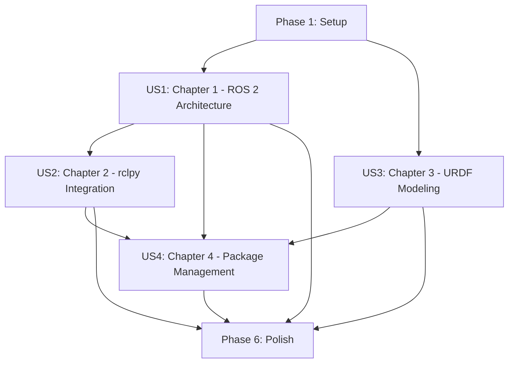

# Tasks: Module 1 - ROS 2 Fundamentals

**Input**: Design documents from `/specs/001-module-1-ros2/`
**Prerequisites**: plan.md (required), spec.md (required for user stories), research.md, data-model.md, contracts/

**Organization**: Tasks are grouped by user story to enable independent implementation and testing of each chapter.

## Format: `[ID] [P?] [Story] Description`

- **[P]**: Can run in parallel (different files, no dependencies)
- **[Story]**: Which user story this task belongs to (US1, US2, US3, US4)
- Include exact file paths in descriptions

## User Story Dependencies



**Execution Strategy**:
- **MVP**: Complete US1 (Chapter 1) first - delivers foundational ROS 2 content
- **Parallel Opportunities**: US3 (Chapter 3 - URDF) can start after US1 exports are available, even if US2 is in progress
- **Integration Point**: US4 (Chapter 4) requires exports from US1, US2, and US3

---

## Phase 1: Setup (Shared Infrastructure)

**Purpose**: Initialize Docusaurus project and configure dependencies for Module 1

### Docusaurus Initialization

- [ ] T001 Create Docusaurus project with docs plugin in repository root using `npx create-docusaurus@latest . classic`
- [ ] T002 [P] Install KaTeX dependencies: `npm install remark-math@5 rehype-katex@6`
- [ ] T003 [P] Install Mermaid plugin: `npm install @docusaurus/theme-mermaid`
- [ ] T004 Configure docusaurus.config.js with KaTeX and Mermaid plugins per research.md Q2 and Q3
- [ ] T005 [P] Create custom CSS theme in src/css/custom.css with teal color palette and Inter/JetBrains Mono fonts per research.md Q6
- [ ] T006 [P] Create sidebars.js with Module 1 structure (4 chapters)
- [ ] T007 [P] Create module directory structure: docs/module-1/ and docs/module-1/_diagrams/chapter-{1-4}/
- [ ] T008 [P] Create examples directory structure: examples/module-1/chapter-{1-4}/

### Testing Infrastructure

- [ ] T009 Pull Docker image for code validation: `docker pull osrf/ros:humble-desktop`
- [ ] T010 [P] Create master test script examples/module-1/test-all.sh that runs all chapter test-all.sh scripts

### Documentation Templates

- [ ] T011 [P] Create shared content template at templates/content-template.md per plan.md Phase 2
- [ ] T012 [P] Create code example template at templates/code-example-template.py per plan.md Phase 2
- [ ] T013 [P] Create test script template at templates/test-template.sh per plan.md Phase 2

**Phase 1 Complete**: ✅ Docusaurus configured, directory structure created, templates ready

---

## Phase 2: US1 - Learning ROS 2 Architecture (Chapter 1)

**User Story**: As a robotics student, I want to understand ROS 2 architecture and communication patterns (nodes, topics, services, actions) to design distributed robotic systems.

**Independent Test**: Student can read Chapter 1, complete exercises, and demonstrate a working multi-node system using all three communication patterns (topics, services, actions).

**Subagent**: ROSArchitectureAgent

### Chapter 1 Content Generation

- [ ] T014 [US1] Invoke ROSArchitectureAgent with inputs: spec.md (FR-001 to FR-007), data-model.md, contracts/chapter-content-contract.md, config { chapter_number: 1 }
- [ ] T015 [US1] Generate docs/module-1/chapter-1.mdx with all 9 required sections per data-model.md Chapter Template Structure (Overview, Learning Objectives, Theoretical Foundations, Hands-On Implementation, Practical Examples, Exercises, Further Reading, Summary, Troubleshooting)
- [ ] T016 [US1] Create 3-5 learning objectives for Chapter 1 covering ROS 2 architecture, nodes, topics, services, actions (FR-001)

### Chapter 1 Theoretical Foundations

- [ ] T017 [P] [US1] Write DDS middleware layer explanation with QoS policies section in docs/module-1/chapter-1.mdx (FR-002)
- [ ] T018 [P] [US1] Write ROS 1 vs ROS 2 architectural differences section with comparison table in docs/module-1/chapter-1.mdx (FR-002)
- [ ] T019 [P] [US1] Create Mermaid diagram for pubsub communication pattern in docs/module-1/_diagrams/chapter-1/pubsub-graph.mmd
- [ ] T020 [P] [US1] Create Mermaid diagram for service pattern in docs/module-1/_diagrams/chapter-1/service-pattern.mmd
- [ ] T021 [P] [US1] Create Mermaid diagram for action pattern in docs/module-1/_diagrams/chapter-1/action-pattern.mmd
- [ ] T022 [P] [US1] Create Mermaid diagram for DDS architecture in docs/module-1/_diagrams/chapter-1/dds-architecture.mmd

### Chapter 1 Code Examples

- [ ] T023 [P] [US1] Create minimal publisher example in examples/module-1/chapter-1/example-01-minimal-publisher/minimal_publisher.py (FR-003, Python)
- [ ] T024 [P] [US1] Create minimal subscriber example in examples/module-1/chapter-1/example-02-minimal-subscriber/minimal_subscriber.py (FR-003, Python)
- [ ] T025 [P] [US1] Create service server example in examples/module-1/chapter-1/example-03-service-server/service_server.py (FR-003, Python)
- [ ] T026 [P] [US1] Create service client example in examples/module-1/chapter-1/example-04-service-client/service_client.py (FR-003, Python)
- [ ] T027 [P] [US1] Create action server example in examples/module-1/chapter-1/example-05-action-server/action_server.py (FR-003, Python)
- [ ] T028 [P] [US1] Create action client example in examples/module-1/chapter-1/example-06-action-client/action_client.py (FR-003, Python)

### Chapter 1 Code Example Infrastructure

- [ ] T029 [US1] Create README.md for each Chapter 1 example following contracts/chapter-content-contract.md README template (FR-031)
- [ ] T030 [US1] Create test.sh for each Chapter 1 example following templates/test-template.sh (FR-030)
- [ ] T031 [US1] Create package.xml for each Chapter 1 ROS 2 package example

### Chapter 1 Tutorials and Exercises

- [ ] T032 [P] [US1] Write minimal ROS 2 workspace creation tutorial in docs/module-1/chapter-1.mdx (FR-004)
- [ ] T033 [P] [US1] Write simple node writing tutorial in docs/module-1/chapter-1.mdx (FR-004)
- [ ] T034 [P] [US1] Write communication pattern testing tutorial in docs/module-1/chapter-1.mdx (FR-004)
- [ ] T035 [P] [US1] Create practical example for sensor data publishing scenario in docs/module-1/chapter-1.mdx (FR-005)
- [ ] T036 [P] [US1] Create practical example for motor command subscribing in docs/module-1/chapter-1.mdx (FR-005)
- [ ] T037 [P] [US1] Create 5 exercises (2 beginner, 2 intermediate, 1 advanced) for Chapter 1 in docs/module-1/chapter-1.mdx (FR-006)
- [ ] T038 [P] [US1] Create "Further Reading" section with 5+ references to ROS 2 docs, DDS specs, research papers in docs/module-1/chapter-1.mdx (FR-007)

### Chapter 1 Validation

- [ ] T039 [US1] Test all Chapter 1 code examples in Docker (osrf/ros:humble-desktop) via examples/module-1/chapter-1/test-all.sh
- [ ] T040 [US1] Validate Chapter 1 code examples achieve 100% execution success rate (SC-006)
- [ ] T041 [US1] Run Python linting (flake8) on all Chapter 1 Python examples
- [ ] T042 [US1] Generate test report in examples/module-1/chapter-1/test-report.md documenting all example execution results
- [ ] T043 [US1] Register Chapter 1 exports: communication_patterns and node_basics sections for reference by US2 and US4

**US1 Complete**: ✅ Chapter 1 delivered with 6+ code examples, tested in Docker, exports registered

---

## Phase 3: US2 - Bridging AI Agents to ROS 2 (Chapter 2)

**User Story**: As a robotics developer, I want to bridge Python AI agents to ROS 2 controllers using rclpy to create intelligent autonomous behaviors.

**Independent Test**: Student can complete Chapter 2, implement a Python AI agent communicating via rclpy, and demonstrate it controlling a simulated robot.

**Subagent**: RclpyIntegrationAgent

**Dependencies**: Requires US1 exports (communication_patterns, node_basics)

### Chapter 2 Content Generation

- [ ] T044 [US2] Invoke RclpyIntegrationAgent with inputs: spec.md (FR-008 to FR-014), data-model.md, contracts/chapter-content-contract.md, config { chapter_number: 2 }, cross-references from US1 exports
- [ ] T045 [US2] Generate docs/module-1/chapter-2.mdx with all 9 required sections per data-model.md Chapter Template Structure
- [ ] T046 [US2] Create 3-5 learning objectives for Chapter 2 covering rclpy API, AI agent integration, real-time control (FR-008)
- [ ] T047 [US2] Add cross-references to Chapter 1 communication_patterns and node_basics sections per FR-033

### Chapter 2 Theoretical Foundations

- [ ] T048 [P] [US2] Write rclpy architecture explanation with Python-C++ bridge internals in docs/module-1/chapter-2.mdx (FR-009)
- [ ] T049 [P] [US2] Write callback execution models section (single-threaded, multi-threaded executors) in docs/module-1/chapter-2.mdx (FR-009)
- [ ] T050 [P] [US2] Write real-time control considerations section (timing, latency, callback prioritization) in docs/module-1/chapter-2.mdx (FR-013)
- [ ] T051 [P] [US2] Create Mermaid diagram for rclpy architecture in docs/module-1/_diagrams/chapter-2/rclpy-architecture.mmd
- [ ] T052 [P] [US2] Create Mermaid diagram for executor model in docs/module-1/_diagrams/chapter-2/executor-model.mmd
- [ ] T053 [P] [US2] Create Mermaid diagram for AI agent integration pattern in docs/module-1/_diagrams/chapter-2/ai-agent-integration.mmd

### Chapter 2 Code Examples

- [ ] T054 [P] [US2] Create rclpy node lifecycle example in examples/module-1/chapter-2/example-01-rclpy-node/node.py (FR-010)
- [ ] T055 [P] [US2] Create timer-based control loop example in examples/module-1/chapter-2/example-02-timer-callbacks/timer_node.py (FR-010)
- [ ] T056 [P] [US2] Create multi-threaded executor example in examples/module-1/chapter-2/example-03-multithreaded-executor/executor_demo.py (FR-010)
- [ ] T057 [P] [US2] Create AI agent integration example with NumPy-based planner in examples/module-1/chapter-2/example-04-ai-agent-integration/agent.py and ros2_wrapper.py (FR-011, FR-012)
- [ ] T058 [P] [US2] Create PyTorch RL agent example in examples/module-1/chapter-2/example-05-pytorch-agent/rl_agent.py and ros2_wrapper.py with requirements.txt (FR-012)
- [ ] T059 [P] [US2] Create real-time control loop example achieving 10-100 Hz in examples/module-1/chapter-2/example-06-realtime-control/control_loop.py (FR-013)

### Chapter 2 Code Example Infrastructure

- [ ] T060 [US2] Create README.md for each Chapter 2 example following contracts/chapter-content-contract.md README template
- [ ] T061 [US2] Create test.sh for each Chapter 2 example following templates/test-template.sh
- [ ] T062 [US2] Create requirements.txt for PyTorch example (example-05) with CPU-only PyTorch dependencies

### Chapter 2 Tutorials and Exercises

- [ ] T063 [P] [US2] Write rclpy development environment setup tutorial in docs/module-1/chapter-2.mdx (FR-011)
- [ ] T064 [P] [US2] Write AI agent wrapping tutorial in docs/module-1/chapter-2.mdx (FR-011)
- [ ] T065 [P] [US2] Create 5 exercises (2 beginner, 2 intermediate, 1 advanced) for Chapter 2 in docs/module-1/chapter-2.mdx (FR-014)
- [ ] T066 [P] [US2] Create "Further Reading" section with 5+ references in docs/module-1/chapter-2.mdx

### Chapter 2 Validation

- [ ] T067 [US2] Test all Chapter 2 code examples in Docker (osrf/ros:humble-desktop) via examples/module-1/chapter-2/test-all.sh
- [ ] T068 [US2] Validate AI agent examples achieve control loop frequency ≥10 Hz (SC-011)
- [ ] T069 [US2] Run Python linting (flake8) on all Chapter 2 Python examples
- [ ] T070 [US2] Generate test report in examples/module-1/chapter-2/test-report.md
- [ ] T071 [US2] Register Chapter 2 export: rclpy_patterns section for reference by US4

**US2 Complete**: ✅ Chapter 2 delivered with AI agent integration examples, ≥10 Hz control validated, exports registered

---

## Phase 4: US3 - Modeling Humanoid Robots with URDF (Chapter 3)

**User Story**: As a humanoid robotics engineer, I want to master URDF to model humanoid kinematics, dynamics, and geometries for simulation and control.

**Independent Test**: Student can complete Chapter 3, create a URDF model of a simplified humanoid robot (≥10 DOF), visualize in RViz, and verify correct kinematic chains.

**Subagent**: URDFModelingAgent

**Dependencies**: Weak dependency on US1 exports (node_basics for package structure)

### Chapter 3 Content Generation

- [ ] T072 [US3] Invoke URDFModelingAgent with inputs: spec.md (FR-015 to FR-021), data-model.md, contracts/chapter-content-contract.md, config { chapter_number: 3 }, cross-references from US1 node_basics
- [ ] T073 [US3] Generate docs/module-1/chapter-3.mdx with all 9 required sections per data-model.md Chapter Template Structure
- [ ] T074 [US3] Create 3-5 learning objectives for Chapter 3 covering URDF syntax, humanoid modeling, kinematic chains (FR-015)
- [ ] T075 [US3] Add cross-references to Chapter 1 node_basics section per FR-033

### Chapter 3 Theoretical Foundations

- [ ] T076 [P] [US3] Write rigid body transformations section (homogeneous transforms) with KaTeX notation in docs/module-1/chapter-3.mdx (FR-016)
- [ ] T077 [P] [US3] Write Denavit-Hartenberg parameters section with KaTeX formulations in docs/module-1/chapter-3.mdx (FR-016)
- [ ] T078 [P] [US3] Write inertial property calculations section (center of mass, inertia tensor) in docs/module-1/chapter-3.mdx (FR-016)
- [ ] T079 [P] [US3] Create Mermaid diagram for kinematic chain in docs/module-1/_diagrams/chapter-3/kinematic-chain.mmd
- [ ] T080 [P] [US3] Create Mermaid diagram for URDF structure in docs/module-1/_diagrams/chapter-3/urdf-structure.mmd

### Chapter 3 URDF Examples

- [ ] T081 [P] [US3] Create simple 2-link arm URDF in examples/module-1/chapter-3/example-01-simple-urdf/robot.urdf (FR-017, FR-018)
- [ ] T082 [P] [US3] Create simple 2-link arm xacro in examples/module-1/chapter-3/example-01-simple-urdf/robot.xacro with modular design (FR-018)
- [ ] T083 [P] [US3] Create humanoid arm URDF (3+ DOF: shoulder, elbow, wrist) in examples/module-1/chapter-3/example-02-humanoid-arm/arm.urdf (FR-017)
- [ ] T084 [P] [US3] Create humanoid arm xacro in examples/module-1/chapter-3/example-02-humanoid-arm/arm.xacro with parameterized dimensions (FR-018)
- [ ] T085 [P] [US3] Create humanoid leg URDF (3+ DOF: hip, knee, ankle) in examples/module-1/chapter-3/example-03-humanoid-leg/leg.urdf (FR-017)
- [ ] T086 [P] [US3] Create humanoid leg xacro in examples/module-1/chapter-3/example-03-humanoid-leg/leg.xacro (FR-018)
- [ ] T087 [P] [US3] Create full simplified humanoid URDF (10+ DOF: torso, 2 arms, 2 legs, head) in examples/module-1/chapter-3/example-04-full-humanoid/humanoid.urdf (FR-017, FR-019)
- [ ] T088 [P] [US3] Create full humanoid xacro in examples/module-1/chapter-3/example-04-full-humanoid/humanoid.xacro with realistic inertial properties (FR-019)

### Chapter 3 Visualization and Validation

- [ ] T089 [P] [US3] Create RViz launch file for simple URDF in examples/module-1/chapter-3/example-01-simple-urdf/launch/display.launch.py (FR-018)
- [ ] T090 [P] [US3] Create RViz launch files for arm, leg, and full humanoid examples
- [ ] T091 [P] [US3] Create test scripts that validate URDF with check_urdf tool for all examples

### Chapter 3 Code Example Infrastructure

- [ ] T092 [US3] Create README.md for each Chapter 3 example following contracts/chapter-content-contract.md README template
- [ ] T093 [US3] Create test.sh for each Chapter 3 example that runs check_urdf validation and RViz loading test

### Chapter 3 Tutorials and Exercises

- [ ] T094 [P] [US3] Write URDF from scratch tutorial in docs/module-1/chapter-3.mdx (FR-018)
- [ ] T095 [P] [US3] Write xacro macro tutorial in docs/module-1/chapter-3.mdx (FR-018)
- [ ] T096 [P] [US3] Write validation tutorial (check_urdf and RViz) in docs/module-1/chapter-3.mdx (FR-018)
- [ ] T097 [P] [US3] Write common URDF pitfalls section (joint limits, coordinate frames, mass distribution) in docs/module-1/chapter-3.mdx (FR-020)
- [ ] T098 [P] [US3] Create 5 exercises (2 beginner, 2 intermediate, 1 advanced) for Chapter 3 in docs/module-1/chapter-3.mdx (FR-021)
- [ ] T099 [P] [US3] Create "Further Reading" section with 5+ references in docs/module-1/chapter-3.mdx

### Chapter 3 Validation

- [ ] T100 [US3] Test all Chapter 3 URDF examples with check_urdf validation via examples/module-1/chapter-3/test-all.sh
- [ ] T101 [US3] Validate all URDF models load in RViz without errors
- [ ] T102 [US3] Validate full humanoid model has ≥10 DOF (SC-012)
- [ ] T103 [US3] Generate test report in examples/module-1/chapter-3/test-report.md
- [ ] T104 [US3] Register Chapter 3 export: urdf_basics section for reference by US4

**US3 Complete**: ✅ Chapter 3 delivered with humanoid URDF examples (≥10 DOF), check_urdf validated, RViz tested, exports registered

---

## Phase 5: US4 - Building and Managing ROS 2 Packages (Chapter 4)

**User Story**: As a ROS 2 developer, I want to learn package organization, build systems, launch files, and parameter management to create maintainable robotic applications.

**Independent Test**: Student can complete Chapter 4, create a multi-package workspace with nodes from Chapters 1-3, write launch files orchestrating ≥5 nodes, and manage parameters via YAML.

**Subagent**: PackageManagementAgent

**Dependencies**: Requires US1 exports (node_basics, communication_patterns), US2 exports (rclpy_patterns), US3 exports (urdf_basics)

### Chapter 4 Content Generation

- [ ] T105 [US4] Invoke PackageManagementAgent with inputs: spec.md (FR-022 to FR-034), data-model.md, contracts/chapter-content-contract.md, config { chapter_number: 4 }, cross-references from US1, US2, US3 exports
- [ ] T106 [US4] Generate docs/module-1/chapter-4.mdx with all 9 required sections per data-model.md Chapter Template Structure
- [ ] T107 [US4] Create 3-5 learning objectives for Chapter 4 covering workspace setup, packages, launch files, parameters (FR-022)
- [ ] T108 [US4] Add cross-references to Chapters 1-3 exported sections per FR-033
- [ ] T109 [US4] Write Module 1 summary section recapping ROS 2 fundamentals (FR-034)
- [ ] T110 [US4] Write Module 2 preview section introducing Digital Twin (Gazebo and Unity) (FR-034)

### Chapter 4 Theoretical Foundations

- [ ] T111 [P] [US4] Write colcon build system architecture section in docs/module-1/chapter-4.mdx (FR-023)
- [ ] T112 [P] [US4] Write ament package structure section (ament_cmake, ament_python) in docs/module-1/chapter-4.mdx (FR-023)
- [ ] T113 [P] [US4] Write ROS 2 dependency resolution section (package.xml) in docs/module-1/chapter-4.mdx (FR-023)
- [ ] T114 [P] [US4] Create Mermaid diagram for colcon build flow in docs/module-1/_diagrams/chapter-4/colcon-build-flow.mmd
- [ ] T115 [P] [US4] Create Mermaid diagram for package dependencies in docs/module-1/_diagrams/chapter-4/package-dependencies.mmd
- [ ] T116 [P] [US4] Create Mermaid diagram for launch file composition in docs/module-1/_diagrams/chapter-4/launch-composition.mmd

### Chapter 4 Package Examples

- [ ] T117 [P] [US4] Create Python package example in examples/module-1/chapter-4/example-01-python-package/my_robot_pkg/ with setup.py and package.xml (FR-024)
- [ ] T118 [P] [US4] Create C++ package example in examples/module-1/chapter-4/example-02-cpp-package/my_cpp_pkg/ with CMakeLists.txt and package.xml (FR-024)
- [ ] T119 [P] [US4] Create multi-package workspace in examples/module-1/chapter-4/example-03-multi-package/ with robot_description, robot_control, robot_bringup packages (FR-025)

### Chapter 4 Launch File Examples

- [ ] T120 [P] [US4] Create Python launch file example in examples/module-1/chapter-4/example-04-launch-files/launch/robot.launch.py (FR-025, FR-026)
- [ ] T121 [P] [US4] Create XML launch file example in examples/module-1/chapter-4/example-04-launch-files/launch/robot.launch.xml (FR-025, FR-026)
- [ ] T122 [P] [US4] Create launch file composition example (including other launch files) in examples/module-1/chapter-4/example-04-launch-files/launch/composed.launch.py (FR-026)
- [ ] T123 [P] [US4] Add namespace management and node remapping to launch file examples (FR-026)

### Chapter 4 Parameter Examples

- [ ] T124 [P] [US4] Create parameter YAML example in examples/module-1/chapter-4/example-05-parameters/config/params.yaml (FR-025, FR-027)
- [ ] T125 [P] [US4] Create parameter callback example in examples/module-1/chapter-4/example-05-parameters/param_node.py demonstrating dynamic reconfiguration (FR-027)
- [ ] T126 [P] [US4] Create hierarchical parameter namespace example in examples/module-1/chapter-4/example-05-parameters/config/hierarchical_params.yaml (FR-027)

### Chapter 4 Code Example Infrastructure

- [ ] T127 [US4] Create README.md for each Chapter 4 example following contracts/chapter-content-contract.md README template
- [ ] T128 [US4] Create test.sh for each Chapter 4 example that tests colcon build and launch file execution

### Chapter 4 Tutorials and Exercises

- [ ] T129 [P] [US4] Write colcon workspace creation tutorial in docs/module-1/chapter-4.mdx (FR-025)
- [ ] T130 [P] [US4] Write Python package creation tutorial in docs/module-1/chapter-4.mdx (FR-025)
- [ ] T131 [P] [US4] Write launch file writing tutorial (Python and XML) in docs/module-1/chapter-4.mdx (FR-025)
- [ ] T132 [P] [US4] Write parameter management tutorial in docs/module-1/chapter-4.mdx (FR-025)
- [ ] T133 [P] [US4] Write debugging workflow section (ROS 2 CLI tools) in docs/module-1/chapter-4.mdx (FR-028)
- [ ] T134 [P] [US4] Create 5 exercises (2 beginner, 2 intermediate, 1 advanced) for Chapter 4 in docs/module-1/chapter-4.mdx (FR-028)
- [ ] T135 [P] [US4] Create "Further Reading" section with 5+ references in docs/module-1/chapter-4.mdx

### Chapter 4 Validation

- [ ] T136 [US4] Test all Chapter 4 packages build successfully with colcon build via examples/module-1/chapter-4/test-all.sh
- [ ] T137 [US4] Validate launch file examples start ≥5 nodes (SC-013)
- [ ] T138 [US4] Test parameter YAML files load correctly
- [ ] T139 [US4] Run Python linting (flake8) on all Chapter 4 Python examples
- [ ] T140 [US4] Generate test report in examples/module-1/chapter-4/test-report.md

**US4 Complete**: ✅ Chapter 4 delivered with multi-package workspace, launch files orchestrating ≥5 nodes, Module 1 finalized

---

## Phase 6: Polish & Cross-Cutting Concerns

**Purpose**: Final validation, cross-chapter consistency, and deployment preparation

### Docusaurus Build and Validation

- [ ] T141 Run full Docusaurus build: `npm run build` to detect broken links and MDX errors
- [ ] T142 [P] Validate all internal cross-references between chapters work correctly
- [ ] T143 [P] Validate all Mermaid diagrams render correctly in Docusaurus
- [ ] T144 [P] Validate all KaTeX math notation renders correctly

### Code Example Testing

- [ ] T145 Test all Module 1 code examples via examples/module-1/test-all.sh master script
- [ ] T146 Validate 100% code example execution success rate (SC-006)
- [ ] T147 [P] Run flake8 linting on all Python examples across all chapters
- [ ] T148 [P] Validate all example README.md files follow contract template

### Content Quality Validation

- [ ] T149 [P] Validate each chapter has 3-5 learning objectives (SC-001)
- [ ] T150 [P] Validate each chapter has ≥3 code examples (SC-002)
- [ ] T151 [P] Validate each chapter has ≥5 exercises (SC-003)
- [ ] T152 [P] Validate each chapter has ≥1 mathematical formulation (SC-004)
- [ ] T153 [P] Validate each chapter has ≥5 further reading references (SC-005)
- [ ] T154 [P] Run readability check on all chapters for Flesch-Kincaid grade level 12-16 (SC-007)
- [ ] T155 [P] Validate all diagrams have alt text for accessibility (SC-009)

### Performance and Accessibility

- [ ] T156 Run Lighthouse performance audit on Docusaurus site (target: score 90+, load time <2s) (SC-016)
- [ ] T157 [P] Test responsive design on viewports 320px, 768px, 1024px, 1920px (SC-017)
- [ ] T158 [P] Validate WCAG 2.1 AA accessibility compliance (headings, alt text, keyboard navigation)

### Cross-Chapter Consistency

- [ ] T159 Validate terminology consistency across all chapters (Node, Topic, Service, Action, etc.) per data-model.md
- [ ] T160 [P] Validate code style consistency (CamelCase classes, snake_case functions) across all examples
- [ ] T161 [P] Validate file path conventions followed across all examples (examples/module-1/chapter-N/)

### Final Review and Documentation

- [ ] T162 Generate final test report summarizing all chapter test results and quality gate outcomes
- [ ] T163 [P] Update README.md with Module 1 status and getting started instructions
- [ ] T164 [P] Verify all PHRs created for specification, planning, and task generation phases

**Phase 6 Complete**: ✅ Module 1 validated, all quality gates passed, ready for deployment

---

## Implementation Strategy

### MVP Scope (User Story 1 Only)

**Minimum Viable Product**: Complete US1 (Chapter 1 - ROS 2 Architecture) delivers:
- Foundational ROS 2 content (nodes, topics, services, actions)
- ≥6 working code examples tested in Docker
- Complete chapter with all 9 required sections
- Exports (communication_patterns, node_basics) for other chapters

**MVP Test**: Student can read Chapter 1, execute all code examples, complete exercises, and build a multi-node ROS 2 system.

**Estimated Effort**: ~40% of total Module 1 effort (Chapter 1 is most complex due to foundational content)

### Incremental Delivery

1. **Release 1** (MVP): US1 complete → Chapter 1 published
2. **Release 2**: US1 + US2 complete → Chapters 1-2 published (AI agent integration available)
3. **Release 3**: US1 + US2 + US3 complete → Chapters 1-3 published (URDF modeling available)
4. **Release 4** (Full Module 1): All US1-US4 complete → All 4 chapters published, Module 1 finalized

### Parallel Execution Opportunities

**After US1 Complete**:
```bash
# US2 and US3 can run in parallel (US3 has weak dependency on US1)
Parallel Track A: Execute US2 tasks (T044-T071) - Chapter 2
Parallel Track B: Execute US3 tasks (T072-T104) - Chapter 3

# US4 requires both US2 and US3 exports, so must wait for both
Sequential: Execute US4 tasks (T105-T140) - Chapter 4
```

**Estimated Time Savings**: ~20-30% by parallelizing US2 and US3

### Task Summary

**Total Tasks**: 164
- Phase 1 (Setup): 13 tasks
- Phase 2 (US1 - Chapter 1): 30 tasks
- Phase 3 (US2 - Chapter 2): 28 tasks
- Phase 4 (US3 - Chapter 3): 33 tasks
- Phase 5 (US4 - Chapter 4): 36 tasks
- Phase 6 (Polish): 24 tasks

**Parallel Opportunities**: ~60% of tasks marked [P] can run in parallel within their phase

**Independent Tests**:
- US1: Student demonstrates multi-node system with topics, services, actions
- US2: Student demonstrates AI agent controlling robot via rclpy (≥10 Hz)
- US3: Student demonstrates humanoid URDF model (≥10 DOF) in RViz
- US4: Student demonstrates multi-package workspace with launch file orchestrating ≥5 nodes

---

## Validation Checklist

Before marking Module 1 complete, verify:

- [ ] All 164 tasks completed
- [ ] All 4 chapters (chapter-1.mdx through chapter-4.mdx) delivered
- [ ] All code examples (50-100 total) tested in Docker with 100% success rate
- [ ] All quality gates passed (80 total: 20 per chapter)
- [ ] Docusaurus builds without errors
- [ ] Cross-references validated (no broken links)
- [ ] Learning effectiveness criteria met (SC-010 to SC-013)
- [ ] UX criteria met (SC-014 to SC-017)
- [ ] Technical accuracy criteria met (SC-018 to SC-020)
- [ ] All PHRs created and filed in history/prompts/001-module-1-ros2/

**Module 1 Status**: Ready for `/sp.implement` command to execute tasks
