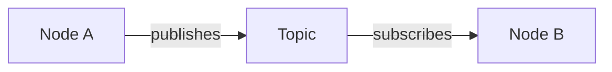

# Chapter [N]: [Chapter Title]

**Learning Objectives**: [List 3-5 specific, measurable learning objectives]

**Prerequisites**: [List required prior knowledge or completed chapters]

**Estimated Time**: [Time estimate for completing chapter content and exercises]

---

## Overview

[Brief introduction to the chapter's topic and why it matters for humanoid robotics. 200-400 words.]

---

## Learning Objectives

By the end of this chapter, you will be able to:

1. [Specific, measurable objective 1]
2. [Specific, measurable objective 2]
3. [Specific, measurable objective 3]
4. [Specific, measurable objective 4 (optional)]
5. [Specific, measurable objective 5 (optional)]

---

## Theoretical Foundations

### [Section 1 Title]

[Detailed explanation of core concept 1. Include:
- Definitions of key terms
- Theoretical background
- Mathematical formulations (using KaTeX where applicable)
- Diagrams (using Mermaid)
- Real-world applications]

**Mathematical Formulation** (Example):

The transformation matrix $T$ is defined as:

$$
T = \begin{bmatrix}
R & t \\
0 & 1
\end{bmatrix}
$$

where $R$ is the rotation matrix and $t$ is the translation vector.

**Diagram** (Example):



### [Section 2 Title]

[Continue with additional theoretical sections as needed...]

---

## Hands-On Implementation

### [Implementation Section 1]

[Step-by-step guide to implementing concepts in ROS 2. Include:
- Setup instructions
- Code walkthrough
- Common pitfalls and solutions]

:::info Prerequisites
[List any specific setup requirements for this section]
:::

:::warning Common Pitfall
[Describe a common mistake and how to avoid it]
:::

:::tip Performance Optimization
[Provide optimization tips where relevant]
:::

---

## Practical Examples

### Example [N].1: [Example Title]

**Objective**: [What this example demonstrates]

**Files**: [`examples/module-1/chapter-[N]/example-01-[slug]/`](../../../../examples/module-1/chapter-[N]/example-01-[slug]/)

**Description**:
[Detailed description of what the example does and how it works]

**Setup**:
```bash
cd examples/module-1/chapter-[N]/example-01-[slug]
# [Setup instructions]
```

**Running**:
```bash
# [Commands to run the example]
```

**Expected Output**:
```
[What the user should see when running the example]
```

**Code Walkthrough**:
[Key sections of the code explained with inline code references]

### Example [N].2: [Example Title]

[Repeat structure for additional examples...]

---

## Exercises

### Exercise [N].1: [Exercise Title] (Beginner)

**Objective**: [What skill this exercise develops]

**Task**:
[Detailed description of what the student should implement]

**Hints**:
1. [Helpful hint 1]
2. [Helpful hint 2]

**Expected Outcome**:
[What success looks like]

### Exercise [N].2: [Exercise Title] (Intermediate)

[Follow same structure, increasing difficulty...]

### Exercise [N].3: [Exercise Title] (Advanced)

[Follow same structure, most challenging...]

---

## Further Reading

### Official Documentation
- [ROS 2 Humble Docs: [Relevant Topic]](https://docs.ros.org/en/humble/...)
- [ROS 2 Design: [Relevant Concept]](https://design.ros2.org/articles/...)

### Research Papers
- [Author(s), "Paper Title", Conference/Journal, Year]
- [Additional papers as relevant]

### Community Resources
- [ROS Discourse: [Topic]](https://discourse.ros.org/...)
- [GitHub Example: [Repository]](https://github.com/...)

---

## Summary

### Key Takeaways

1. [Major concept 1 learned]
2. [Major concept 2 learned]
3. [Major concept 3 learned]
4. [Major concept 4 learned (optional)]
5. [Major concept 5 learned (optional)]

### Connection to Next Chapter

[Brief preview of how this chapter's concepts connect to the next chapter. 100-200 words.]

---

## Troubleshooting

### Common Issues

**Issue 1: [Problem Description]**
- **Symptom**: [What the error looks like]
- **Cause**: [Why this happens]
- **Solution**: [How to fix it]

**Issue 2: [Problem Description]**
- **Symptom**: [What the error looks like]
- **Cause**: [Why this happens]
- **Solution**: [How to fix it]

[Add 3-5 common issues total]

### Debugging Tips

1. [General debugging tip 1]
2. [General debugging tip 2]
3. [General debugging tip 3]

### Getting Help

- Check the [ROS 2 Humble Docs](https://docs.ros.org/en/humble/)
- Search [ROS Answers](https://answers.ros.org/)
- Ask on [ROS Discourse](https://discourse.ros.org/)
- Review examples in [ros2/examples](https://github.com/ros2/examples)
